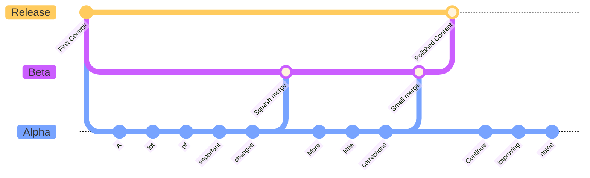

# How this repository works

This is an schematic view of how the repository is intended to be worked on

```mermaid
---
config:
  theme: 'base'
  gitGraph:
    showBranches: true
    showCommitLabel: true
    mainBranchName: 'Release'
---
gitGraph
    commit id:"First Commit"
    branch Beta
    branch Alpha
    commit id:"A"
    commit id:"lot"
    commit id:"of"
    commit id:"important"
    commit id:"changes"
    checkout Beta
    merge Alpha id:"Squash merge"
    checkout Alpha
    commit id:"More"
    commit id:"little"
    commit id:"corrections"
    checkout Beta
    merge Alpha id:"Small merge"
    checkout Release
    merge Beta id:"Polished Content"
    checkout Alpha
    commit id:"Continue"
    commit id:"improving"
    commit id:"notes"
```
