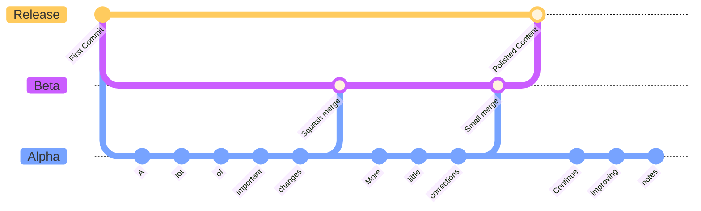

# How this repository works

The idea here is to do all the little and big changes on the Alpha branch. Then, when it's supposedly polished enough, the branch passes to the Beta branch with a merge and squash command for a revision stage. If more changes are made in those files it repeates the process until there are no more important changes and the Beta branch is again merged into de Release branch where the content is polished enough to be used as study material.

This is an schematic view of how the repository is intended to be worked on.

