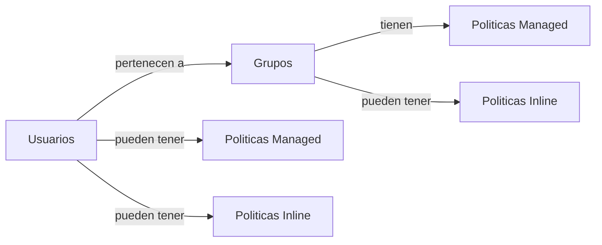

# 2.1. IAM - Usuarios y grupos

-> [Índice principal](./Index.md) -> [1. Fundamentos](./1.%20Fundamentos.md)

-> [Versión en inglés](/SAA-C03/en/2.1.%20IAM%20-%20Users%20and%20Groups.md) **PENDIENTE**

## Índice

- [1. Resumen rápido](#1-resumen-rápido)
- [2. Explicación en detalle](#2-explicación-en-detalle)
    - [IAM Policy Documents](#iam-policy-documents)
    - [Sintaxis de una política en JSON](#sintaxis-de-una-política-en-json)
    - [Reportes de credenciales](#reportes-de-credenciales)
- [3. Prácticas Hands-On Labs](#3-prácticas-hands-on-labs)
- [4. Casos de uso](#4-casos-de-uso)
- [5. Notas adicionales](#5-notas-adicionales)
- [6. Recursos oficiales](#6-recursos-oficiales)

## 1. Resumen rápido

💡 **CLAVES PARA EL EXAMEN:**

- IAM permite gestionar identidades y accesos en AWS.
- Es un **servicio global**, no depende de regiones.
- La cuenta **root** debe protegerse con MFA y usarse solo en tareas críticas.
- Aplicar siempre el principio de **Least Privilege**.
- Crear **usuarios individuales**, nunca usar root para operaciones diarias.
- Asignar permisos mediante **grupos** en lugar de a usuarios directamente.
- Existen **usuarios, grupos y roles** como entidades principales de IAM.
- Claves de acceso (`Access Key` + `Secret Key`) sirven para CLI/SDK, no consola web.
- Las claves solo se muestran **una vez al crearlas**.
- Se recomienda la **rotación periódica** de contraseñas y claves.
- **Federación (Federation)** permite usar identidades externas (SSO) con SAML u OpenID Connect.
- Tipos de políticas IAM:
    - **Identity-based** (usuarios, grupos, roles).
    - **Resource-based** (ej. políticas en S3, KMS, SQS).
    - **Permissions Boundaries** (límite de permisos).
    - **Service Control Policies (SCPs)** en AWS Organizations.
    - **Access Control Lists (ACLs)** (ej. S3, VPC).
    - **Session Policies** (temporales).
- En conflictos: **Deny explícito > Allow explícito > Deny implícito**.
- Los **reportes de credenciales** permiten auditar contraseñas, claves y MFA.
- Roles permiten que **servicios** o **cuentas externas** accedan a recursos sin usar credenciales fijas.

## 2. Explicación en detalle

IAM es el **Gestor de Accesos e identidades (*Identity and Access Management*)** y es el encargado de controlar qué y quienes pueden realizar determinadas acciones dentro de AWS.

> 🗒️❕**Nota**: Dada la complejidad y el largo del tema, he decidido dividirlo. De esta manera los documentos se hacen más sencillos de manejar y el proceso de aprendizaje es menos abrumador. Sobre todo teniendo en cuenta que un 30% del examen son preguntas relacionadas con la seguridad, conviene entender bien todos estos conceptos y practicarlos con soltura.

La cuenta inicial se llama raíz o *root* y es la más poderosa, ya que puede hacer absolutamente todo. Si alguien accediera a ella de forma maliciosa, tendría control total de la cuenta, con consecuencias graves y costos directos.

Por eso, lo primero al configurar AWS es proteger la cuenta root con:

- Usar un email único y específico para aws y ningún otro servicio.
- Una contraseña robusta.
- Usar Autenticación multifactor (**MFA**)
- Y, en la práctica, **no usarla nunca más salvo emergencias**

El uso diario debe hacerse con **usuarios individuales**, organizados en **grupos**, a los que se asignan permisos mediante **políticas**.
Esto responde al principio de *Least Privilege*: cada identidad (usuario, grupo o rol) debe tener el mínimo acceso posible para realizar su trabajo.

Un error común es asignar permisos directamente a usuarios. Esto no es escalable y dificulta la gestión de permisos a largo plazo.
Lo recomendable: crear grupos (ej. Administradores, DevOps, Finanzas), asociarles políticas, y luego añadir usuarios a esos grupos, ya que así heredarán los permisos de los grupos y nuestra única función será añadir o quitar usuarios a los grupos adecuados sin otorgar permisos manual e individualmente.

Al crear un usuario, AWS genera un *Access Key ID* y un *Secret Access Key*. Estas credenciales permiten el acceso a AWS desde la CLI (Command Line Interface) o SDK (Software Development Kit), no desde la consola web.

>⚠️ **Advertencia:**
>
> Se muestran **una sola vez**. Si se pierden, hay que regenerarlas.
>
> Además, **tampoco** es recomendable crear Access Keys para la cuenta root, ya que si se filtrasen, serían otro vector de entrada para gente con malas intenciones.

Por otro lado, es recomendable configurar **rotación de contraseñas y claves**, para reforzar la seguridad de las cuentas.

Si ya disponemos de un listado de usuarios y grupos en otros sistemas con Azure AD o Google, es posible configurar una Federación (*IAM Federation*) usando un proveedor de identidades o "*Identity Providers*" para que AWS se conecte a estos y reconozca esos usuarios y grupos como propios, permitiendo usar las mismas credenciales para ambos sistemas como **Single Sign-On (SSO)**.

### IAM Policy Documents

Las **políticas** son objetos (JSON) que definen permisos.

Por defecto, toda política que no explícitamente permitida, se entiende que está implícitamente denegada. Y si hay alguna política explícitamente prohibida/denegada, esta tiene prevalencia sobre las permitidas. Es decir, el orden de aplicación de las políticas (incluso cuando 2 se solapan o entran en conflicto) es:

1. Políticas explícitamente prohibidas/denegadas.
2. Políticas explícitamente permitidas.
3. Políticas implícitamente prohibidas (por defecto)

Hay varios tipos de políticas:

- **Basados en identidad (*Identity-based*)**: se adjuntan a usuarios, grupos o roles IAM para definir qué acciones pueden realizar sobre los recursos.
- **Basados en recursos (*Resource-based*)**:se adjuntan directamente a recursos (S3, KMS, SQS, etc.) y especifican quién puede acceder y qué acciones puede hacer.
- **Límites de permisos (*Permissions Boundaries*)**: definen un límite máximo de permisos que una identidad IAM puede tener, aunque tenga otras políticas adjuntas.
- **Políticas de control de servicios organizativos (*Organization Service Control Policies*)**: aplicadas a cuentas dentro de una organización de AWS, establecen permisos máximos permitidos para todas las identidades de la cuenta.
- **Listas de control de Accesos (*Access Control Lists* or *ACLs*)**: políticas simples, normalmente en S3 o VPC, que controlan acceso a recursos específicos mediante reglas de permit/deny para usuarios o IPs.
- **Políticas de sesión (*Session Policies*)**: políticas temporales que se aplican durante una sesión de IAM (ej. con roles asumidos), limitando permisos solo mientras dura esa sesión.

En este momento nos centraremos en las 2 primeras. En otra lección veremos IAM avanzado donde profundizaremos en las restantes.

1. Las políticas **basadas en identidad (*Identity Based*)** se aplican a identidades de IAM:

    - **Usuarios (*Users*)** → personas reales, seres humanos, con acceso a AWS.
    - **Grupos (*Groups*)** → conjuntos lógicos de usuarios (ej. DevOps, Finanzas).
    - **Roles (*Roles*)** → identidad temporal con permisos asignados que puede asumir un usuario, servicio o cuenta externa.

     A su vez, existen 2 tipos principales:

    - **Administradas (*Managed*)**: Son aquellas que se crean con carácter "general" y reutilizable, es decir, tienen su propio ARN y pueden aplicarse a varias identidades.
        - **Administradas por AWS**: Creadas y mantenidas por AWS (identificables por el símbolo de un cubo naranja).
        - **Administradas por el cliente**: Creadas manualmente por nosotros. Una buena práctica es usar como base una política gestionada por AWS y ajustarla según nuestras necesidades.

        > 🔹**Ejemplo** de política *Managed* que permite iniciar y detener instancias EC2 en la cuenta `123456789012` en la región `us-east-1`:
        >
        > ```json
        > {
        >    "Version": "2012-10-17",
        >    "Statement": [
        >       {
        >           "Sid": "EC2StartStop",
        >           "Effect": "Allow",
        >           "Action": [
        >               "ec2:StartInstances",
        >               "ec2:StopInstances"
        >           ],
        >           "Resource": "arn:aws:ec2:us-east-1:123456789012:instance/*"
        >       }
        >    ]
        > }
        > ```

    - **Insertadas (*Inline*)**: Se vinculan de forma exclusiva a **una única identidad IAM** (usuario, grupo o rol). Son creadas para casos muy específicos, no son reutilizables, no tienen ARN propio y desaparecen si se elimina la identidad a la que estaban asociadas.

        Otra forma de verlo es con la pregunta: *"¿Qué puede hacer este usuario/grupo/rol sobre los recursos?"*

        > 🔹**Ejemplo** de política *Inline* que permite al usuario al que esté adjunta listar los objetos dentro del bucket `mi-bucket-ejemplo`:
        >
        > ```json
        > {
        >    "Version": "2012-10-17",
        >    "Statement": [
        >       {
        >          "Effect": "Allow",
        >          "Action": "s3:ListBucket",
        >          "Resource": "arn:aws:s3:::mi-bucket-ejemplo"
        >       }
        >    ]
        > }
        > ```

2. Las políticas **basadas en recursos (*Resource Based*)** se aplican directamente a un recurso de AWS:

    Con recursos me refiero a objetos de AWS como un *bucket* de S3, una cola SQS o una función Lambda. Estas políticas definen quién puede acceder al recurso y con qué acciones. Por ello se comportan como *inline*: dependen del recurso y, si este se elimina, la política también.

    > ❗ **Importante**: a diferencia de las políticas basadas en identidad (que se crean y gestionan en IAM), las resource-based se configuran directamente en el servicio al que pertenecen, normalmente en la pestaña de *Permissions* del recurso en cuestión.

    Otra forma de verlo es con la pregunta: *"¿Quién puede acceder a este recurso y cómo?"*

    Este tipo de políticas resultan especialmente útiles para:
    - Dar acceso a otras cuentas AWS (cross-account).
    - Integraciones con otros servicios de AWS.
    - Casos donde se requiere un control muy granular directamente en el recurso.
    - Dar acceso a identidades que no forman parte del IAM interno/propio.
    > 🔹**Ejemplo** de política que da acceso de lectura (`s3:GetObject`) al usuario `UsuarioCuentaB` de otra cuenta AWS (`111122223333`) sobre todos los objetos del bucket `mi-bucket-ejemplo`:
    >
    > ```json
    > {
    >     "Version": "2012-10-17",
    >     "Statement": [
    >        {
    >           "Sid": "AllowAccountBReadAccess",
    >           "Effect": "Allow",
    >           "Principal": {
    >                 "AWS": "arn:aws:iam::111122223333:user/UsuarioCuentaB"
    >            },
    >            "Action": "s3:GetObject",
    >            "Resource": "arn:aws:s3:::mi-bucket-ejemplo/*"
    >        }
    >     ]
    > }
    > ```

> 🗒️ **Nota**:
> En las políticas basadas en identidad (tanto *managed* como *inline*) no se define el campo `"Principal"`, porque este queda implícito: el sujeto de la política es la propia identidad IAM (usuario, grupo o rol) a la que está vinculada.
> En cambio, en las políticas basadas en recursos sí es obligatorio especificar `"Principal"`. Esto se debe a que los recursos (S3 buckets, colas SQS, funciones Lambda, etc.) **no son identidades IAM** y, por tanto, no pueden “reconocerse a sí mismos” como sujetos. El recurso debe declarar explícitamente qué identidades (usuarios, roles, cuentas u otros servicios) pueden acceder a él.



### Sintaxis de una política en JSON

- **Version**
    - Indica la versión del lenguaje de políticas de AWS.
    - Valor recomendado: `"2012-10-17"`.
    - No afecta al comportamiento de permisos, pero define cómo se interpretan las políticas.
- **Id** (opcional)
    - Identificador opcional de la política.
    - Útil para administración o seguimiento.
- **Statement**
    - Bloque principal donde se definen permisos.
    - Puede ser un objeto o una lista de objetos.
    - Cada objeto contiene estos posibles campos:
        - **Sid** (Statement ID, opcional)
            - Identificador opcional único para el *statement*.
            - Facilita la lectura y auditoría.
            - Ejemplo: `"Sid": "AllowS3ReadAccess"`
        - **Effect**
            - Define si la regla *permite* o *deniega*.
            - Valores: `"Allow"` o `"Deny"`.
        - **Principal**
            - Define a quién se aplica la política (sólo en políticas de recurso).
            - Puede ser: `AWS`, `Service`, `Federated`.
            - Ejemplo: `"Principal": {"AWS": "arn:aws:iam::123456789012:user/Alice"}`
        - **NotPrincipal**
            - Opuesto a `Principal`.
            - Especifica a quién **no** se aplica.
        - **Action**
            - Acciones permitidas o denegadas.
            - Se usan nombres de API, como `"s3:GetObject"` o `"ec2:StartInstances"`.
            - Puede incluir comodines (`"s3:*"`).
        - **NotAction**
            - Opuesto a `Action`.
            - Define las acciones que **no** están afectadas.
        - **Resource**
            - Define sobre qué recursos se aplica la acción.
            - Normalmente usa ARNs (`"arn:aws:s3:::my-bucket/*"`).
            - `"*"` significa todos los recursos.
        - **NotResource**
            - Opuesto a `Resource`.
            - Define los recursos que quedan excluidos.
        - **Condition** (opcional)
            - Expresiones para afinar cuándo se aplica la política.
            - Usa operadores como:
                - `StringEquals`, `StringLike`
                - `IpAddress`, `DateGreaterThan`, etc.

> 🔹**Ejemplo** con todos los campos mencionados:
>
> ```json
>  {
>     "Version": "2012-10-17",
>     "Id": "PolicyExampleID",
>     "Statement":
>     [
>        {
>           "Sid": "ExampleStatementID",
>           "Effect": "Allow",
>           "Principal": { "AWS": "arn:aws:iam::111122223333:user/Juan" },
>           "NotPrincipal": { "AWS": "arn:aws:iam::444455556666:user/Maria" },
>           "Action": ["s3:GetObject", "s3:PutObject"],
>           "NotAction": "s3:DeleteObject",
>           "Resource": "arn:aws:s3:::mi-bucket/*",
>           "NotResource": "arn:aws:s3:::mi-bucket/privado/*",
>           "Condition":
>           {
>              "IpAddress": { "aws:SourceIp": "203.0.113.0/24" },
>              "Bool": { "aws:SecureTransport": "true" }
>           }
>        }
>     ]
>  }
> ```

### Reportes de credenciales

El servicio de IAM permite generar **reportes de credenciales (*Credentials Reports*)** que muestren el estado de la seguridad de los usuarios dentro de AWS. En estos reportes podemos mostrar parámetros como:

- Todos los usuarios existentes.
- El estado de las contraseñas.
- El estado de las access keys.
- El estado de la autenticación multifactor.
- Última fecha y hora de acceso.
- Última región de acceso.

[Documentación oficial de todos los parámetros](https://docs.aws.amazon.com/es_es/IAM/latest/UserGuide/id_credentials_getting-report.html)

Estos datos pueden ser realmente útiles para auditorías y el cumplimiento de las normativas de seguridad dentro de la empresa.

> 🗒️**Nota**: Si bien podemos generar tantos reportes como queramos, la información en ellos solo se actualizará cada 4 horas.

## 3. Prácticas Hands-On Labs

- Crear un **usuario IAM** con acceso de solo lectura a un bucket específico de S3 y probar que no puede modificar objetos.
- Configurar un **grupo IAM** llamado "Desarrolladores" y asignarle una **managed policy** que permita iniciar y detener instancias EC2; añadir usuarios al grupo y verificar permisos.
- Crear un **rol IAM** para un servicio de Lambda que necesite acceder a DynamoDB, adjuntando una **inline policy** con permisos mínimos requeridos.
- Implementar una **resource-based policy** en un bucket S3 que permita a un usuario de otra cuenta AWS leer y subir objetos únicamente en una carpeta específica.
- Probar la creación de **access keys** para un usuario y usarlas desde la CLI para listar recursos de S3; luego revocar las keys y verificar que el acceso se deniega.
- Generar un **credentials report** y analizarlo para identificar usuarios sin MFA o con claves antiguas; aplicar correcciones según mejores prácticas.
- Configurar una **política de Deny explícito** para impedir que un grupo elimine objetos críticos en un bucket S3, comprobando que funciona incluso si hay un Allow en otra política.
- Simular una **Federación SSO** usando un proveedor de identidad (busca "SAML test" en internet) y acceder a la consola AWS sin usar usuarios IAM locales.

## 4. Casos de uso

- Un auditor externo necesita acceso temporal para revisar los datos de **S3** de la empresa y se le crea un **rol** con una **inline policy** de solo lectura sobre los buckets relevantes.
- Un equipo de desarrollo necesita poder iniciar, detener y describir instancias en **EC2**, así que se les asigna una **managed policy** que permite estas acciones de forma estándar.
- Un usuario necesita permisos para administrar usuarios y grupos dentro de **IAM**, por lo que se le aplica una **identity-based policy** que le da esos privilegios específicos sin afectar otros recursos.
- Un departamento de soporte externo requiere acceso de solo lectura a ciertos objetos de un **bucket S3** de otra cuenta, usando una **resource-based policy** que define quién puede leer los datos.
- El equipo de seguridad genera un **credentials report** semanal para auditar contraseñas, claves de acceso y MFA de todos los usuarios de la cuenta, garantizando cumplimiento de seguridad.

## 5. Notas adicionales

¡Felicidades por llegar hasta aquí! 🙌
Has aprendido los conceptos clave de IAM: usuarios, grupos, políticas y permisos. Recuerda:

- **Privilegio mínimo siempre:** menos es más. Da solo los permisos necesarios y tu infraestructura será más segura y manejable.
- **Organiza antes de actuar:** crea grupos y políticas reutilizables, no asignaciones sueltas a usuarios.
- **Piensa como un atacante:** si alguien accediera a esta cuenta, ¿qué daño podría hacer? Esto te ayudará a aplicar seguridad de forma consciente.

¡Ahora respira, tómate un cafecito ☕ o un matecito 🧉 y prepárate para terminar de dominar IAM!

## 6. Recursos oficiales

- [AWS IAM Documentation](https://docs.aws.amazon.com/IAM/latest/UserGuide/introduction.html)
- [AWS IAM Federation](https://docs.aws.amazon.com/es_es/IAM/latest/UserGuide/id_roles_providers.html)

---

*Siguiente lección: [2.2. IAM - Roles e instancias](./2.2.%20IAM%20-%20Roles%20e%20instancias.md)*
