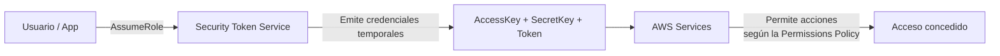
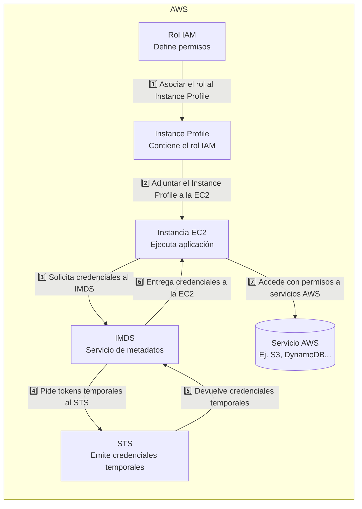

# 2.2. IAM - Roles e instancias

-> [Índice principal](./Index.md) -> [2.1. IAM - Usuarios y grupos](./2.1.%20IAM%20-%20Usuarios%20y%20grupos.md)

-> [Versión en inglés](/SAA-C03/en/2.2%20IAM%20Roles%20and%20instances.md) **PENDIENTE**

## Índice

- [1. Resumen rápido](#1-resumen-rápido)
- [2. Explicación en detalle](#2-explicación-en-detalle)
    - [AWS Security Token Service (STS)](#aws-security-token-service-sts)
    - [IAM Role Trust Policies](#iam-role-trust-policies)
    - [EC2 Instance Profiles](#ec2-instance-profiles)
        - [Por qué se hace así](#por-qué-se-hace-así)
- [3. Prácticas Hands-On Labs](#3-prácticas-hands-on-labs)
- [4. Casos de uso](#4-casos-de-uso)
- [5. Notas adicionales](#5-notas-adicionales)
- [6. Recursos oficiales](#6-recursos-oficiales)

## 1. Resumen rápido

💡 **CLAVES PARA EL EXAMEN:**

- Los **roles IAM** no pertenecen a usuarios concretos: se **asumen temporalmente**.
- Tipos de roles: **Service-linked Roles**, **Instance Profiles**, **Federated Identities**.
- Los roles necesitan dos cosas:
    - **Permissions Policy** → qué permisos otorga el rol.
    - **Trust Policy** → quién puede asumirlo (obligatoria).
- Las instancias EC2 usan **Instance Profiles** para obtener credenciales temporales vía **IMDS**.
- **STS (Security Token Service)** emite credenciales temporales de 15 min a 12h.
- Diferencia clave: **permissions policies** (normales, se aplican a identidades y recursos) vs **trust policies** (exclusivas de roles).
- Las **Instance Policies** permiten que las instancias EC2 usen temporalmente permisos de un rol IAM a través de un **Instance Profile**, otorgando acceso seguro a servicios de AWS sin necesidad de claves estáticas.

## 2. Explicación en detalle

En esta segunda parte vamos a profundizar en el uso de los *roles* y cómo se relacionan con instancias **EC2**, ya que puede ser un concepto algo más difícil de asimilar, pero dada su utilidad y frecuencia es clave entenderlo bien.

Un **rol** es similar a un usuario de IAM. Tiene una serie de permisos definidos sobre lo que puede y lo que no puede hacer, pero con una diferencia esencial: **no pertenece a una persona o servicio concreto**, sino que puede ser **asumido temporalmente** por quien lo necesite (usuarios, grupos, aplicaciones o servicios tanto de AWS como de terceros).

Cuando se asume un rol, la sesión adopta únicamente los permisos del rol: los permisos originales del usuario no se aplican mientras dure la sesión. Por ejemplo, si un administrador asume un rol de solo lectura, su sesión tendrá únicamente permisos de lectura durante ese periodo.

Por ponerlo en términos coloquiales y sencillos, es como un papel en una obra de teatro. Una entidad tiene las características que tiene, pero cuando entra en el papel (es decir, interpreta otro rol), este pasa **temporalmente** a tener las características de ese rol.

Estas son unas de las formas más comunes de usar los roles:

- **Servicios ligados a servicios (*Service-linked Roles*)**: Permite que los servicios de AWS accedan a otros servicios de AWS de manera segura.
- **Perfiles de instancias (*Instance Profiles*)**: Unidos a instancias EC2 que permiten el uso de un rol IAM.
- **Identidades federadas (*Federated Identities*)**: Permite a entidades externas asumir roles.

> 🔹**Ejemplos**:
>
> - *Técnico*:
>     - Para usuarios: Un administrador asume temporalmente un rol con los permisos de un usuario para comprobar que la configuración es correcta, y luego vuelve a su rol habitual.
>     - Para apps/servicios: Una instancia EC2 por defecto no tiene permisos especiales. Si necesita acceder a S3 u otro servicio, se le asigna un rol IAM que le otorga esos permisos de forma temporal. Al terminar la tarea, la instancia deja de usar el rol y ya no conserva privilegios adicionales.
>     - Para terceros: Una auditoría de ciberseguridad independiente requiere que sus empleados accedan al almacenamiento de los datos sensibles en un bucket S3 de una empresa. Finalizada la auditoría, dejan de tener acceso.
> - *Coloquial*:
>     - Para usuarios: Un usuario, por el día es una persona de a pié con los privilegios mínimos. Pero por la noche cambia de rol y se convierte en un murciélago justiciero. Es decir, cambia de rol temporalmente, siendo alguien con privilegios y capacidades totalmente distintas.
>     - Para apps/servicios: Un polideportivo normalmente es usado para representar deportes y solo tiene acceso los deportistas. Pero en caso de desastre natural, cambia de rol y sirve como refugio para cualquiera que lo necesite hasta que termine la tormenta.
>     - Para terceros: Una persona quiere entrar a un edificio gubernamental y le dan una tarjeta de acceso que pone "visitante", dándole acceso solo a las zonas autorizadas y únicamente durante la visita.
>
> En ambos casos, la idea clave es que los roles otorgan permisos de manera temporal, permitiendo realizar tareas específicas sin modificar los privilegios permanentes del usuario o servicio.

### AWS Security Token Service (STS)

Los Roles de IAM se apoyan en el servicio de tokens seguros para generar y gestionar los accesos temporales que tanto les caracteriza. Cuando alguien asume un rol, el STS es quien emite las credenciales temporales (AccessKey, SecretKey y SessionToken) que la entidad utilizará para autenticarse durante la duración de la sesión.

Estas credenciales pueden durar entre 15 minutos a 12 horas según la configuración usada; es comúnmente usado en Federaciones SAML o OpenID Connect y soporta condiciones adicionales de acceso como la autenticación de factor múltiple (MFA).

Puedes ver un ejemplo simplificado de cómo trabaja el servicio STS con el siguiente esquema:



### IAM Role Trust Policies

Los roles tienen otro tipo de políticas que, junto a las políticas de permisos (*permissions policies*) que hemos visto en la lección anterior, definen a qué identidad se le puede aplicar el rol y son las llamadas **políticas de confianza (*Trust Policies*)**, que están basadas en recursos y siguen el mismo formato JSON.

Dadas las características de los roles, es obligatorio definir una trust policy donde se aclare la/s identidad/es a la que va/n dirigida/s el rol para indicarle a AWS en qué o a quién confiarle dicho rol (de ahí su nombre). Estos pueden ser usuarios de IAM, otros roles de IAM, otras cuentas de AWS y servicios de AWS. Si no se declarase una política de confianza, se daría a entender que nadie puede asumir el rol y por tanto carece de uso, entonces, ¿para qué crearla en un principio?

> 🔹**Ejemplo** de Trust Policy donde al usuario "Ana" se le permite que asuma un rol, pero solo si inició sesión con MFA activado. (Nótese que al tener "Principal" es una política de recurso como se dijo antes)
>
> ```json
> {
>    "Version": "2012-10-17",
>    "Statement": [
>        {
>        "Effect": "Allow",
>        "Principal": {
>            "AWS": "arn:aws:iam::123456789012:user/Ana"
>        },
>        "Action": "sts:AssumeRole",
>        "Condition": {
>            "Bool": {
>            "aws:MultiFactorAuthPresent": "true"
>            }
>        }
>        }
>    ]
> }
> ```

### EC2 Instance Profiles

Las instancias **EC2 (*Elastic Compute Cloud*)** son máquinas virtuales en la nube que podemos configurar con distintos niveles de red, almacenamiento, potencia y software.

Cuando queremos que una instancia EC2 acceda a servicios de AWS (por ejemplo, leer un bucket S3), **no** se le puede asignar un rol IAM directamente. Para lograrlo, se utiliza un **perfil de instancia (*Instance Profile*)**.

El perfil de instancia actúa como un puente traductor entre la instancia y el rol:

- El perfil contiene el rol IAM.
- La instancia, al iniciarse, tiene disponible a través del servicio de metadatos (IMDS) las credenciales temporales generadas para el rol del perfil, que funcionan como “traducción” para que la instancia entienda qué permisos tiene dentro de AWS.
- Con esas credenciales, la aplicación dentro de la EC2 puede autenticarse en AWS sin necesidad de claves de acceso estáticas.

En otras palabras, el perfil de instancia es lo que permite que una máquina virtual (EC2) pueda asumir de forma automática y segura un rol IAM.

#### ¿Por qué se hace así?

Las instancias EC2 no pueden recibir un rol IAM directamente por cómo funciona el hypervisor. Para resolverlo, AWS creó los Instance Profiles y el servicio de metadatos, que entregan a la instancia credenciales temporales generadas por STS.
Esto evita el uso de claves estáticas (inseguras si se filtran) y limita el alcance de un posible compromiso: la instancia solo tendría los permisos del rol y bastaría con revocar o detenerla para cortar el acceso.

A continuación tienes un esquema visual en donde se ve el uso y flujo de credenciales para una instancia EC2 que usa un Instance Profile:



>🗒️ **Nota**: Veremos un ejemplo práctico más adelante, donde quedará aún más claro cómo la EC2 obtiene sus permisos mediante el perfil de instancia.

## 3. Prácticas Hands-On Labs

- Crear un **rol IAM** desde la consola, asignarle permisos de lectura en S3 y asociarlo a una instancia EC2 mediante un **Instance Profile**.
- Lanzar una EC2 sin rol y comprobar que no tiene acceso a S3; después adjuntar el Instance Profile y verificar el acceso con `aws s3 ls`.
- Crear una **trust policy** que solo permita asumir un rol si se cumple la condición de tener MFA activado.
- Usar **AWS STS** con el comando `assume-role` para obtener credenciales temporales y comprobar los permisos asociados.
- Configurar un **Service-linked Role** para un servicio de AWS (por ejemplo, CloudWatch) y observar cómo el servicio utiliza ese rol automáticamente.

## 4. Casos de uso

- **EC2 con permisos temporales**: una aplicación en una instancia necesita leer y escribir en un bucket S3 sin exponer claves de acceso.  
- **Acceso temporal para terceros**: una empresa consultora necesita revisar logs en CloudWatch; se les asigna un rol con permisos limitados y caducidad temporal.  
- **Federación de identidades**: empleados inician sesión en AWS usando credenciales corporativas (Active Directory/SSO) sin necesidad de usuarios IAM locales.  
- **Cambio de privilegios temporales**: un administrador trabaja con un rol de lectura por defecto y solo asume un rol de administrador completo cuando necesita realizar tareas críticas.  
- **Automatización con servicios AWS**: Lambda asume un rol con permisos para publicar mensajes en SNS o escribir en DynamoDB sin necesidad de claves.  

## 5. Notas adicionales

¡Enhorabuena, has completado IAM! 🎉  
Este es uno de los temas más importantes de todo el examen y también en la vida real trabajando con AWS.  

Recuerda:  

- La seguridad no es un extra, es la base de todo.  
- Entender IAM te da control total sobre tu infraestructura.  
- La práctica es tu mejor aliada: prueba, rompe y vuelve a configurar hasta que lo domines.  

Ahora que ya tienes este bloque en tus manos, estás un paso más cerca de dominar AWS. 🚀

## 6. Recursos oficiales

- [AWS IAM Documentation](https://docs.aws.amazon.com/IAM/latest/UserGuide/introduction.html)
- [AWS IAM Federation](https://docs.aws.amazon.com/es_es/IAM/latest/UserGuide/id_roles_providers.html)

---

*Siguiente lección: [3. VPC - Virtual Private Cloud](3.%20VPC%20-%20Virtual%20Private%20Cloud.md)*
