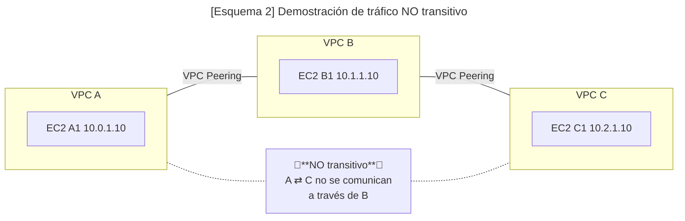

# 3 VPC - Virtual Private Cloud

-> [Índice principal](./Index.md) -> [2.2. IAM - Roles e instancias](./2.2.%20IAM%20-%20Roles%20e%20instancias.md)

-> [Versión en inglés](/SAA-C03/en/nombre del documento.md) **PENDIENTE**

## Índice

- [1. Resumen rápido](#1-resumen-rápido)
- [2. Explicación en detalle](#2-explicación-en-detalle)
- [3. Prácticas Hands-On Labs](#3-prácticas-hands-on-labs)
- [4. Casos de uso](#4-casos-de-uso)
- [5. Notas adicionales](#5-notas-adicionales)
- [6. Recursos oficiales](#6-recursos-oficiales)

## 1. Resumen rápido

💡 **CLAVES PARA EL EXAMEN:**

## 2. Explicación en detalle

Una **Nube Privada Virtual (*Virtual Private Cloud* o *VPC*)** puede entenderse como tener nuestro propio centro de procesamiento de datos (CPD) en la nube: servidores, redes, almacenamiento y seguridad virtualizados y bajo tu control.

**¿Qué características ofrecen las VPCs?**

- Rangos o CIDRs de IP personalizados.
- Subnets
- Tablas de enrutamiento
- Grupos de seguridad
- Conexión a internet
- Control fino del aislamiento y enrutamiento de tus recursos.
- Listas de control de acceso a nivel de red (NACLs)

### Requerimientos y buenas prácticas

- Por defecto nada más crear una cuenta de AWS, viene preconfigurada con una VPC (su CIDR por defecto es 172.31.0.0/16). Esta red es recomendable usarla solo para pruebas y **NO** se debería usar para entornos de producción (ya que en la default VPC, las subnets por defecto vienen con auto-assign public IPv4 activado, por lo que las instancias allí lanzadas recibirán IP pública salvo que lo desactives), por lo tanto, para producción, crea VPC y subnets propias y controla explícitamente el direccionamiento.
- A la hora de crear una VPC, se nos requerirá escoger un rango de IPv4 **privado** con CIDR entre /16 a /28 y siguiendo los rangos de la RFC 1918, que son 10.0.0.0 ; 172.16.0.0 ; 192.168.0.0. Los rangos más comunes según se necesiten más o menos IPs son: 10.0.0.0/8 ; 172.16.0.0/12 y 192.168.0.0/16.
- IPv6 es opcional. Por lo general, una VPC recibe un **/56** y cada subred IPv6 debe ser **/64**. Con **IPAM** puedes gestionar otros tamaños, pero para el examen recuerda **/56 en VPC y /64 en subredes**.
- Es recomendable pensar bien el tipo de bloques que se van a usar de cara a futuro para que luego no sea un problema por falta de IPs y/o tener que volver a reestructurar toda la infraestructura por algo que se podría haber evitado de base.
- Las VPCs se organizan por región (refiriéndose a las diferentes regiones de AWS en el mundo que podemos seleccionar) y están limitadas a 5 por región, por cuenta (por defecto).

### CIDR

Si no tienes conocimientos en redes, esta sección explica brevemente cómo funciona la notación CIDR y en qué consiste.

Voy a usar las direcciones IPv4 por simplicidad, pero las v6 también cumplen esto solo que en un espectro mucho más grande y complejo.

La notación **CIDR (*Classless Inter-Domain Routing*)** se usa para definir redes IP, indicando la cantidad de bits que utilizará la máscara de red.

> 🗒️**Nota**: Para entender mejor la siguiente explicación, utiliza la siguiente web que lo muestra muy fácil: [cidr.xyz](https://cidr.xyz/)

Una IP está conformada por 4 números del 0 al 255, que a su vez son representados en 4 grupos de 8 bits, haciendo un total de 32 bits para representar una IP.

La notación CIDR se usa marcando, a continuación de una IP y seguido de una barra `/`, el número de bits que corresponden a la máscara de red, que indicará la dirección de red (que vendría a ser la parte fija, que no cambia) y haciendo el cálculo se puede saber cuántos bits corresponden a la dirección de dispositivos.

> 🔹**Ejemplo**: [`192.168.1.0/24`](https://cidr.xyz/#192.168.1.0/24) suele ser la más común en ambientes domésticos ya que, si hacemos el cálculo, veremos que la máscara de red se corresponde con:
>
>255.255.255.0 que en binario, los bits se verían así: 1111 1111 . 1111 1111 . 1111 1111 . 0000 0000
>
>Lo que significa que la parte de "192.168.1" no va a cambiar. Mientras que los últimos 8 bits son los que cambian para ser asignados a cada dispositivo. Esto nos da un total de 2^8 = 256 direcciones posibles. De las cuales tenemos que descartar el 0 y la 255 porque son el identificador de red y broadcast, lo que nos deja con 254 IPs disponibles para nuestros dispositivos en casa.
>
> Otra forma de entenderlo es que la dirección de red vendría a representar una calle, las direcciones de los dispositivos representan las casas y el CIDR es la nomenclatura, como el código postal que define la zona de la calle.

Entender y saber calcular el CIDR es **clave** para poder continuar en los siguientes apartados sobre redes, ya que es usado constantemente. Recomiendo ir al apartado de prácticas y probar a realizar actividades para reforzar estos conceptos.

### Puertas de enlace

La **puerta de enlace (*internet Gateway*)** es el portal de acceso a internet que permite a la VPC conectarse a internet. Estas tienen las siguientes características:

- Soporta IPv4 e IPv6.
- Es automáticamente escalable.
- Ofrece alta disponibilidad.
- Es redundante.
- Permite a los recursos de subredes (que tengan direcciones públicas) conectarse a internet.
- Se crean aparte de las VPC y solo pueden estar vinculadas a una VPC a la vez.

### Subredes

Las **subredes (*subnets*)** son rangos de direcciones IP dentro de la VPC donde gestionar nuestros recursos. Pueden tener las siguientes características:

- Están relacionadas a una sola *Availability Zone* (AZ).
- Pueden soportar IPv4 solo, IPv6 solo, y Dual stack (ambos tipos).
- Existen 4 tipos:
  - Públicas: Son aquellas que tienen acceso directo a internet por medio de una puerta de enlace con IPs que pueden ser resueltas de manera pública.
  - Privadas: Son aquellas que no tienen acceso directo a internet por medio de una puerta de enlace y requieren de un dispositivo NAT para ello.
  - Solo VPN: Se verán más adelante.
  - Aisladas: Son aquellas que, como su nombre indica, están aisladas y no hay ningún tipo de conexión por red. Suelen usarse como plantillas o conexiones con VPNs/Direct Connect.

AWS reserva las siguientes direcciones:

- La dirección de red.
- Las 3 primeras direcciones asignables.
- La dirección de broadcast (ya que no se permiten comunicaciones por broadcast)

> 🔹**Ejemplo**: Suponiendo una red con las siguientes características:
>
> *VPC*: 10.0.0.0/16 --- *Subred*: 10.0.0.0/24
>
> 10.0.0.0 -> Reservada por ser **la dirección de red**.
> 10.0.0.1 -> Reservada para el **router VPC**.
> 10.0.0.2 -> Reservada para el **servidor DNS del VPC**.
> 10.0.0.3 -> Reservada para **futuros usos de AWS** (sin especificar a día de hoy).
> 10.0.0.255 -> Reservada **por AWS** ya que no están permitidas las comunicaciones por broadcast.
>
> ⚠️**Importante**: Debemos tener esto en cuenta a la hora de diseñar nuestras redes.

### Tablas de enrutamiento

Las **tablas de enrutamiento (*Route tables*)** son listas de reglas o rutas (de ahí su nombre) que guían el tráfico de red hacia donde debe ir. Hay 2 tipos de tablas de enrutamiento:

- **Main Route Table**: Es la tabla por defecto, creada por AWS automáticamente al crear una VPC. Se aplica implícitamente a cualquier subred no asociada a una tabla personalizada.
- **Custom Route Table**: Serán las tablas que creemos nosotros manualmente para personalizar el tráfico de nuestras subredes.

Algunos conceptos importantes sobre las tablas de enrutamiento:

- **El destino (*Destination*)**: Se refiere al rango de IPs (CIDR) hacia donde quieres dirigir el tráfico.
- **El objetivo (*Target*)**: Puede ser otra puerta de enlace, interfaz de red u otro tipo de conexiones hacia donde el tráfico debería ir.
- **Ruta local (*Local Route*)**: Sirven para guiar los paquetes entre todas las subredes dentro de una misma VPC. Este tipo de rutas no se pueden quitar y son creadas automáticamente dentro de todas las tablas de enrutamiento.
- **Asociaciones (*Associations*)**: Se refiere a la acción de relacionar una tabla de enrutamiento con una subred para que se apliquen las diversas reglas en dicha subred.

> ✅**Mejores prácticas**: Normalmente lo mejor es tener una relación 1:1, es decir, una (1) sola tabla de enrutamiento por subred y viceversa.

### Listas de control de acceso a la red

Las **Listas de control de acceso a la red (*Network Access Control Lists* o *NACL*)** son un recurso que permite o deniega tráfico específico tanto de salida como de entrada al nivel de subred. Podríamos considerarlo como una especie de firewall que no tiene en cuenta el estado y funciona a nivel de subred dentro de AWS. Este tipo de listas tienen las siguientes características:

- Es obligatorio especificar el estado del paquete (ya que se dice que son *stateless*), es decir, si es entrante o saliente.
- Se asigna un NACL por subred. Hay una NACL por defecto si fuera necesario (permite todo el tráfico entrante y saliente), pero es mejor tener una personalizada.
- Por defecto, nada más crearse una NACL personalizada, se deniega todo el tráfico.
- Es una lista ordenada, por lo que se revisará la lista en orden ascendente y en cuanto se encuentre una regla que coincida, la búsqueda se detiene y se aplica esa regla.

Sin embargo, estas listas no pueden filtrar los siguientes tipos de tráfico:

- Amazon Domain Name Services (DNS)
- Amazon Dynamic Host Configuration Protocol (DHCP)
- Amazon EC2 instance Metadata
- Direcciones IP usadas por defecto por el router de la VPC.

### Puertos efímeros

Los **puertos efímeros (*Ephemeral ports*)** son puertos temporales que el sistema operativo abre de manera automática y aleatoria dentro de un rango alto (generalmente entre 1024 y 65535, aunque cada SO define un sub-rango específico).
Se utilizan principalmente en las **conexiones salientes de los clientes**, para que el sistema pueda comunicarse con el servidor sin necesidad de usar siempre el mismo puerto.

> 🔹 **Ejemplo**: Supongamos un servidor web en AWS escuchando en el puerto 80.  
> Un cliente inicia la conexión desde un puerto efímero, por ejemplo el 4302, hacia el 80 del servidor.
> El servidor responde desde su puerto 80 al puerto efímero del cliente, cerrando así el canal de comunicación.
>
> ⚠️ **Importante**: Al configurar reglas de **NACLs** en AWS, debes permitir no solo los puertos de escucha del servidor (ej. 80, 443), sino también el rango de puertos efímeros para el tráfico de retorno, de lo contrario la comunicación fallará.

### Grupos de seguridad

Los **grupos de seguridad (*Security Groups* o *SGs*)** son firewalls virtuales con estado o **stateful** que controlan el tráfico entrante y saliente de los recursos a los que están asociados (por ejemplo, una instancia EC2). Tienen las siguientes características:

- Se aplican a nivel de recurso, no de subred.
- Son **stateful**: si se permite la ida, la vuelta se permite automáticamente.
- Solo definen reglas de **permitir** (Allow). El Deny es implícito.
- Las reglas pueden usar rangos de IP, CIDRs o incluso otros SGs como origen/destino.
- Al asociar varios SGs a una instancia, sus reglas se combinan (suma de permisos).
- Un grupo de seguridad solo puede pertenecer a 1 VPC.

Algunas buenas prácticas son:

- Usar grupos separados por función (ej. *WebServerSG*, *DatabaseSG*).
- Abrir únicamente los puertos necesarios (ej. 80 y 443 para web).
- Limitar accesos administrativos (ej. puerto 22 solo desde la IP del administrador).
- Preferir referencias a otros SGs en lugar de IPs fijas para arquitecturas dinámicas.

> 🔹**Ejemplo**: Servidor web en EC2
>
> - **Inbound**: permitir TCP 80 y 443 desde cualquier IP (`0.0.0.0/0`).  
> - **Outbound**: permitir todo (configuración por defecto).
>
> ⚠️ **Importante**: Al ser *stateful*, no es necesario configurar explícitamente el retorno: si se permite la entrada, la salida correspondiente está permitida automáticamente.

### Diferencias entre NACLs y Security Groups

Es muy importante entender la diferencia entre las NACL y los SG, ya que estos a pesar de cumplir funciones distintas, no son excluyentes, son características complementarias que añaden capas extras de seguridad a nuestra distribución. A continuación encontrarás una tabla con las diferencias para que entiendas cuándo se usa una u otra.

> 🗒️**Nota**: Podrás encontrar casos más prácticos en el apartado de [4. Casos de uso](#4-casos-de-uso).

| Característica       | **Security Groups (SG)** | **Network ACLs (NACL)** |
| -------------------- | ------------------------ | ----------------------- |
| Nivel de aplicación  | A nivel de **instancia o interfaz de red (ENI)** | A nivel de **subred** |
| Tipo de firewall     | **Con estado (stateful)** | **Sin estado (stateless)** |
| Permisos             | Solo permiten **Allow** (lo no permitido se deniega implícitamente) | Permiten **Allow y Deny** explícitos |
| Evaluación de reglas | Todas las reglas se evalúan juntas (no hay orden numérico) | Se evalúan en orden numérico (de menor a mayor) hasta encontrar coincidencia |
| Flujo de tráfico     | Si se permite una dirección (entrada o salida), la respuesta contraria se permite automáticamente | Se deben crear reglas de ida **y** de vuelta |
| Alcance              | Se asocian directamente a recursos (EC2, ENI, Load Balancers...) | Se asocian a subredes completas |
| Facilidad de gestión | Más simples y fáciles de mantener | Más complejas, útiles para control granular o capas extra de seguridad |

Si no te queda claro y crees que son demasiados conceptos que se refieren a lo mismo, debes pensar en todos estos ellos como AWS pretende que lo veas: en una defensa por capas, cada una más restrictiva que la anterior. A continuación tienes un esquema muy visual de cómo se organizan todas estas capas que hemos visto:


### DHCP Option Sets

Los **Sets de opciones DHCP (*DHCP Option Sets*)** son una serie de ajustes de red que usarán los dispositivos que pongamos en nuestra VPC.

> 🗒️**Nota**: Si no has oído hablar de lo que es el DHCP, es un servicio que asigna automáticamente direcciones IP y configuraciones de red a los dispositivos para que puedan comunicarse dentro de una red sin tener que hacerlo manualmente.

Entre los ajustes disponibles están:

- Servidores DNS.
- Nombres de dominio (*Domain Names*).
- Servidores NTP (*Network Time Protocol*).
- Habilitar o no la resolución de nombres (DNS) dentro de una VPC.

> ⚠️**Importante**:
>
> - Un mismo set de opciones DHCP puede ser compartido entre varios VPC; cada VPC solo puede tener un set asociado.
> - Una vez aplicado el Set de opciones, este **NO** puede ser modificado, **se debe crear uno nuevo** y reasignarlo al VPC en cuestión. (Esto está hecho adrede por diseño para evitar fallos humanos que causen la caída instantánea de la red, forzando al administrador asegurarse de que quiere aplicar esos cambios, permitiendo así que se siga la filosofía de AWS "infraestructura inmutable")

Debemos saber además que:

- Cada región de AWS tiene un set de opciones por defecto.
- Cada VPC usa por defecto el set de opciones de su región a menos que se indique lo contrario.
- Se puede crear y asociar un set de opciones personalizado con una VPC o prescindir de DHCP a nivel de instancia (config manual), según la necesidad.

### Emparejamiento de VPCs

El **Emparejamiento de VPCs (*VPC Peering*)** es una manera directa, segura y sin interrupciones en el servicio de permitir la comunicación entre VPCs, tanto dentro de una misma cuenta así como entre cuentas de AWS e incluso entre regiones. Esta característica permite que nuestros recursos se puedan comunicar sin que el tráfico salga de AWS.

Para poder hacer uso de esta característica debemos tener en cuenta que:

- Las VPCs emparejadas no pueden tener CIDR superpuestos, es decir, se deben usar rangos de CIDR distintos para poder diferenciar el tráfico entre redes.
- El emparejamiento no permite el tráfico transitivo (por defecto), es decir, debe haber emparejamiento **directo** entre VPCs para poder hacer llegar el tráfico hasta otra VPC por más que haya otras VPCs que podrían hacer de intermediarias. (Véase el Esquema 2)
- Las Route Tables deben actualizarse correctamente para permitir el flujo del tráfico a través de esta característica.



### NAT

La **Traducción de direcciones de red (*Network Address Translation*, *NAT*)** es un servicio que se encarga de traducir las direcciones privadas a públicas y viceversa, permitiendo así la comunicación entre diferentes tipos de direcciones y redes (normalmente entre un grupo de direcciones de una red privada e internet, haciendo que el tráfico salga ocupando solo una IP pública).

#### Puertas de enlace NAT

Dentro de AWS existen las **Puertas de enlace NAT (*NAT Gateways*)**, permitiendo a las instancias de una subred privada puedan comunicarse con redes externas, pero sin que servicios externos inicialicen una conexión con dichas instancias. Esto permite:

- Privacidad: Permite a una subred conectarse a internet, VPCs emparejados o a redes on-premise.
- Seguridad: La subred queda protegida de comunicaciones no solicitadas provenientes del exterior.
- Escalabilidad: Es automáticamente escalable con alta capacidad.
- Comodidad: Es más fácil de mantener ya que se vinculan a toda una zona de disponibilidad (AZ), y usan una sola **dirección IP elástica (*Elastic IP Address*)**.

> 🗒️**Nota**: Una Elastic IP es una IP pública estática administrada por AWS, que puedes reasignar entre recursos dentro de tu cuenta, y que permanece fija hasta que la liberes.
> ⚠️**Importante**: Debes desplegar un dispositivo NAT dentro de una subred pública para permitir el acceso a internet

```mermaid
  ---
  title: "[Esquema 3] NAT Gateway y NACLs — Control del tráfico en subredes privadas"
  ---
  flowchart LR
    subgraph "🌍"
      I[Internet]
    end

    subgraph Public_Subnet["Subred pública (con NAT e IGW)"]
      NGW[NAT Gateway<br/>❌ sin Security Group]
      IGW[Internet Gateway]
    end

    subgraph Private_Subnet["Subred privada (con EC2)"]
      EC2[EC2 Instance<br/>Security Group ✅]
    end

    EC2 -->|"Tráfico saliente (HTTP/HTTPS)"| NGW
    NGW -->|"NAT: privada → pública (Elastic IP)"| IGW
    IGW --> I

    I -->|"Respuestas a conexiones iniciadas desde dentro"| IGW
    IGW --> NGW --> EC2

    N1["ℹ️ NACL controla a nivel de subred"]
    N2["ℹ️ El control fino va en SG de la instancia"]
    Public_Subnet -.-> N1
    Private_Subnet -.-> N2
```

> ✅**Buenas Prácticas**:
>
> - Para una auténtica resiliencia (High Availability), se debe desplegar una NAT Gateway en múltiples zonas de disponibilidad (AZ), y deberemos tener cuidado con los costes (Cost Optimization).
> - No se asignan grupos de seguridad (SG) a las puertas de enlace NAT, no está pensado para controlarse de esta forma. Para eso están los SG en las propias instancias EC2, así como las NACLs.

#### Instancias NAT

Antes de que existieran las puertas de enlace NAT, se usaba y configuraba manualmente una instancia EC2 para poder realizar la función de NAT, esto se las conocía como **instancias NAT (*NAT Instance*)**. Esto es una práctica desfasada y debería de evitarse su uso, pero tal vez aparezca en el examen ya que era algo muy común. Se dejó de usar también porque no era fácilmente escalable y requería de mayor mantenimiento.

Si fuera necesario hacer uso de una instancia NAT, debemos acordarnos de desactivar dentro del sistema operativo la comprobación de origen/destino de las direcciones.

## 3. Prácticas Hands-On Labs

## 4. Casos de uso

## 5. Notas adicionales

## 6. Recursos oficiales

---

*Siguiente lección: [4.](./4.%20)*
