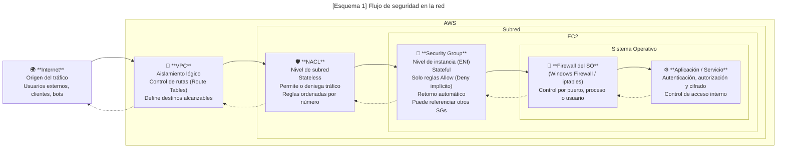
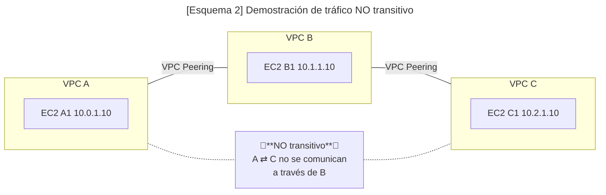
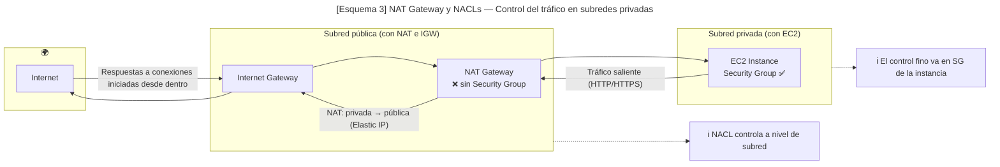
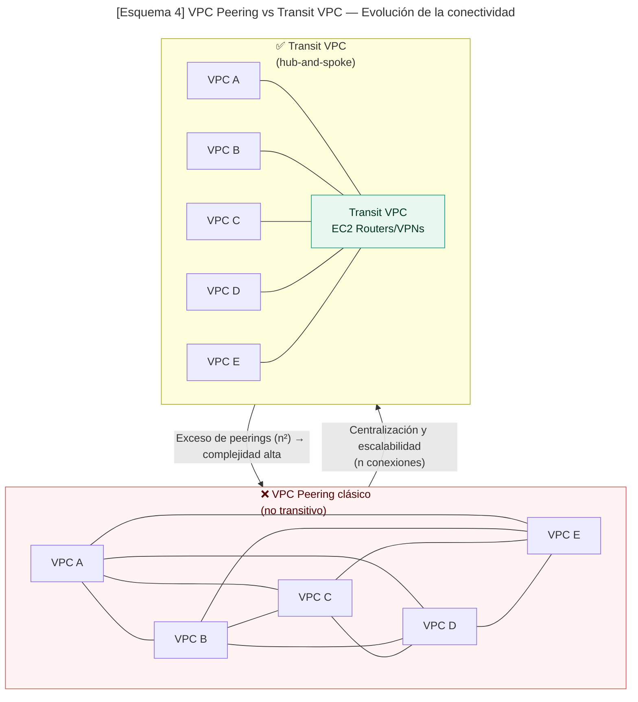
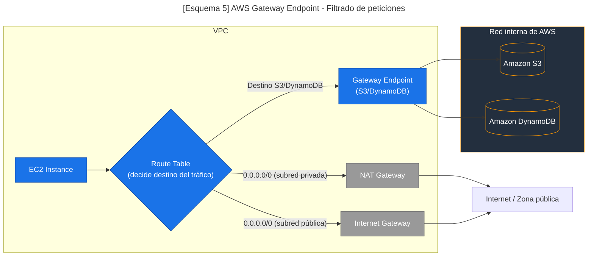
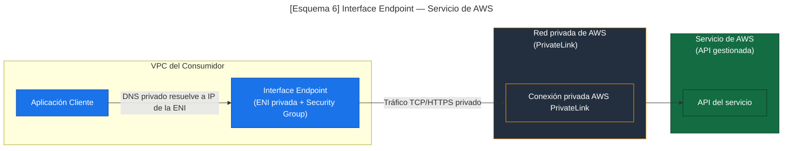
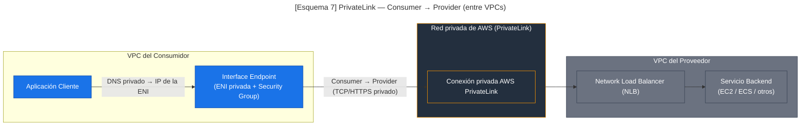

# 3. VPC - Virtual Private Cloud

-> [Índice principal](./Index.md) -> [2.2. IAM - Roles e instancias](./2.2.%20IAM%20-%20Roles%20e%20instancias.md)

-> [Versión en inglés](/SAA-C03/en/nombre del documento.md) **PENDIENTE**

## Índice

- [1. Resumen rápido](#1-resumen-rápido)
- [2. Explicación en detalle](#2-explicación-en-detalle)
  - [Requerimientos y buenas prácticas](#requerimientos-y-buenas-prácticas)
  - [CIDR](#cidr)
  - [Puertas de enlace](#puertas-de-enlace)
  - [Subredes](#subredes)
  - [Tablas de enrutamiento](#tablas-de-enrutamiento)
  - [Listas de control de acceso a la red (NACLs)](#listas-de-control-de-acceso-a-la-red)
  - [Puertos efímeros](#puertos-efímeros)
  - [Grupos de seguridad](#grupos-de-seguridad)
  - [Diferencias entre NACLs y Security Groups](#diferencias-entre-nacls-y-security-groups)
  - [DHCP Option Sets](#dhcp-option-sets)
  - [Emparejamiento de VPCs (VPC Peering)](#emparejamiento-de-vpcs)
  - [NAT (Network Address Translation)](#nat)
    - [Puertas de enlace NAT](#puertas-de-enlace-nat)
    - [Instancias NAT](#instancias-nat)
  - [VPCs Transitivas](#vpcs-transitivas)
  - [VPC Endpoints](#vpc-endpoints)
    - [Gateway Endpoints](#gateway-endpoints)
    - [Interface Endpoints](#interface-endpoints)
      - [AWS PrivateLink](#aws-privatelink)
- [3. Prácticas Hands-On Labs](#3-prácticas-hands-on-labs)
- [4. Casos de uso](#4-casos-de-uso)
- [5. Notas adicionales](#5-notas-adicionales)
- [6. Recursos oficiales](#6-recursos-oficiales)

## 1. Resumen rápido

💡 **CLAVES PARA EL EXAMEN**

- **VPC, CIDR y subredes**
  - Una **VPC** es una red virtual privada completamente aislada, donde defines tus propios rangos de IP y controlas el flujo del tráfico.  
  - Los rangos válidos siguen la **RFC 1918**: `10.0.0.0/8`, `172.16.0.0/12` y `192.168.0.0/16`.  
  - El tamaño del bloque IPv4 debe estar entre **/16 y /28**, mientras que en IPv6 AWS asigna un bloque **/56** a la VPC y **/64** a cada subred.  
  - Las **subredes públicas** son las que tienen una ruta `0.0.0.0/0 → IGW`; las **privadas** no tienen acceso directo a Internet y dependen de un **NAT Gateway** o de **VPC Endpoints**.  
  - La **Route Table** es quien decide el destino del tráfico: `local`, `IGW`, `NAT`, `Gateway Endpoint`, `Peering`, `TGW` o `VGW`.  
  - Mantener una relación **1:1 entre subred y tabla de enrutamiento** es una buena práctica por claridad y control.

- **Security Groups y NACLs**
  - Los **Security Groups (SG)** son **stateful (con estado)**, lo que significa que si se permite una dirección de entrada, la respuesta de salida se permite automáticamente.  
  - Las **NACLs (Network ACLs)** son **stateless (sin estado)**: necesitan reglas explícitas tanto para entrada como para salida.  
  - Los SG operan a **nivel de recurso o interfaz de red (ENI)**; las NACL lo hacen a **nivel de subred**.  
  - Los SG solo admiten **Allow**, mientras que las NACL admiten **Allow y Deny**.  
  - En el examen, suelen plantear preguntas sobre qué capa bloquea el tráfico: recuerda que NACLs evalúan por orden numérico y SGs combinan todas las reglas.

- **Puertos efímeros y tráfico de retorno**
  - Los **puertos efímeros (1024–65535)** son usados por las instancias al iniciar conexiones salientes.  
  - Si no se permite ese rango en las NACLs, las respuestas de retorno fallarán.  
  - Pregunta típica del examen: “La instancia puede iniciar conexión pero no recibe respuesta”; la solución suele ser **abrir puertos efímeros** en la NACL.

- **Internet Gateway (IGW) y NAT Gateway**
  - El **IGW** permite a las instancias con IP pública comunicarse con Internet, tanto de entrada como de salida.  
  - El **NAT Gateway** permite a las instancias privadas iniciar tráfico saliente a Internet **sin recibir tráfico entrante**.  
  - El **NAT Gateway** tiene **coste por hora y por GB**, y debe desplegarse **por AZ** para lograr alta disponibilidad.  
  - Un error común en el examen es olvidar que las instancias privadas **necesitan una ruta 0.0.0.0/0 → NAT Gateway** para salir a Internet.

- **VPC Peering**
  - El **VPC Peering** conecta dos VPCs directamente, sin necesidad de un gateway ni VPN.  
  - Es **no transitivo**: si A está conectado a B y B a C, A no puede comunicarse con C a través de B.  
  - Requiere **CIDR no solapados** y **rutas actualizadas** en ambas VPCs.  
  - Pregunta clásica: identificar un escenario donde el tráfico entre tres VPCs no fluye → respuesta: “El Peering no es transitivo”.

- **VPC Transitiva y AWS Transit Gateway**
  - Antes se usaban **Transit VPCs**, con instancias EC2 actuando como routers, para permitir conectividad transitiva.  
  - Hoy en día, se usa **AWS Transit Gateway (TGW)**, que centraliza el enrutamiento entre múltiples VPCs y redes on-premises.  
  - TGW ofrece conectividad **transitiva, escalable y gestionada**, evitando configuraciones manuales.  
  - En el examen, si ves muchas VPCs interconectadas o una arquitectura tipo “hub-and-spoke”, la respuesta será **Transit Gateway**.

- **VPC Endpoints**
  - Los **VPC Endpoints** permiten que una VPC acceda a servicios de AWS **sin pasar por Internet**, usando la red interna de Amazon.  
  - Existen **dos tipos**: **Gateway Endpoints** y **Interface Endpoints**.  
  - Son una pieza fundamental para entornos privados, ya que eliminan la necesidad de un NAT Gateway o VPN.

  - **Gateway Endpoints**
    - Se integran directamente en la **Route Table**, sin crear ENIs ni consumir IPs.  
    - Solo funcionan con **Amazon S3** y **DynamoDB**.  
    - Son **gratuitos** y altamente disponibles.  
    - Añaden una entrada del tipo `com.amazonaws.region.s3 → vpce-xxxxxx` en la tabla de rutas.  
    - Recomendado en el examen cuando se mencione “acceso privado a S3 sin costo adicional”.

  - **Interface Endpoints**
    - Crean una **ENI privada** dentro de una subred y pueden asociarse a **Security Groups**.  
    - Usan **AWS PrivateLink** para enrutar el tráfico de forma privada hacia el servicio.  
    - Permiten acceder a docenas de **servicios de AWS (SSM, ECR, KMS, etc.)** o SaaS externos.  
    - Tienen **coste por hora + tráfico**, pero ofrecen control granular y compatibilidad con DNS privado.  
    - En preguntas de examen, si se menciona “acceso privado a KMS, ECR o SSM”, la respuesta será **Interface Endpoint**.

- **AWS PrivateLink**
  - Es la **tecnología subyacente** que hace posible los Interface Endpoints.  
  - Conecta un servicio (a través de un **NLB** en la VPC del proveedor) con una **ENI privada** en la VPC del consumidor.  
  - La comunicación es **unidireccional (Consumer → Provider)** y viaja completamente dentro del **backbone de AWS**.  
  - Se usa para compartir servicios entre cuentas o exponer APIs internas de forma privada, sin Peering ni exposición pública.  
  - Pregunta típica: “¿Cómo exponer un servicio interno a otra cuenta sin abrir la red?” → Respuesta: **PrivateLink con NLB + Interface Endpoint**.

- **DHCP Option Sets**
  - Permiten configurar el dominio interno, DNS y servidores NTP usados por las instancias en la VPC.  
  - Cada VPC puede tener un solo set asociado, y los cambios requieren **crear uno nuevo** (no se modifican en caliente).  
  - Por defecto, AWS usa `AmazonProvidedDNS`, pero en entornos empresariales se puede usar un dominio interno (por ejemplo, `corp.local`).  
  - En el examen, recuerda: *DHCP Option Sets son inmutables y deben reasignarse si cambian.*

- **Buenas prácticas generales**
  - Diseña subredes distribuidas en **múltiples AZs** para garantizar alta disponibilidad.  
  - Usa **tags** descriptivos para identificar recursos (rutas, NATs, endpoints).  
  - Prioriza el **tráfico privado** (VPC Endpoints) sobre el público (NAT/IGW) por seguridad y costo.  
  - Usa **NACLs** como barrera exterior y **SGs** como control de acceso interno.  
  - Asegúrate de entender **el flujo completo del tráfico**:  
    1. Route Table decide el destino.  
    2. NACL filtra a nivel de subred.  
    3. SG controla acceso a nivel de instancia.  
    4. Firewall del SO o aplicación gestiona el control final.

## 2. Explicación en detalle

Una **Nube Privada Virtual (*Virtual Private Cloud* o *VPC*)** puede entenderse como tener nuestro propio centro de procesamiento de datos (CPD) en la nube: servidores, redes, almacenamiento y seguridad virtualizados y bajo tu control.

**¿Qué características ofrecen las VPCs?**

- Rangos o CIDRs de IP personalizados.
- Subnets
- Tablas de enrutamiento
- Grupos de seguridad
- Conexión a Internet
- Control fino del aislamiento y enrutamiento de tus recursos.
- Listas de control de acceso a nivel de red (NACLs)

### Requerimientos y buenas prácticas

- Por defecto nada más crear una cuenta de AWS, viene preconfigurada con una VPC (su CIDR por defecto es 172.31.0.0/16). Esta red es recomendable usarla solo para pruebas y **NO** se debería usar para entornos de producción (ya que en la default VPC, las subnets por defecto vienen con auto-assign public IPv4 activado, por lo que las instancias allí lanzadas recibirán IP pública salvo que lo desactives), por lo tanto, para producción, crea VPC y subnets propias y controla explícitamente el direccionamiento.
- A la hora de crear una VPC, se nos requerirá escoger un rango de IPv4 **privado** con CIDR entre /16 a /28 y siguiendo los rangos de la RFC 1918, que son 10.0.0.0 ; 172.16.0.0 ; 192.168.0.0. Los rangos más comunes según se necesiten más o menos IPs son: 10.0.0.0/8 ; 172.16.0.0/12 y 192.168.0.0/16.
- IPv6 es opcional. Por lo general, una VPC recibe un **/56** y cada subred IPv6 debe ser **/64**. Con **IPAM** puedes gestionar otros tamaños, pero para el examen recuerda **/56 en VPC y /64 en subredes**.
- Es recomendable pensar bien el tipo de bloques que se van a usar de cara a futuro para que luego no sea un problema por falta de IPs y/o tener que volver a reestructurar toda la infraestructura por algo que se podría haber evitado de base.
- Las VPCs se organizan por región (refiriéndose a las diferentes regiones de AWS en el mundo que podemos seleccionar) y están limitadas a 5 por región, por cuenta (por defecto, aumentable por ticket).

### CIDR

Si no tienes conocimientos en redes, esta sección explica brevemente cómo funciona la notación CIDR y en qué consiste.

Voy a usar las direcciones IPv4 por simplicidad, pero las v6 también cumplen esto solo que en un espectro mucho más grande y complejo.

La notación **CIDR (*Classless Inter-Domain Routing*)** se usa para definir redes IP, indicando la cantidad de bits que utilizará la máscara de red.

> 🗒️**Nota**: Para entender mejor la siguiente explicación, utiliza la siguiente web que lo muestra muy fácil: [cidr.xyz](https://cidr.xyz/)

Una IP está conformada por 4 números del 0 al 255, que a su vez son representados en 4 grupos de 8 bits, haciendo un total de 32 bits para representar una IP.

La notación CIDR se usa marcando, a continuación de una IP y seguido de una barra `/`, el número de bits que corresponden a la máscara de red, que indicará la dirección de red (que vendría a ser la parte fija, que no cambia) y haciendo el cálculo se puede saber cuántos bits corresponden a la dirección de dispositivos.

> 🔹**Ejemplo**: [`192.168.1.0/24`](https://cidr.xyz/#192.168.1.0/24) suele ser la más común en ambientes domésticos ya que, si hacemos el cálculo, veremos que la máscara de red se corresponde con:
>
>255.255.255.0 que en binario, los bits se verían así: 1111 1111 . 1111 1111 . 1111 1111 . 0000 0000
>
>Lo que significa que la parte de "192.168.1" no va a cambiar. Mientras que los últimos 8 bits son los que cambian para ser asignados a cada dispositivo. Esto nos da un total de 2^8 = 256 direcciones posibles. De las cuales tenemos que descartar el 0 y la 255 porque son el identificador de red y broadcast, lo que nos deja con 254 IPs disponibles para nuestros dispositivos en casa.
>
> Otra forma de entenderlo es que la dirección de red vendría a representar una calle, las direcciones de los dispositivos representan las casas y el CIDR es la nomenclatura, como el código postal que define la zona de la calle.

Entender y saber calcular el CIDR es **clave** para poder continuar en los siguientes apartados sobre redes, ya que es usado constantemente. Recomiendo ir al apartado de prácticas y probar a realizar actividades para reforzar estos conceptos.

### Puertas de enlace

La **puerta de enlace (*Internet Gateway*)** es el portal de acceso a Internet que permite a la VPC conectarse a Internet. Estas tienen las siguientes características:

- Soporta IPv4 e IPv6.
- Es automáticamente escalable.
- Ofrece alta disponibilidad.
- Es redundante.
- Permite a los recursos de subredes (que tengan direcciones públicas) conectarse a Internet.
- Se crean aparte de las VPC y solo pueden estar vinculadas a una VPC a la vez.

### Subredes

Las **subredes (*subnets*)** son rangos de direcciones IP dentro de la VPC donde gestionar nuestros recursos. Pueden tener las siguientes características:

- Están relacionadas a una sola *Availability Zone* (AZ).
- Pueden soportar IPv4 solo, IPv6 solo, y Dual stack (ambos tipos).
- Existen 4 tipos:
  - Públicas: Son aquellas que tienen acceso directo a Internet por medio de una puerta de enlace con IPs que pueden ser resueltas de manera pública.
  - Privadas: Son aquellas que no tienen acceso directo a Internet por medio de una puerta de enlace y requieren de un dispositivo NAT para ello.
  - Solo VPN: Se verán más adelante.
  - Aisladas: Son aquellas que, como su nombre indica, están aisladas y no hay ningún tipo de conexión por red. Suelen usarse como plantillas o conexiones con VPNs/Direct Connect.

AWS reserva las siguientes direcciones:

- La dirección de red.
- Las 3 primeras direcciones asignables.
- La dirección de broadcast (ya que no se permiten comunicaciones por broadcast)

> 🔹**Ejemplo**: Suponiendo una red con las siguientes características:
>
> *VPC*: 10.0.0.0/16 --- *Subred*: 10.0.0.0/24
>
> 10.0.0.0 -> Reservada por ser **la dirección de red**.
> 10.0.0.1 -> Reservada para el **router VPC**.
> 10.0.0.2 -> Reservada para el **servidor DNS del VPC**.
> 10.0.0.3 -> Reservada para **futuros usos de AWS** (sin especificar a día de hoy).
> 10.0.0.255 -> Reservada **por AWS** ya que no están permitidas las comunicaciones por broadcast.

> ⚠️**Importante**: Debemos tener esto en cuenta a la hora de diseñar nuestras redes.

### Tablas de enrutamiento

Las **tablas de enrutamiento (*Route tables*)** son listas de reglas o rutas (de ahí su nombre) que guían el tráfico de red hacia donde debe ir dentro de una subred. Hay 2 tipos de tablas de enrutamiento:

- **Main Route Table**: Es la tabla por defecto, creada por AWS automáticamente al crear una VPC. Se aplica implícitamente a cualquier subred no asociada a una tabla personalizada.
- **Custom Route Table**: Serán las tablas que creemos nosotros manualmente para personalizar el tráfico de nuestras subredes.

Algunos conceptos importantes sobre las tablas de enrutamiento:

- **El destino (*Destination*)**: Se refiere al rango de IPs (CIDR) hacia donde quieres dirigir el tráfico.
- **El objetivo (*Target*)**: Puede ser otra puerta de enlace, interfaz de red u otro tipo de conexiones hacia donde el tráfico debería ir.
- **Ruta local (*Local Route*)**: Sirven para guiar los paquetes entre todas las subredes dentro de una misma VPC. Este tipo de rutas no se pueden quitar y son creadas automáticamente dentro de todas las tablas de enrutamiento.
- **Asociaciones (*Associations*)**: Se refiere a la acción de relacionar una tabla de enrutamiento con una subred para que se apliquen las diversas reglas en dicha subred.

> ✅**Mejores prácticas**: Normalmente lo mejor es tener una relación 1:1, es decir, una (1) sola tabla de enrutamiento por subred y viceversa.

### Listas de control de acceso a la red

Las **Listas de control de acceso a la red (*Network Access Control Lists* o *NACL*)** son un recurso que permite o deniega tráfico específico tanto de salida como de entrada al nivel de subred. Podríamos considerarlo como una especie de firewall que no tiene en cuenta el estado y funciona a nivel de subred dentro de AWS. Este tipo de listas tienen las siguientes características:

- Es obligatorio especificar el estado del paquete (ya que se dice que son *stateless*), es decir, si es entrante o saliente.
- Se asigna un NACL por subred. Hay una NACL por defecto si fuera necesario (permite todo el tráfico entrante y saliente), pero es mejor tener una personalizada.
- Por defecto, nada más crearse una NACL personalizada, se deniega todo el tráfico.
- Es una lista ordenada, por lo que se revisará la lista en orden ascendente y en cuanto se encuentre una regla que coincida, la búsqueda se detiene y se aplica esa regla.

Sin embargo, estas listas no pueden filtrar los siguientes tipos de tráfico:

- Amazon Domain Name Services (DNS)
- Amazon Dynamic Host Configuration Protocol (DHCP)
- Amazon EC2 instance Metadata
- Direcciones IP usadas por defecto por el router de la VPC.

### Puertos efímeros

Los **puertos efímeros (*Ephemeral ports*)** son puertos temporales que el sistema operativo abre de manera automática y aleatoria dentro de un rango alto (generalmente entre 1024 y 65535, aunque cada SO define un sub-rango específico).
Se utilizan principalmente en las **conexiones salientes de los clientes**, para que el sistema pueda comunicarse con el servidor sin necesidad de usar siempre el mismo puerto.

> 🔹 **Ejemplo**: Supongamos un servidor web en AWS escuchando en el puerto 80.  
> Un cliente inicia la conexión desde un puerto efímero, por ejemplo el 4302, hacia el 80 del servidor.
> El servidor responde desde su puerto 80 al puerto efímero del cliente, cerrando así el canal de comunicación.

> ⚠️ **Importante**: Al configurar reglas de **NACLs** en AWS, debes permitir no solo los puertos de escucha del servidor (ej. 80, 443), sino también el rango de puertos efímeros para el tráfico de retorno, de lo contrario la comunicación fallará.

### Grupos de seguridad

Los **grupos de seguridad (*Security Groups* o *SGs*)** son firewalls virtuales con estado o **stateful** que controlan el tráfico entrante y saliente de los recursos a los que están asociados (por ejemplo, una instancia EC2). Tienen las siguientes características:

- Se aplican a nivel de recurso, no de subred.
- Son **stateful**: si se permite la ida, la vuelta se permite automáticamente.
- Solo definen reglas de **permitir** (Allow). El Deny es implícito.
- Las reglas pueden usar rangos de IP, CIDRs o incluso otros SGs como origen/destino.
- Al asociar varios SGs a una instancia, sus reglas se combinan (suma de permisos).
- Un grupo de seguridad solo puede pertenecer a 1 VPC.

Algunas buenas prácticas son:

- Usar grupos separados por función (ej. *WebServerSG*, *DatabaseSG*).
- Abrir únicamente los puertos necesarios (ej. 80 y 443 para web).
- Limitar accesos administrativos (ej. puerto 22 solo desde la IP del administrador).
- Preferir referencias a otros SGs en lugar de IPs fijas para arquitecturas dinámicas.

> 🔹**Ejemplo**: Servidor web en EC2
>
> - **Inbound**: permitir TCP 80 y 443 desde cualquier IP (`0.0.0.0/0`).  
> - **Outbound**: permitir todo (configuración por defecto).

> ⚠️ **Importante**: Al ser *stateful*, no es necesario configurar explícitamente el retorno: si se permite la entrada, la salida correspondiente está permitida automáticamente.

### Diferencias entre NACLs y Security Groups

Es muy importante entender la diferencia entre las NACL y los SG, ya que estos a pesar de cumplir funciones distintas, no son excluyentes, son características complementarias que añaden capas extras de seguridad a nuestra distribución. A continuación encontrarás una tabla con las diferencias para que entiendas cuándo se usa una u otra.

> 🗒️**Nota**: Podrás encontrar casos más prácticos en el apartado de [4. Casos de uso](#4-casos-de-uso).

| Característica       | **Security Groups (SG)** | **Network ACLs (NACL)** |
| -------------------- | ------------------------ | ----------------------- |
| Nivel de aplicación  | A nivel de **instancia o interfaz de red (ENI)** | A nivel de **subred** |
| Tipo de firewall     | **Con estado (stateful)** | **Sin estado (stateless)** |
| Permisos             | Solo permiten **Allow** (lo no permitido se deniega implícitamente) | Permiten **Allow y Deny** explícitos |
| Evaluación de reglas | Todas las reglas se evalúan juntas (no hay orden numérico) | Se evalúan en orden numérico (de menor a mayor) hasta encontrar coincidencia |
| Flujo de tráfico     | Si se permite una dirección (entrada o salida), la respuesta contraria se permite automáticamente | Se deben crear reglas de ida **y** de vuelta |
| Alcance              | Se asocian directamente a recursos (EC2, ENI, Load Balancers...) | Se asocian a subredes completas |
| Facilidad de gestión | Más simples y fáciles de mantener | Más complejas, útiles para control granular o capas extra de seguridad |

Si no te queda claro y crees que son demasiados conceptos que se refieren a lo mismo, debes pensar en todos estos ellos como AWS pretende que lo veas: en una defensa por capas, cada una más restrictiva que la anterior. A continuación tienes un esquema muy visual de cómo se organizan todas estas capas que hemos visto:

> 🗒️**Nota**: Un Elastic Network Interface (ENI) es, en términos simples, una interfaz de red virtual dentro de una VPC —equivalente a una tarjeta de red en un entorno físico.
> Cada ENI tiene su propia dirección IP privada (y opcionalmente pública), un grupo de seguridad asociado y otros atributos de red. Se verá más adelante en profundidad.

### DHCP Option Sets

Los **Sets de opciones DHCP (*DHCP Option Sets*)** son una serie de ajustes de red que usarán los dispositivos que pongamos en nuestra VPC.

> 🗒️**Nota**: Si no has oído hablar de lo que es el DHCP, es un servicio que asigna automáticamente direcciones IP y configuraciones de red a los dispositivos para que puedan comunicarse dentro de una red sin tener que hacerlo manualmente.

Entre los ajustes disponibles están:

- Servidores DNS.
- Nombres de dominio (*Domain Names*).
- Servidores NTP (*Network Time Protocol*).
- Habilitar o no la resolución de nombres (DNS) dentro de una VPC.

> ⚠️**Importante**:
>
> - Un mismo set de opciones DHCP puede ser compartido entre varias VPC; cada VPC solo puede tener un set asociado.
> - Una vez aplicado el Set de opciones, este **NO** puede ser modificado, **se debe crear uno nuevo** y reasignarlo al VPC en cuestión. (Esto está hecho adrede por diseño para evitar fallos humanos que causen la caída instantánea de la red, forzando al administrador asegurarse de que quiere aplicar esos cambios, permitiendo así que se siga la filosofía de AWS "infraestructura inmutable")

Debemos saber además que:

- Cada región de AWS tiene un set de opciones por defecto.
- Cada VPC usa por defecto el set de opciones de su región a menos que se indique lo contrario.
- Se puede crear y asociar un set de opciones personalizado con una VPC o prescindir de DHCP a nivel de instancia (config manual), según la necesidad.

### Emparejamiento de VPCs

El **Emparejamiento de VPCs (*VPC Peering*)** es una manera directa, segura y sin interrupciones en el servicio de permitir la comunicación entre VPCs, tanto dentro de una misma cuenta así como entre cuentas de AWS e incluso entre regiones. Esta característica permite que nuestros recursos se puedan comunicar sin que el tráfico salga de AWS.

Para poder hacer uso de esta característica debemos tener en cuenta que:

- Las VPCs emparejadas no pueden tener CIDR superpuestos, es decir, se deben usar rangos de CIDR distintos para poder diferenciar el tráfico entre redes.
- El emparejamiento no permite el tráfico transitivo (por defecto), es decir, debe haber emparejamiento **directo** entre VPCs para poder hacer llegar el tráfico hasta otra VPC por más que haya otras VPCs que podrían hacer de intermediarias. (Véase el Esquema 2)
- Las Route Tables deben actualizarse correctamente para permitir el flujo del tráfico a través de esta característica.

### NAT

La **Traducción de direcciones de red (*Network Address Translation*, *NAT*)** es un servicio que se encarga de traducir las direcciones privadas a públicas y viceversa, permitiendo así la comunicación entre diferentes tipos de direcciones y redes (normalmente entre un grupo de direcciones de una red privada e Internet, haciendo que el tráfico salga ocupando solo una IP pública).

#### Puertas de enlace NAT

Dentro de AWS existen las **Puertas de enlace NAT (*NAT Gateways*)**, permitiendo que las instancias de una subred privada puedan comunicarse con redes externas, pero sin que servicios externos inicialicen una conexión con dichas instancias. Esto permite:

- Privacidad: Permite a una subred conectarse a Internet, VPCs emparejados o a redes on-premise.
- Seguridad: La subred queda protegida de comunicaciones no solicitadas provenientes del exterior.
- Escalabilidad: Es automáticamente escalable con alta capacidad.
- Comodidad: Es más fácil de mantener ya que se vinculan a toda una zona de disponibilidad (AZ), y usan una sola **dirección IP elástica (*Elastic IP Address*)**.

> 🗒️**Nota**: Una Elastic IP es una IP pública estática administrada por AWS, que puedes reasignar entre recursos dentro de tu cuenta, y que permanece fija hasta que la liberes.

> ⚠️**Importante**: Debes desplegar un dispositivo NAT dentro de una subred pública para permitir el acceso a Internet.

> ✅**Buenas Prácticas**:
>
> - Para una auténtica resiliencia (High Availability), se debe desplegar una NAT Gateway en múltiples zonas de disponibilidad (AZ), y deberemos tener cuidado con los costes (Cost Optimization).
> - No se asignan grupos de seguridad (SG) a las puertas de enlace NAT, no está pensado para controlarse de esta forma. Para eso están los SG en las propias instancias EC2, así como las NACLs.

#### Instancias NAT

Antes de que existieran las puertas de enlace NAT, se usaba y configuraba manualmente una instancia EC2 para poder realizar la función de NAT, esto se las conocía como **instancias NAT (*NAT Instance*)**. Esto es una práctica desfasada y debería de evitarse su uso, pero tal vez aparezca en el examen ya que era algo muy común. Se dejó de usar también porque no era fácilmente escalable y requería de mayor mantenimiento.

Si fuera necesario hacer uso de una instancia NAT, debemos acordarnos de desactivar dentro del sistema operativo la comprobación de origen/destino de las direcciones.

### VPCs Transitivas

Una **VPC Transitiva (*Transit VPC*)** es una red que actúa como punto central de enrutamiento, permitiendo la interconexión entre múltiples VPCs y/o redes on-premises.
Esta VPC usa instancias EC2 funcionando como routers, encargadas de reenviar el tráfico entre las distintas redes conectadas.

Este método era una solución común para entornos con muchas VPCs, ya que el VPC Peering clásico tiene limitaciones importantes como:

- Un máximo de 50 peerings por VPC (por defecto, aumentable)
- No es transitivo haciendo que la gestión de las tablas de enrutamiento fuera caótica y sujeta a errores humanos.
- No permite la conexión con redes on-premises.

Cuando el número de VPCs aumentaba, la cantidad de emparejamientos necesarios crecía de manera exponencial, volviendo la gestión prácticamente inmanejable.
Al establecer una VPC transitiva, aunque el coste y la complejidad técnica eran mayores (por tener que mantener instancias EC2, túneles VPN redundantes y rutas personalizadas), la administración de red se volvía más centralizada y escalable, justificando su coste.
Además, permitía conectar entornos on-premises y evitar los límites de VPC Peering.

Hoy en día, este patrón ha sido reemplazado casi por completo por *AWS Transit Gateway*, que ofrece las mismas capacidades —conectividad transitiva, centralización y alta disponibilidad— de forma nativa, gestionada y sin necesidad de instancias EC2. Veremos este método más adelante en configuraciones de VPC más avanzadas.

>🔹 **Ejemplo**:
>
> En una red con 5 VPCs, serían necesarias 10 conexiones de peering para que todas pudieran comunicarse entre sí directamente, además de tener que modificar manualmente las tablas de enrutamiento en cada una de ellas al añadir una nueva VPC.
>
> Con una VPC transitiva actuando como router, bastaba con crear una conexión IPSec desde cada VPC hacia la VPC central y actualizar solo las tablas de enrutamiento de ambos extremos.
>
> El enrutamiento complejo quedaba delegado a las instancias EC2 que funcionaban como routers dentro de la Transit VPC.
>
> Puedes ver un ejemplo de esta problemática en el siguiente esquema 4.

### VPC Endpoints

Los **Puntos de conexión de VPC (*VPC Endpoints*)** permiten conectar tu VPC de forma privada con servicios de AWS sin necesidad de pasar por Internet, VPNs o NAT Gateways.
Esto se logra a través de la red interna de Amazon, garantizando seguridad, baja latencia y sin costo adicional por transferencia hacia Internet.

En la práctica, un **VPC Endpoint** actúa como una “puerta privada” entre tu VPC y un servicio de AWS.
Existen **dos tipos principales** de VPC Endpoints:

- **Gateway Endpoints**, que se integran directamente en las tablas de enrutamiento.
- **Interface Endpoints**, que crean interfaces de red (ENIs) dentro de tus subredes privadas.

A continuación, se explican ambos en detalle.

#### Gateway Endpoints

Los **Puntos de conexión de puerta de enlace (*Gateway Endpoints*)** son el tipo más sencillo de VPC Endpoint.
Permiten conectar tu VPC directamente con **Amazon S3** y **DynamoDB**, los únicos dos servicios compatibles con este tipo, sin necesidad de usar Internet Gateway, NAT Gateway ni VPN.

En lugar de enviar el tráfico hacia Internet, el Gateway Endpoint crea una **ruta interna gestionada por AWS**.
Así, cuando una instancia dentro de tu VPC intenta acceder a un bucket de S3 o a una tabla de DynamoDB, el tráfico se mantiene dentro del backbone de AWS, sin salir jamás a la red pública.

A diferencia de los Interface Endpoints, los Gateway Endpoints **no utilizan ENIs (Elastic Network Interfaces)** ni direcciones IP dentro de subredes.
Se integran directamente en las **Route Tables** de la VPC, donde se añade una entrada con destino al servicio (por ejemplo, `com.amazonaws.eu-west-1.s3`) y como destino el endpoint creado.

Estos endpoints son **gratuitos**, **altamente disponibles** y **seguros por diseño**, ya que no exponen tráfico a Internet ni requieren mantenimiento.

#### Interface Endpoints

Los **Puntos de conexión de interfaz de red (*Interface Endpoints*)** permiten acceder de forma privada a otros servicios de AWS o aplicaciones alojadas en AWS a través de una **ENI (Elastic Network Interface)** creada dentro de tu subred.
Cada Interface Endpoint recibe una o más direcciones IP privadas, que actúan como punto de acceso local al servicio.

Estos endpoints pueden conectarse a decenas de servicios gestionados de AWS (por ejemplo, CloudWatch, SSM, ECR, KMS, etc.) y también a servicios SaaS externos publicados en AWS Marketplace o por otras cuentas.

El tráfico se enruta de manera privada: cuando una instancia dentro de tu VPC realiza una solicitud, el DNS interno resuelve automáticamente el nombre del servicio hacia la dirección IP privada del endpoint, sin salir nunca a Internet.

A diferencia de los Gateway Endpoints, los Interface Endpoints **sí tienen costo**, tanto por hora de uso como por datos transferidos, y pueden asociarse a grupos de seguridad (Security Groups) para controlar el acceso.

##### AWS PrivateLink

**AWS PrivateLink** es la tecnología que hace posible la comunicación privada de los Interface Endpoints.
Mientras que el VPC Peering conecta redes completas (a nivel de capa 3), PrivateLink conecta **servicios específicos** (a nivel de capa 4, TCP), permitiendo exponer o consumir recursos concretos sin compartir toda la red.

En este modelo:

- El **proveedor (Provider)** publica su servicio mediante un **Network Load Balancer (NLB)** en su VPC.
- El **consumidor (Consumer)** crea un **Interface Endpoint (ENI privada)** en su VPC, el cual se conecta internamente al NLB a través del backbone de AWS.
- El tráfico fluye de forma privada, directa y unidireccional (Consumer → Provider), sin atravesar Internet.

Una vez configurado, las peticiones del consumidor se resuelven mediante DNS privado hacia la dirección IP del endpoint, enviando el tráfico directamente al servicio publicado en la otra VPC o cuenta.

> 🔹 **Ejemplos:**
>
> Si VPC Peering conecta dos edificios enteros por un túnel, AWS PrivateLink sería una puerta secreta que une una oficina concreta de un edificio con otra del edificio opuesto.
>
> El tráfico no circula por calles públicas (Internet), sino por un pasaje interno y seguro bajo tierra (la red privada de AWS).

## 3. Prácticas Hands-On Labs

## 4. Casos de uso

- **Creación de una VPC personalizada**: se diseña una red aislada con su propio rango CIDR, separada de la VPC por defecto, para tener control total del direccionamiento y las subredes.
- **Definición del rango CIDR**: una empresa necesita 4000 direcciones IP privadas para distintos entornos (dev, test, prod), por lo que elige un bloque **10.0.0.0/20** y lo subdivide en varias subredes /24.
- **Subredes públicas y privadas**: una aplicación web se despliega en una subred pública (con acceso a Internet) mientras que la base de datos se aloja en una subred privada sin exposición externa.
- **Puerta de enlace a Internet (IGW)**: una instancia EC2 en una subred pública requiere acceso a Internet para atender peticiones de clientes; se crea una **Internet Gateway** y se añade la ruta `0.0.0.0/0 → IGW` en la tabla correspondiente.
- **Puerta de enlace NAT**: las instancias de una subred privada necesitan descargar actualizaciones sin exponerse; se crea una **NAT Gateway** en la subred pública, añadiendo la ruta `0.0.0.0/0 → NAT` en la tabla de las subredes privadas.
- **Tablas de enrutamiento personalizadas**: una organización divide su VPC en múltiples entornos (producción, pruebas, administración) y crea una tabla de rutas distinta para cada grupo de subredes, manteniendo independencia y control de tráfico.
- **Listas de control de acceso (NACLs)**: se implementan reglas de NACL para permitir tráfico HTTP (80) y HTTPS (443) en una subred pública, y se bloquean rangos IP no confiables para reducir exposición a ataques externos.
- **Security Groups (SGs)**: una base de datos RDS solo acepta conexiones entrantes desde instancias con el SG `WebServerSG`, bloqueando el acceso desde cualquier otra fuente.
- **Puertos efímeros**: una aplicación cliente necesita abrir conexiones salientes hacia un servicio remoto; se habilitan los puertos efímeros (1024–65535) en las NACLs para permitir el tráfico de retorno y evitar bloqueos inesperados.
- **DHCP Option Sets personalizados**: una empresa con dominio interno `corp.local` crea un DHCP Option Set que usa su propio servidor DNS y lo asigna a la VPC, garantizando resolución de nombres interna coherente.
- **VPC Peering**: dos VPCs (producción y analítica) necesitan intercambiar datos sin salir de AWS; se establece un **VPC Peering** directo y se actualizan las tablas de enrutamiento para permitir tráfico entre ambas.
- **Limitación del Peering no transitivo**: tres VPCs (A, B y C) se conectan en cadena mediante Peering; A no puede comunicarse con C porque el tráfico no es transitivo, lo que obliga a establecer un nuevo Peering o usar un **Transit Gateway**.
- **Transit Gateway (TGW)**: una empresa multinacional con múltiples VPCs en distintas regiones conecta todas ellas a través de un **Transit Gateway**, centralizando la gestión del tráfico y simplificando el enrutamiento.
- **Gateway Endpoint (S3/DynamoDB)**: instancias privadas necesitan acceder a un bucket S3 para subir backups; se crea un **Gateway Endpoint**, eliminando la necesidad de usar un NAT Gateway y evitando costos adicionales.
- **Interface Endpoint (PrivateLink)**: un servicio interno de facturación necesita comunicarse de forma privada con **AWS KMS** y **CloudWatch Logs**; se crean **Interface Endpoints** en las subredes privadas para garantizar conectividad segura.
- **PrivateLink entre cuentas**: una empresa expone su API de inventario como servicio privado mediante **PrivateLink**; los clientes internos crean un **Interface Endpoint** para consumir la API sin abrir conexiones públicas ni usar VPC Peering.
- **Control por capas (SG + NACL)**: un entorno de producción combina NACLs para bloquear tráfico externo no deseado y SGs para permitir solo las comunicaciones internas necesarias entre servicios (por ejemplo, Web → DB).
- **Pruebas con subredes aisladas**: un entorno de laboratorio crea una subred “aislada” sin IGW ni NAT para validar comportamientos de aplicaciones desconectadas y probar mecanismos de alta seguridad.
- **Acceso híbrido on-premises – AWS**: una red corporativa local se conecta a una VPC mediante **VPN Site-to-Site** o **Direct Connect**, permitiendo acceso privado a recursos en la nube sin usar Internet público.
- **Implementación dual-stack IPv4/IPv6**: una empresa comienza la transición a IPv6 habilitando **dual stack** en la VPC; los servicios reciben tanto direcciones IPv4 como IPv6, asegurando compatibilidad sin interrumpir la red existente.

## 5. Notas adicionales

Bufff... ¿Ha sido bastante, verdad?

Este apartado es uno de los más densos, pero también de los más importantes para entender la red interna de AWS.  
Espero que los esquemas te hayan ayudado a visualizar mejor el flujo del tráfico y los distintos componentes.

Recuerda que la **teoría es solo la mitad del camino**: dominar las VPC realmente llega cuando pones todo esto en práctica.  
Crea tus propias subredes, experimenta con NAT Gateways, prueba VPC Peering, y sobre todo **observa cómo el tráfico fluye** según tus tablas de enrutamiento y reglas de seguridad.

Más adelante veremos conceptos más avanzados relacionados con todo esto y que hemos mencionado por encima —como VPNs o Transit Gateways— que consolidarán todo lo aprendido aquí.

Por ahora, con todo lo que has llegado hasta este punto, ya tienes una base sólida para comprender y diseñar arquitecturas seguras y eficientes en AWS.

💪 ¡Mucho ánimo y sigue construyendo!

## 6. Recursos oficiales

- [Amazon VPC User Guide](https://docs.aws.amazon.com/vpc/latest/userguide/what-is-amazon-vpc.html)
- [Route Tables - Amazon VPC](https://docs.aws.amazon.com/vpc/latest/userguide/VPC_Route_Tables.html)
- [Security Groups - Amazon EC2](https://docs.aws.amazon.com/AWSEC2/latest/UserGuide/ec2-security-groups.html)
- [Network ACLs - Amazon VPC](https://docs.aws.amazon.com/vpc/latest/userguide/vpc-network-acls.html)
- [NAT Gateways - Amazon VPC](https://docs.aws.amazon.com/vpc/latest/userguide/vpc-nat-gateway.html)
- [VPC Peering - Amazon VPC](https://docs.aws.amazon.com/vpc/latest/peering/what-is-vpc-peering.html)
- [AWS Transit Gateway Documentation](https://docs.aws.amazon.com/vpc/latest/tgw/what-is-transit-gateway.html)
- [VPC Endpoints - Amazon VPC](https://docs.aws.amazon.com/vpc/latest/privatelink/vpc-endpoints.html)
- [AWS PrivateLink Overview](https://docs.aws.amazon.com/vpc/latest/privatelink/what-is-privatelink.html)
- [DHCP Option Sets - Amazon VPC](https://docs.aws.amazon.com/vpc/latest/userguide/VPC_DHCP_Options.html)

---

*Siguiente lección: [4.](./4.%20)*
