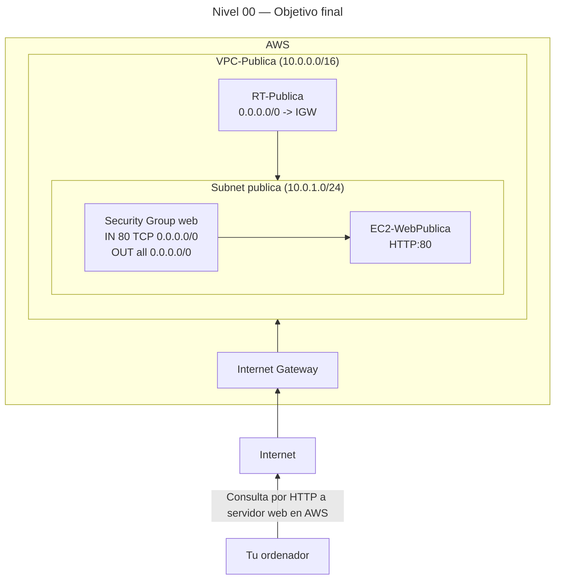
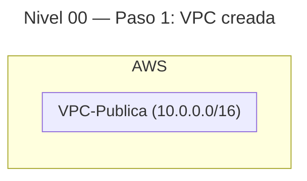
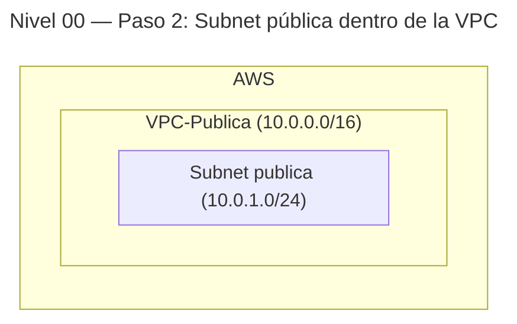
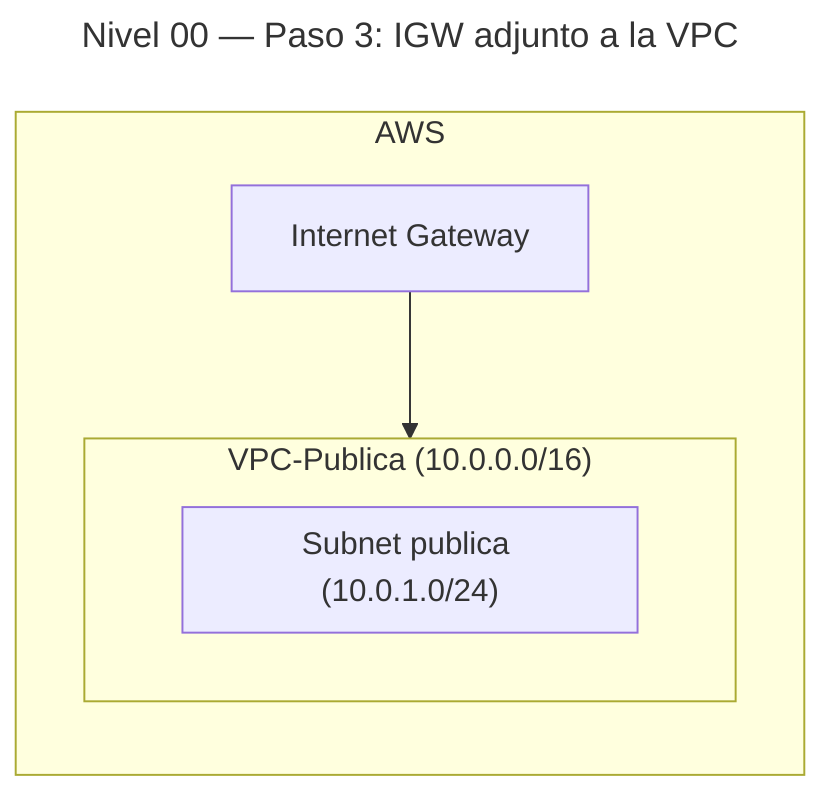
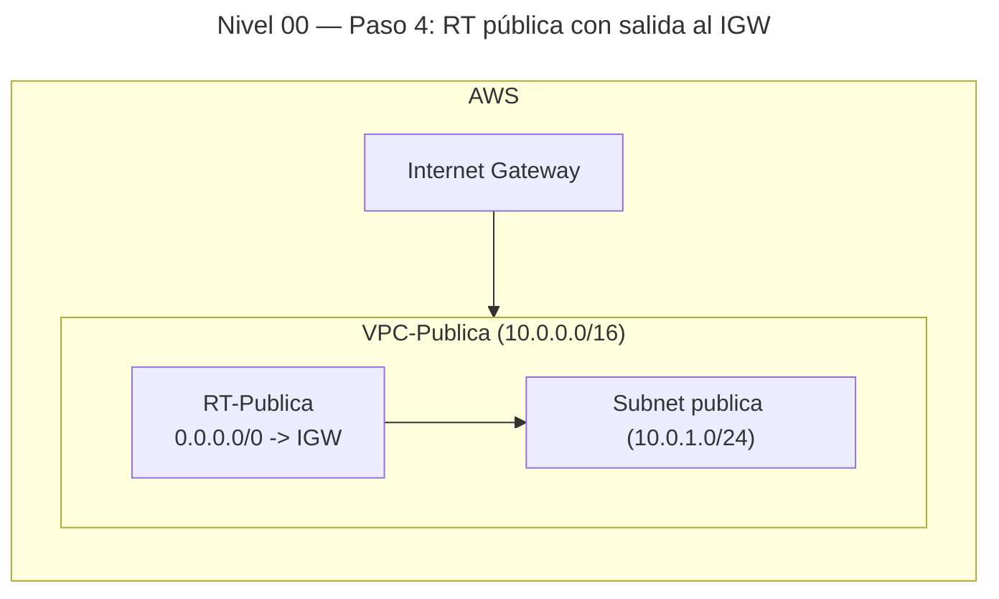
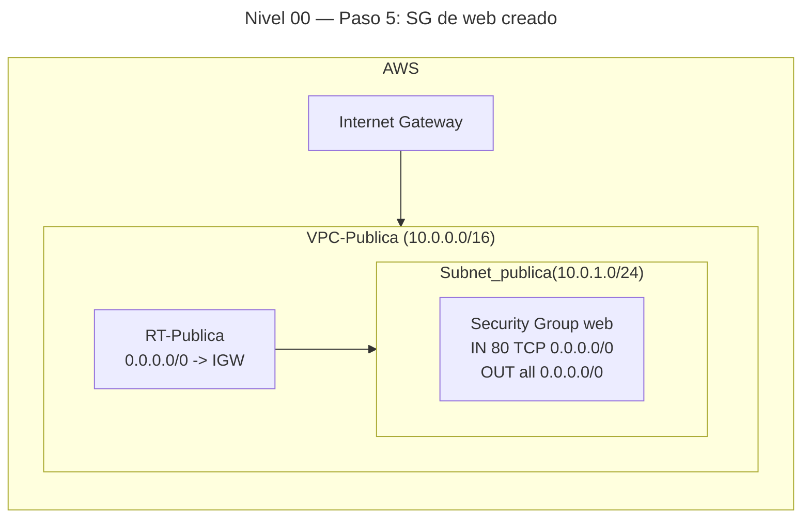
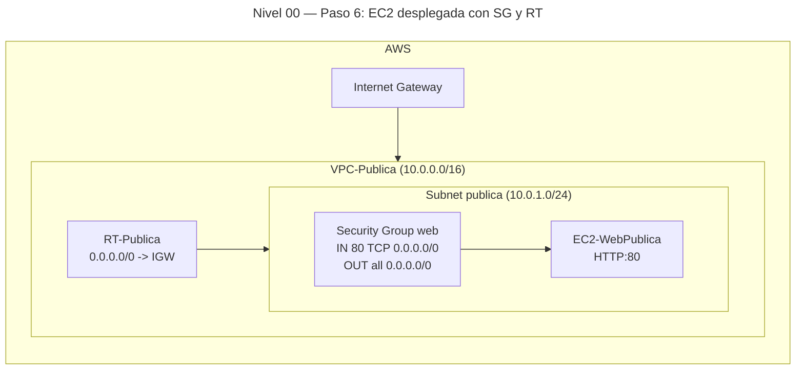
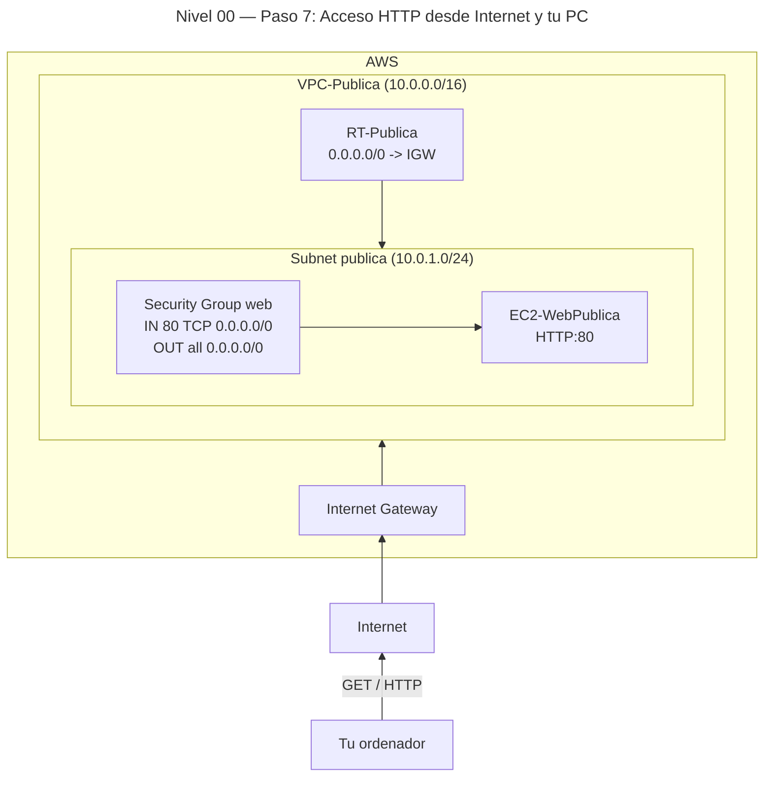

# 🥉 Nivel 00 — Fácil

Crea tu primera **VPC pública** y conéctate a un **servidor web** (HTTP)

**[Enlace rápido al apartado para practicar con CLI](#️-usando-la-cli-en-cloudshell-command-line-interface)**

## 🖱️ Usando la GUI (Graphical User Interface)

### 🎯 Objetivo

Construir una **VPC** con **subred pública**, **Internet Gateway**, **tabla de rutas pública**, **Security Group** de web y una **instancia EC2** que sirva una página en **HTTP (80)** accesible desde Internet.

### 🧱 Requisitos previos

- Tener acceso a la **Consola de AWS** en una región (ejemplo: **eu-west-1**).
- No necesitas par de claves si no vas a hacer SSH en este nivel (usaremos **User data**).
- Mantén **siempre la misma región** en toda la práctica.

---

### 🗺️ Arquitectura objetivo (resultado final)



---

### 🔧 Paso 1 — Crear la VPC

1. En la consola: **VPC** → **Your VPCs** → **Create VPC**.
2. **Resources to create**: marca **VPC only**.
3. **Name tag**: `VPC-Publica`
4. **IPv4 CIDR**: `10.0.0.0/16`
5. Deja el resto por defecto → **Create VPC**.

**Progresión (tras paso 1):**



---

### 🔧 Paso 2 — Crear la Subnet pública

1. **Subnets** → **Create subnet**.
2. **VPC ID**: selecciona `VPC-Publica`.
3. **Subnet name**: `subnet-pub-a`
4. **Availability Zone**: `eu-west-1a` (o la que prefieras en tu región).
5. **IPv4 CIDR block**: `10.0.1.0/24`
6. **Create subnet**.
7. (Opcional) Activa la IP pública por defecto: Subnet → **Edit subnet settings** → **Enable auto-assign public IPv4 address** → **Save**.
   *(Si no lo activas aquí, lo habilitaremos al lanzar la instancia.)*

**Progresión (tras paso 2):**



---

### 🔧 Paso 3 — Crear y adjuntar el Internet Gateway (IGW)

1. **Internet Gateways** → **Create internet gateway**.
2. **Name tag**: `IGW-Publica` → **Create internet gateway**.
3. Selecciónalo → **Actions** → **Attach to VPC** → `VPC-Publica` → **Attach**.

**Progresión (tras paso 3):**



---

### 🔧 Paso 4 — Crear Route Table pública y asociarla a la Subnet

1. **Route Tables** → **Create route table**.
2. **Name**: `RT-Publica` → **VPC**: `VPC-Publica` → **Create route table**.
3. Pestaña **Routes** → **Edit routes** → **Add route**:
   - **Destination**: `0.0.0.0/0`
   - **Target**: selecciona **Internet Gateway** → `IGW-Publica`
   - **Save changes**
4. Pestaña **Subnet associations** → **Edit subnet associations** → marca `subnet-pub-a` → **Save associations**.

**Progresión (tras paso 4):**



---

### 🔧 Paso 5 — Crear el Security Group para HTTP

1. **Security Groups** → **Create security group**.
2. **Security group name**: `SG-WebPublica`
3. **Description**: `SG web publico Nivel 00`
4. **VPC**: `VPC-Publica`
5. **Inbound rules** → **Add rule**:
   - **Type**: `HTTP`
   - **Port range**: `80` (se rellena solo)
   - **Source**: `0.0.0.0/0` (acceso desde Internet)
6. **Outbound rules**: deja **All traffic** → `0.0.0.0/0`
7. **Create security group**

**Progresión (tras paso 5):**



---

### 🔧 Paso 6 — Lanzar la EC2 con User data (Apache)

1. **EC2** → **Instances** → **Launch instances**.
2. **Name**: `EC2-WebPublica`
3. **Application and OS Images (AMI)**: **Amazon Linux 2023**
4. **Instance type**: `t2.micro` (o `t3.micro` si está disponible)
5. **Key pair (login)**: `Proceed without a key pair` (en este nivel no haremos SSH)
6. **Network settings**:
   - **VPC**: `VPC-Publica`
   - **Subnet**: `subnet-pub-a`
   - **Auto-assign public IP**: `Enable` (si no lo habilitaste en la Subnet)
   - **Firewall (security groups)**: **Select existing** → `SG-WebPublica`
7. **Advanced details** → **User data** (pega el siguiente script):
   - Instala Apache y publica una página simple.
8. **Launch instance**.

```bash
#!/bin/bash
set -euxo pipefail
dnf -y update
dnf -y install httpd
echo "<h1>Bienvenido a mi primer servidor en AWS</h1>" > /var/www/html/index.html
systemctl enable httpd
systemctl start httpd
```

**Progresión (tras paso 6):**



---

### 🔎 Paso 7 — Verificación

1. En **EC2 → Instances**, abre `EC2-WebPublica`.
2. Copia la **IPv4 Public IP**.
3. Prueba en tu navegador: `http://IP_PUBLICA`
4. Deberías ver: **“Bienvenido a mi primer servidor en AWS”**.  
   (También puedes probar con `curl` desde tu PC.)

**Progresión (verificación):**



---

### 🧯 Problemas típicos

- No abre la web: revisa **SG** (entrada **HTTP 80** desde `0.0.0.0/0`).
- Sin salida a Internet: revisa **Route Table** (ruta `0.0.0.0/0 → IGW`) y **asociación** a la Subnet.
- Página en blanco: comprueba en la instancia (System Log) si el **User data** se ejecutó:
  - `cloud-init-output.log` (en **EC2 → Instance → Monitor and troubleshoot → System log**).

---

### 🧹 Limpieza (GUI)

1. **EC2 → Instances**: selecciona `EC2-WebPublica` → **Instance state** → **Terminate instance**.
2. **Security Groups**: borra `SG-WebPublica`.
3. **Route Tables**: desasocia la Subnet y borra `RT-Publica`.
4. **Internet Gateways**: **Detach** de `VPC-Publica` y **Delete** `IGW-Publica`.
5. **Subnets**: borra `subnet-pub-a`.
6. **VPCs**: borra `VPC-Publica`.

---
---
---
---
---

## ⌨️ Usando la CLI en CloudShell (Command Line Interface)

Crea tu primera **VPC pública** y conéctate a un **servidor web** (HTTP)

> Trabajaremos desde **AWS CloudShell** (icono de terminal en la parte superior de la consola).  
> CloudShell ya viene autenticado con tus permisos y usa la **misma región** que tengas seleccionada en la consola. En esta guía incluimos `--region eu-west-1` para dejarlo explícito.

### 🧱 Requisitos previos (CLI)

- Abre **CloudShell** en la **misma región** donde hiciste la GUI (ej.: **eu-west-1**).
- No necesitas par de claves (no haremos SSH).

---

### 🔎 Paso 0 — Comprobar identidad y región

```bash
aws sts get-caller-identity --region eu-west-1
aws configure get region
```

*(Estos comandos confirman quién eres y qué región usa tu CLI. Si `aws configure get region` no devuelve nada, los siguientes comandos usarán `--region eu-west-1` explícito.)*

---

### 🔧 Paso 1 — Crear VPC

```bash
aws ec2 create-vpc \
  --cidr-block 10.0.0.0/16 \
  --tag-specifications 'ResourceType=vpc,Tags=[{Key=Name,Value=VPC-Publica}]' \
  --region eu-west-1
```

- **Qué hace:** crea una VPC con CIDR `10.0.0.0/16` y etiqueta **Name=VPC-Publica**.
- **Salida importante:** copia el valor `VpcId` (ej.: `vpc-0abc...`). Lo usaremos como **<VPC_ID>** en los siguientes pasos.

---

### 🔧 Paso 2 — Crear Subnet pública

```bash
aws ec2 create-subnet \
  --vpc-id <VPC_ID> \
  --cidr-block 10.0.1.0/24 \
  --availability-zone eu-west-1a \
  --tag-specifications 'ResourceType=subnet,Tags=[{Key=Name,Value=subnet-pub-a}]' \
  --region eu-west-1
```

- **Qué hace:** crea la Subnet `10.0.1.0/24` en la AZ `eu-west-1a` dentro de tu VPC y la etiqueta con **Name=subnet-pub-a**.
- **Salida importante:** copia `SubnetId` (ej.: `subnet-0abc...`) como **<SUBNET_ID>**.

*(Opcional) Asignar IP pública automática en la Subnet:*

```bash
aws ec2 modify-subnet-attribute \
  --subnet-id <SUBNET_ID> \
  --map-public-ip-on-launch \
  --region eu-west-1
```

- **Qué hace:** hace que las instancias de esta Subnet reciban IP pública por defecto.

---

### 🔧 Paso 3 — Crear y adjuntar el Internet Gateway

```bash
aws ec2 create-internet-gateway \
  --tag-specifications 'ResourceType=internet-gateway,Tags=[{Key=Name,Value=IGW-Publica}]' \
  --region eu-west-1
```

- **Qué hace:** crea un IGW etiquetado **Name=IGW-Publica**.
- **Salida importante:** copia `InternetGatewayId` como **<IGW_ID>**.

```bash
aws ec2 attach-internet-gateway \
  --internet-gateway-id <IGW_ID> \
  --vpc-id <VPC_ID> \
  --region eu-west-1
```

- **Qué hace:** adjunta el IGW a tu VPC.

---

### 🔧 Paso 4 — Crear Route Table pública, ruta por defecto y asociación

```bash
aws ec2 create-route-table \
  --vpc-id <VPC_ID> \
  --tag-specifications 'ResourceType=route-table,Tags=[{Key=Name,Value=RT-Publica}]' \
  --region eu-west-1
```

- **Qué hace:** crea una tabla de rutas en tu VPC con etiqueta **Name=RT-Publica**.
- **Salida importante:** copia `RouteTableId` como **<RT_ID>**.

```bash
aws ec2 create-route \
  --route-table-id <RT_ID> \
  --destination-cidr-block 0.0.0.0/0 \
  --gateway-id <IGW_ID> \
  --region eu-west-1
```

- **Qué hace:** añade la ruta por defecto `0.0.0.0/0 → IGW`.

```bash
aws ec2 associate-route-table \
  --subnet-id <SUBNET_ID> \
  --route-table-id <RT_ID> \
  --region eu-west-1
```

- **Qué hace:** asocia la Subnet a la **RT-Publica** (para que use la salida al IGW).

---

### 🔧 Paso 5 — Crear Security Group (HTTP 80)

```bash
aws ec2 create-security-group \
  --group-name SG-WebPublica \
  --description "SG web publico Nivel 00" \
  --vpc-id <VPC_ID> \
  --region eu-west-1
```

- **Qué hace:** crea un SG llamado **SG-WebPublica** en tu VPC.
- **Salida importante:** copia `GroupId` como **<SG_ID>**.

```bash
aws ec2 authorize-security-group-ingress \
  --group-id <SG_ID> \
  --protocol tcp --port 80 \
  --cidr 0.0.0.0/0 \
  --region eu-west-1
```

- **Qué hace:** permite tráfico **HTTP (80)** desde cualquier origen (**Internet**).
- **Outbound:** por defecto está en **allow all** (suficiente para este nivel).

*(Opcional) Permitir SSH (22) solo desde tu IP pública:*

```bash
# Obtén tu IP pública y añade /32 manualmente; reemplaza <TU_IP_PUBLICA/32> abajo
aws ec2 authorize-security-group-ingress \
  --group-id <SG_ID> \
  --protocol tcp --port 22 \
  --cidr <TU_IP_PUBLICA/32> \
  --region eu-west-1
```

---

### 🔧 Paso 6 — Preparar User data y AMI (Amazon Linux 2023)

**Crear archivo `user-data.sh` en CloudShell:**

```bash
cat > user-data.sh <<'EOF'
#!/bin/bash
set -euxo pipefail
dnf -y update
dnf -y install httpd
echo "<h1>Bienvenido a mi primer servidor en AWS</h1>" > /var/www/html/index.html
systemctl enable httpd
systemctl start httpd
EOF
```

- **Qué hace:** crea un script que instala Apache, escribe una página y arranca el servicio.

**Obtener el ID de AMI (Amazon Linux 2023) vía SSM:**

```bash
aws ssm get-parameters \
  --names /aws/service/ami-amazon-linux-latest/al2023-ami-kernel-6.1-x86_64 \
  --region eu-west-1
```

- **Qué hace:** devuelve un JSON con la AMI más reciente.  
  Copia el valor de `Parameters[0].Value` como **<AMI_ID>**.

---

### 🔧 Paso 7 — Lanzar la instancia EC2

```bash
aws ec2 run-instances \
  --image-id <AMI_ID> \
  --instance-type t2.micro \
  --subnet-id <SUBNET_ID> \
  --associate-public-ip-address \
  --security-group-ids <SG_ID> \
  --user-data file://user-data.sh \
  --tag-specifications 'ResourceType=instance,Tags=[{Key=Name,Value=EC2-WebPublica}]' \
  --region eu-west-1
```

- **Qué hace cada parámetro principal:**
  - `--image-id`: AMI de Amazon Linux 2023 que copiaste arriba.
  - `--instance-type`: tamaño `t2.micro`.
  - `--subnet-id`: tu Subnet pública.
  - `--associate-public-ip-address`: fuerza IP pública al lanzar.
  - `--security-group-ids`: SG con HTTP 80 abierto.
  - `--user-data`: script para instalar y arrancar Apache.
  - `--tag-specifications`: etiqueta **Name=EC2-WebPublica**.

**Esperar a que esté en running:**

```bash
aws ec2 describe-instances --filters "Name=tag:Name,Values=EC2-WebPublica" --region eu-west-1
# Revisa 'State.Name' en la salida JSON hasta ver 'running'
```

**Obtener la IP pública:**

```bash
aws ec2 describe-instances \
  --filters "Name=tag:Name,Values=EC2-WebPublica" \
  --region eu-west-1
# Copia el campo 'PublicIpAddress' manualmente como <PUBLIC_IP>
```

---

### ✅ Paso 8 — Verificación

Desde CloudShell o tu equipo:

```bash
curl http://<PUBLIC_IP>
# Esperado: HTML con "Bienvenido a mi primer servidor en AWS"
```

---

### 🧯 Troubleshooting rápido

- Si `curl` no devuelve la página:
  - Revisa que el **SG** permita **HTTP 80** desde `0.0.0.0/0`.
  - Confirma que la **Route Table** asociada a la Subnet tiene `0.0.0.0/0 → <IGW_ID>`.
  - Comprueba el **User data** en el log de sistema de la instancia (EC2 → Instance → System log).

---

### 🧹 Limpieza (CLI)

#### 1) Terminar la instancia

```bash
aws ec2 describe-instances \
  --filters "Name=tag:Name,Values=EC2-WebPublica" \
  --region eu-west-1
# Copia manualmente el 'InstanceId' como <INSTANCE_ID>
```

```bash
aws ec2 terminate-instances \
  --instance-ids <INSTANCE_ID> \
  --region eu-west-1
```

#### 2) Borrar Security Group

```bash
aws ec2 delete-security-group \
  --group-id <SG_ID> \
  --region eu-west-1
```

#### 3) Desasociar y borrar Route Table

```bash
aws ec2 describe-route-tables --route-table-ids <RT_ID> --region eu-west-1
# Busca la asociación con tu Subnet y copia su 'RouteTableAssociationId' como <RT_ASSOC_ID>
```

```bash
aws ec2 disassociate-route-table \
  --association-id <RT_ASSOC_ID> \
  --region eu-west-1
```

```bash
aws ec2 delete-route-table \
  --route-table-id <RT_ID> \
  --region eu-west-1
```

#### 4) Desacoplar y borrar IGW

```bash
aws ec2 detach-internet-gateway \
  --internet-gateway-id <IGW_ID> \
  --vpc-id <VPC_ID> \
  --region eu-west-1
```

```bash
aws ec2 delete-internet-gateway \
  --internet-gateway-id <IGW_ID> \
  --region eu-west-1
```

#### 5) Borrar Subnet y VPC

```bash
aws ec2 delete-subnet \
  --subnet-id <SUBNET_ID> \
  --region eu-west-1
```

```bash
aws ec2 delete-vpc \
  --vpc-id <VPC_ID> \
  --region eu-west-1
```

#### 6) Limpiar archivo local

```bash
rm -f user-data.sh
```
