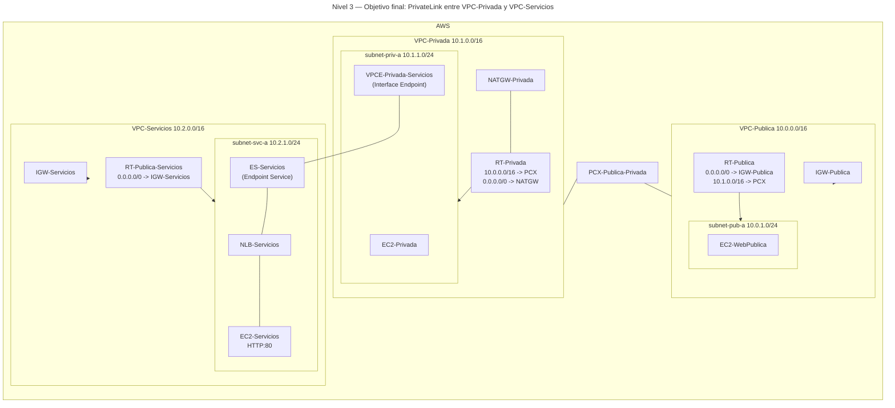
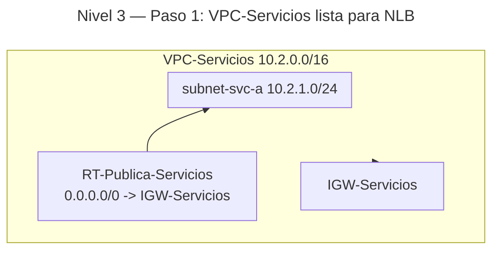
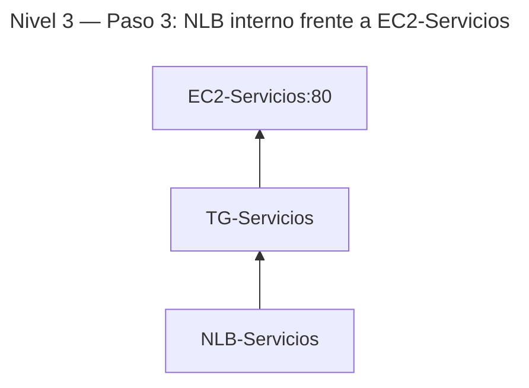
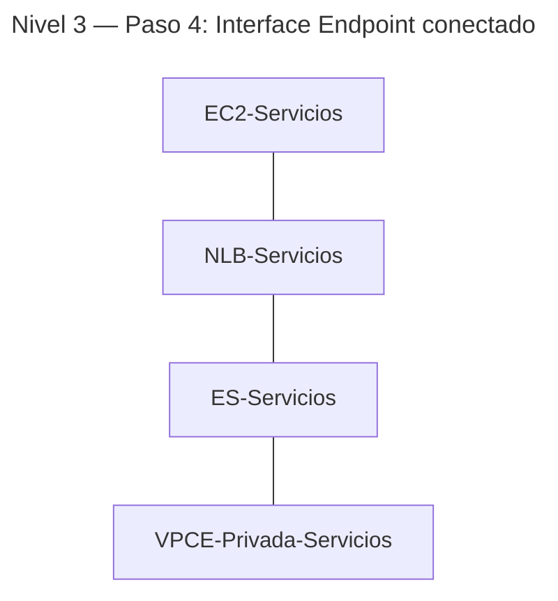

# 🥉 Nivel 3 — Fácil

Crea una **tercera VPC** para alojar un **servicio interno** y conéctalo desde tu **VPC-Privada** mediante un **Interface Endpoint (PrivateLink)**. Partimos del **Nivel 2** (VPC-Publica, VPC-Privada con NAT, y peering operativo entre 10.0.0.0/16 ↔ 10.1.0.0/16).

**[Enlace rápido al apartado para practicar con CLI](#️-usando-la-cli-en-cloudshell-command-line-interface)**

## 🖱️ Usando la GUI (Graphical User Interface)

### 🎯 Objetivo

Añadir una **VPC-Servicios** con una instancia sirviendo HTTP detrás de un **Network Load Balancer**. Publicar ese NLB como **Endpoint Service** y consumirlo desde **VPC-Privada** creando un **Interface VPC Endpoint**. El acceso al servicio debe producirse **por IP/DNS privados**, sin usar Internet ni peering entre la VPC-Privada y la VPC-Servicios.

### 🧱 Requisitos previos

- Haber completado el **Nivel 2** en la misma región (ej.: **eu-west-1**).
- Contar con al menos una instancia en **VPC-Privada** (p. ej., `EC2-Privada`) con salida a Internet vía **NAT** (para poder instalar utilidades como `curl` si hace falta).

---

### 🗺️ Arquitectura objetivo (resultado final)



---

### 🔧 Paso 1 — Crear la VPC-Servicios y su subnet pública

1. **VPC** → **Create VPC** → **VPC only**.  
   - **Name**: `VPC-Servicios`  
   - **CIDR**: `10.2.0.0/16` → **Create VPC**.
2. **Subnets** → **Create subnet** → VPC: `VPC-Servicios`.  
   - **Name**: `subnet-svc-a`  
   - **AZ**: `eu-west-1a`  
   - **CIDR**: `10.2.1.0/24` → **Create subnet**.
3. **Internet Gateways** → **Create** → **Name**: `IGW-Servicios` → **Create** → **Attach to VPC**: `VPC-Servicios`.
4. **Route Tables** → **Create route table** → **Name**: `RT-Publica-Servicios` → VPC: `VPC-Servicios`.  
   - En **Routes**: añade `0.0.0.0/0 → IGW-Servicios`.  
   - En **Subnet associations**: asocia `subnet-svc-a`.

**Progresión (tras paso 1):**



---

### 🔧 Paso 2 — SG y EC2-Servicios (backend HTTP)

1. **Security Groups** (en `VPC-Servicios`) → **Create security group**.  
   - **Name**: `SG-ServiciosWeb`  
   - **Inbound**: `HTTP 80` desde `0.0.0.0/0` (simplifica pruebas)  
   - **Outbound**: All traffic.
2. **EC2 → Launch instances**.  
   - **Name**: `EC2-Servicios`  
   - **AMI**: Amazon Linux 2023  
   - **Type**: `t2.micro`  
   - **Network**: VPC `VPC-Servicios`, Subnet `subnet-svc-a`  
   - **Auto-assign public IP**: Enable  
   - **Security group**: `SG-ServiciosWeb`  
   - **User data**:

```bash
#!/bin/bash
set -euxo pipefail
dnf -y update
dnf -y install httpd
echo "<h1>Servicio interno publicado por PrivateLink</h1>" > /var/www/html/index.html
systemctl enable httpd
systemctl start httpd
```

---

### 🔧 Paso 3 — NLB-Servicios y Target Group

1. **EC2 → Load Balancers** → **Create load balancer** → **Network Load Balancer**.  
   - **Name**: `NLB-Servicios`  
   - **Scheme**: `internal`  
   - **Network mapping**: `subnet-svc-a`  
   - **Listener TCP 80** → **Forward** a un **Target group** nuevo.
2. **Target groups** (tipo **Instances**, protocolo TCP:80) → **Name**: `TG-Servicios` → **Create**.  
3. **Targets** → **Register targets** → selecciona `EC2-Servicios` → **Include as pending** → **Save**.  
4. Vuelve al **Listener** del NLB y asegúrate de que **forward** a `TG-Servicios`.

**Progresión (tras paso 3):**



---

### 🔧 Paso 4 — Crear Endpoint Service (proveedor) y VPC Endpoint (consumidor)

1. **VPC Endpoint Services** → **Create**.  
   - **Name**: `ES-Servicios`  
   - **Load balancers**: `NLB-Servicios`  
   - **Require acceptance**: **Enabled** (recomendado).  
   - **Create** → anota el **Service name** (formato `com.amazonaws.vpce.<region>.vpce-svc-...`).
2. En **VPC-Privada** crea un **Interface endpoint**: **VPC → Endpoints → Create endpoint**.  
   - **Service category**: `Find service by name` → pega el **Service name** de `ES-Servicios`.  
   - **VPC**: `VPC-Privada`  
   - **Subnets**: `subnet-priv-a`  
   - **Security group**: crea/usa uno que permita **TCP 80** desde la **subnet-priv-a** (p. ej., `SG-EndpointPrivado`).  
   - **Create endpoint** → anota el **Endpoint ID** y su **DNS privado**.
3. Vuelve a **Endpoint services** → `ES-Servicios` → **Endpoint connections** → **Accept** la conexión del **Endpoint** creado.

**Progresión (tras paso 4):**



---

### 🔎 Verificación

- En `EC2-Privada` (VPC-Privada), ejecuta `curl` al **DNS del VPCE** (zona privada).  
  Debe responder el HTML del **EC2-Servicios** vía **PrivateLink**.  
- Verifica que **no** necesitas rutas hacia **10.2.0.0/16**: PrivateLink **no** usa **Route Tables** entre VPCs.

---

### 🧯 Problemas típicos

- **VPCE sin respuesta**: revisa **Target group** (health checks), **Listener** del NLB y **SG-ServiciosWeb**.  
- **Conexión pendiente**: falta **Accept** en `ES-Servicios`.  
- **SG del endpoint**: asegúrate de permitir **TCP 80** desde la **subnet-priv-a** (origen: instancia cliente).

---

### 🧹 Limpieza (GUI)

- Para volver al estado del **Nivel 2**:  
  1. **Endpoint services**: **Reject** conexiones activas (si las hubiera) y **Delete** `ES-Servicios`.  
  2. **VPC → Endpoints**: **Delete** el **VPCE-Privada-Servicios**.  
  3. **Load Balancers**: **Delete** `NLB-Servicios` y su **Target group**.  
  4. **EC2**: termina `EC2-Servicios`.  
  5. **Security Groups**: borra `SG-ServiciosWeb` y el SG del endpoint si lo creaste.  
  6. **Route Tables**: desasocia y borra `RT-Publica-Servicios`.  
  7. **Internet Gateways**: **Detach** y **Delete** `IGW-Servicios`.  
  8. **Subnets**: borra `subnet-svc-a`.  
  9. **VPCs**: borra `VPC-Servicios`.

---
---
---
---
---

## ⌨️ Usando la CLI en CloudShell (Command Line Interface)

> CloudShell por defecto. Comandos con `--region eu-west-1` **explícito**. En N0–N4 **no** uses funciones, pipes avanzados ni `--query`. Copia IDs/DNS manualmente como `<PLACEHOLDER>`.

### 🧱 Requisitos previos (CLI)

- Mantener los recursos de **Nivel 2** (NAT en VPC-Privada, peering con VPC-Publica).

---

### 🔎 Prechequeo

```bash
aws sts get-caller-identity --region eu-west-1
aws configure get region
```

---

### 🔧 Paso 1 — VPC-Servicios, subnet, IGW y RT pública

```bash
aws ec2 create-vpc \
  --cidr-block 10.2.0.0/16 \
  --tag-specifications 'ResourceType=vpc,Tags=[{Key=Name,Value=VPC-Servicios}]' \
  --region eu-west-1
# Copia VpcId como <VPC_SVC_ID>

aws ec2 create-subnet \
  --vpc-id <VPC_SVC_ID> \
  --cidr-block 10.2.1.0/24 \
  --availability-zone eu-west-1a \
  --tag-specifications 'ResourceType=subnet,Tags=[{Key=Name,Value=subnet-svc-a}]' \
  --region eu-west-1
# Copia SubnetId como <SUBNET_SVC_ID>

aws ec2 create-internet-gateway \
  --tag-specifications 'ResourceType=internet-gateway,Tags=[{Key=Name,Value=IGW-Servicios}]' \
  --region eu-west-1
# Copia InternetGatewayId como <IGW_SVC_ID>

aws ec2 attach-internet-gateway \
  --internet-gateway-id <IGW_SVC_ID> \
  --vpc-id <VPC_SVC_ID> \
  --region eu-west-1

aws ec2 create-route-table \
  --vpc-id <VPC_SVC_ID> \
  --tag-specifications 'ResourceType=route-table,Tags=[{Key=Name,Value=RT-Publica-Servicios}]' \
  --region eu-west-1
# Copia RouteTableId como <RT_SVC_PUB_ID>

aws ec2 create-route \
  --route-table-id <RT_SVC_PUB_ID> \
  --destination-cidr-block 0.0.0.0/0 \
  --gateway-id <IGW_SVC_ID> \
  --region eu-west-1

aws ec2 associate-route-table \
  --subnet-id <SUBNET_SVC_ID> \
  --route-table-id <RT_SVC_PUB_ID> \
  --region eu-west-1
# Copia AssociationId como <RT_SVC_PUB_ASSOC_ID>
```

---

### 🔧 Paso 2 — SG y EC2-Servicios

```bash
aws ec2 create-security-group \
  --group-name SG-ServiciosWeb \
  --description "SG web para servicio PrivateLink" \
  --vpc-id <VPC_SVC_ID> \
  --region eu-west-1
# Copia GroupId como <SG_SVC_ID>

aws ec2 authorize-security-group-ingress \
  --group-id <SG_SVC_ID> \
  --protocol tcp --port 80 \
  --cidr 0.0.0.0/0 \
  --region eu-west-1

# User data para el backend HTTP
cat > user-data-servicio.sh <<'EOF'
#!/bin/bash
set -euxo pipefail
dnf -y update
dnf -y install httpd
echo "<h1>Servicio interno publicado por PrivateLink</h1>" > /var/www/html/index.html
systemctl enable httpd
systemctl start httpd
EOF

# AMI AL2023
aws ssm get-parameters \
  --names /aws/service/ami-amazon-linux-latest/al2023-ami-kernel-6.1-x86_64 \
  --region eu-west-1
# Copia Parameters[0].Value como <AMI_ID>

aws ec2 run-instances \
  --image-id <AMI_ID> \
  --instance-type t2.micro \
  --subnet-id <SUBNET_SVC_ID> \
  --associate-public-ip-address \
  --security-group-ids <SG_SVC_ID> \
  --user-data file://user-data-servicio.sh \
  --tag-specifications 'ResourceType=instance,Tags=[{Key=Name,Value=EC2-Servicios}]' \
  --region eu-west-1
# Copia InstanceId como <INSTANCE_SVC_ID>
```

---

### 🔧 Paso 3 — NLB interno y Target Group

```bash
# Target Group (TCP 80, type instances)
aws elbv2 create-target-group \
  --name TG-Servicios \
  --protocol TCP \
  --port 80 \
  --vpc-id <VPC_SVC_ID> \
  --target-type instance \
  --region eu-west-1
# Copia TargetGroupArn como <TG_ARN>

# Registrar instancia
aws elbv2 register-targets \
  --target-group-arn <TG_ARN> \
  --targets Id=<INSTANCE_SVC_ID> \
  --region eu-west-1

# NLB interno en la subnet del servicio
aws elbv2 create-load-balancer \
  --name NLB-Servicios \
  --type network \
  --scheme internal \
  --subnets <SUBNET_SVC_ID> \
  --region eu-west-1
# Copia LoadBalancerArn como <NLB_ARN>

# Listener TCP 80 -> TG
aws elbv2 create-listener \
  --load-balancer-arn <NLB_ARN> \
  --protocol TCP \
  --port 80 \
  --default-actions Type=forward,TargetGroupArn=<TG_ARN> \
  --region eu-west-1
# Copia ListenerArn como <LISTENER_ARN>
```

---

### 🔧 Paso 4 — Endpoint Service y VPC Endpoint (Interface)

```bash
# Crear Endpoint Service (proveedor) para el NLB
aws ec2 create-vpc-endpoint-service-configuration \
  --network-load-balancer-arns <NLB_ARN> \
  --acceptance-required \
  --tag-specifications 'ResourceType=vpc-endpoint-service-configuration,Tags=[{Key=Name,Value=ES-Servicios}]' \
  --region eu-west-1
# Copia ServiceId como <ESVC_ID> y ServiceName como <SERVICE_NAME>

# (En VPC-Privada) SG para el Interface Endpoint
aws ec2 create-security-group \
  --group-name SG-EndpointPrivado \
  --description "SG para VPCE privado hacia ES-Servicios" \
  --vpc-id <VPC_PRIV_ID> \
  --region eu-west-1
# Copia GroupId como <SG_EP_ID>

aws ec2 authorize-security-group-ingress \
  --group-id <SG_EP_ID> \
  --protocol tcp --port 80 \
  --cidr 10.1.0.0/16 \
  --region eu-west-1

# Crear Interface VPC Endpoint (consumidor en VPC-Privada)
aws ec2 create-vpc-endpoint \
  --vpc-endpoint-type Interface \
  --vpc-id <VPC_PRIV_ID> \
  --service-name <SERVICE_NAME> \
  --subnet-ids <SUBNET_PRIV_ID> \
  --security-group-ids <SG_EP_ID> \
  --tag-specifications 'ResourceType=vpc-endpoint,Tags=[{Key=Name,Value=VPCE-Privada-Servicios}]' \
  --region eu-west-1
# Copia VpcEndpointId como <VPCE_ID>

# Aceptar la conexión en el servicio (proveedor)
aws ec2 accept-vpc-endpoint-connections \
  --service-id <ESVC_ID> \
  --vpc-endpoint-ids <VPCE_ID> \
  --region eu-west-1

# Obtener los DNS privados del VPCE
aws ec2 describe-vpc-endpoints \
  --vpc-endpoint-ids <VPCE_ID> \
  --region eu-west-1
# Copia uno de los 'DnsEntries[].DnsName' como <VPCE_DNS>
```

---

### ✅ Verificación

```bash
# En EC2-Privada (VPC-Privada):
curl http://<VPCE_DNS>
```

- Debes recibir: **Servicio interno publicado por PrivateLink** (contenido servido por `EC2-Servicios` vía NLB y PrivateLink).

---

### 🧯 Troubleshooting rápido

- Health checks del TG fallan → revisa **SG-ServiciosWeb** y que `EC2-Servicios` tenga **httpd** activo.  
- `curl` sin respuesta → valida **Accept** en `ES-Servicios` y el **SG del endpoint** (TCP 80 desde 10.1.0.0/16).  
- `NLB` sin targets healthy → confirma **register-targets** y puerto correcto.

---

### 🧹 Limpieza (CLI)

```bash
# 1) Eliminar conexión y servicio
aws ec2 delete-vpc-endpoints --vpc-endpoint-ids <VPCE_ID> --region eu-west-1
aws ec2 delete-vpc-endpoint-service-configurations --service-ids <ESVC_ID> --region eu-west-1

# 2) NLB y Target Group
aws elbv2 delete-listener --listener-arn <LISTENER_ARN> --region eu-west-1
aws elbv2 delete-load-balancer --load-balancer-arn <NLB_ARN> --region eu-west-1
# (espera a que el NLB esté eliminado)
aws elbv2 delete-target-group --target-group-arn <TG_ARN> --region eu-west-1

# 3) Backend y SGs
aws ec2 terminate-instances --instance-ids <INSTANCE_SVC_ID> --region eu-west-1
aws ec2 delete-security-group --group-id <SG_SVC_ID> --region eu-west-1
aws ec2 delete-security-group --group-id <SG_EP_ID> --region eu-west-1

# 4) Red de VPC-Servicios
aws ec2 disassociate-route-table --association-id <RT_SVC_PUB_ASSOC_ID> --region eu-west-1
aws ec2 delete-route-table --route-table-id <RT_SVC_PUB_ID> --region eu-west-1
aws ec2 detach-internet-gateway --internet-gateway-id <IGW_SVC_ID> --vpc-id <VPC_SVC_ID> --region eu-west-1
aws ec2 delete-internet-gateway --internet-gateway-id <IGW_SVC_ID> --region eu-west-1
aws ec2 delete-subnet --subnet-id <SUBNET_SVC_ID> --region eu-west-1
aws ec2 delete-vpc --vpc-id <VPC_SVC_ID> --region eu-west-1

# 5) Limpieza de archivos locales
rm -f user-data-servicio.sh
```
