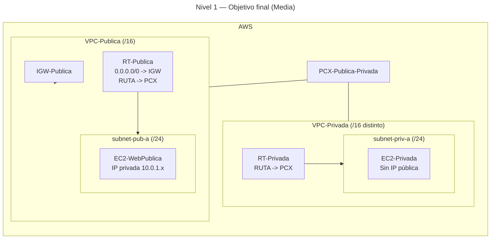

# 🥈 Nivel 1 — Media

Crea una **VPC privada**, establece un **VPC Peering** con tu **VPC pública existente** y **comprueba su bidireccionalidad**.

**[Enlace rápido al apartado para practicar con CLI](#️-usando-la-cli-en-cloudshell-command-line-interface)**

---

## 🖱️ Usando la GUI (Graphical User Interface)

### 🎯 Objetivo

Diseñar una **VPC privada** (sin salida a Internet) y conectarla con tu **VPC pública** por **VPC Peering**, con **rutas en ambos sentidos** y **verificación por ICMP** entre instancias por IP privada.

### 🧱 Requisitos previos

- Haber completado el **Nivel 0** (VPC-Publica operativa y EC2-WebPublica en ejecución).

---

### 🗺️ Arquitectura objetivo (resultado final)



---

### 🧭 Plan de trabajo (tú ejecutas los pasos)

1) **Red privada**
    - Crea **VPC-Privada** (/16 no solapado) y **subnet-priv-a** (/24).  
    - Crea **RT-Privada** y **asóciala** a la subnet (sin salida a Internet).

2) **Seguridad**
    - Crea **SG-Privada** que permita **ICMP** desde la **VPC-Publica** (CIDR).  
    - (Opcional) Añade **SSH 22** a **SG-WebPublica** desde tu **/32** para verificar.

3) **Cómputo**
    - Lanza **EC2-Privada** en la subnet privada **sin IP pública** usando **SG-Privada**.

4) **Peering + Rutas**
    - Crea **PCX-Publica-Privada** y **acéptalo**.
    - Añade ruta hacia la red de la otra VPC en **RT-Publica** y **RT-Privada** con **Target = PCX**.

5) **Verificación**
    - Desde **EC2-WebPublica**, **ping** a la IP privada de **EC2-Privada**.  
    - Éxito del ping ⇒ rutas y SG correctos en ambos sentidos.

---

## ⌨️ Usando la CLI en CloudShell (Command Line Interface)

> Ejecuta todo desde **AWS CloudShell** y **añade tu región manualmente** a cada comando.

---

### 🔎 Prechequeo

```bash
aws sts get-caller-identity
aws configure get region
```

---

### 🧭 Tareas (comandos base, sin parámetros)

#### Red

```bash
aws ec2 create-vpc ...
aws ec2 create-subnet ...
aws ec2 create-route-table ...
aws ec2 associate-route-table ...
```

#### Seguridad y cómputo

```bash
aws ec2 create-security-group ...
aws ec2 authorize-security-group-ingress ...
aws ssm get-parameters ...
aws ec2 run-instances ...
```

#### Peering y rutas

```bash
aws ec2 create-vpc-peering-connection ...
aws ec2 accept-vpc-peering-connection ...
aws ec2 create-route ...
aws ec2 create-route ...
```

---

### 🔎 Verificación

```bash
# Desde EC2-WebPublica, haz ping a la IP privada de EC2-Privada
ping -c 3 <PRIVATE_IP_PRIVADA>
```

---

### 🧹 Limpieza (GUI/CLI)

- Quita rutas del **PCX** en **RT-Publica** y **RT-Privada**.  
- Elimina el **PCX**.  
- Termina **EC2-Privada**.  
- Borra **SG-Privada**, **RT-Privada**, **subnet-priv-a** y **VPC-Privada**.
