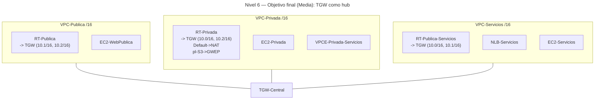

# 🥈 Nivel 6 — Media

Diseña una **VPC transitiva** con **Transit Gateway** y analiza el **flujo de tráfico** entre **VPC-Publica**, **VPC-Privada** y **VPC-Servicios**. Partes del estado del **Nivel 5** (GWEP S3 y PrivateLink activos).

**[Enlace rápido al apartado para practicar con CLI](#️-usando-la-cli-en-cloudshell-command-line-interface)**

---

## 🖱️ Usando la GUI (Graphical User Interface)

### 🎯 Objetivo

Habilitar un **hub** con **TGW** para que las VPCs se comuniquen **entre sí** por rutas explícitas, **sin** alterar:

- El **Gateway Endpoint** de **S3** (tráfico a S3 no debe pasar por TGW).
- El **PrivateLink** (VPCE) hacia VPC-Servicios (no depende del TGW).

### 🧱 Requisitos previos

- Las tres VPCs y sus instancias de prueba disponibles en la **misma región**.

---

### 🗺️ Arquitectura objetivo (resultado final)



---

### 🧭 Plan de trabajo (tú ejecutas los pasos)

1) **TGW y attachments**  
    - Crea `TGW-Central` y **tres attachments** (uno por VPC).

2) **Tabla de rutas del TGW**  
    - Crea `TGW-RT-Compartida`.  
    - **Asocia** los attachments y **habilita propagación** para aprender 10.0/16, 10.1/16, 10.2/16.

3) **Rutas en VPCs**  
    - En cada RT, añade **CIDRs remotos → TGW** (mantén Default y pl-S3 según aplique).

4) **Verificación**  
    - Desde `EC2-Privada`:
    - `curl` a 10.0.1.X (Web en VPC-Publica).  
    - `curl` a 10.2.1.X (App en VPC-Servicios).  
    - `curl` a `http://<VPCE_DNS>` (PrivateLink) y a `http://s3.<region>.amazonaws.com` (GWEP).

5) **Limpieza**  
    - Elimina rutas hacia TGW, attachments y el TGW para volver al estado del **Nivel 5**.

---

## ⌨️ Usando la CLI en CloudShell (Command Line Interface)

> Ejecuta todo desde **AWS CloudShell** y **añade tu región manualmente** a cada comando.

---

### 🔎 Prechequeo

```bash
aws sts get-caller-identity
aws configure get region
```

---

### 🧭 Tareas (comandos base, sin parámetros)

#### Transit Gateway

```bash
aws ec2 create-transit-gateway ...
aws ec2 create-transit-gateway-vpc-attachment ...
```

#### Tabla de rutas del TGW

```bash
aws ec2 create-transit-gateway-route-table ...
aws ec2 associate-transit-gateway-route-table ...
aws ec2 enable-transit-gateway-route-table-propagation ...
```

#### Rutas en VPCs

```bash
aws ec2 create-route ...
aws ec2 create-route ...
aws ec2 create-route ...
```

#### Verificación

```bash
# Desde EC2-Privada:
curl -sI http://10.0.1.X
curl -sI http://10.2.1.X
curl -sI http://<VPCE_DNS_PRIVADO>
curl -I  http://s3.<REGION>.amazonaws.com
```

#### Limpieza

```bash
aws ec2 delete-route ...
aws ec2 delete-transit-gateway-vpc-attachment ...
aws ec2 delete-transit-gateway-route-table ...
aws ec2 delete-transit-gateway ...
```
