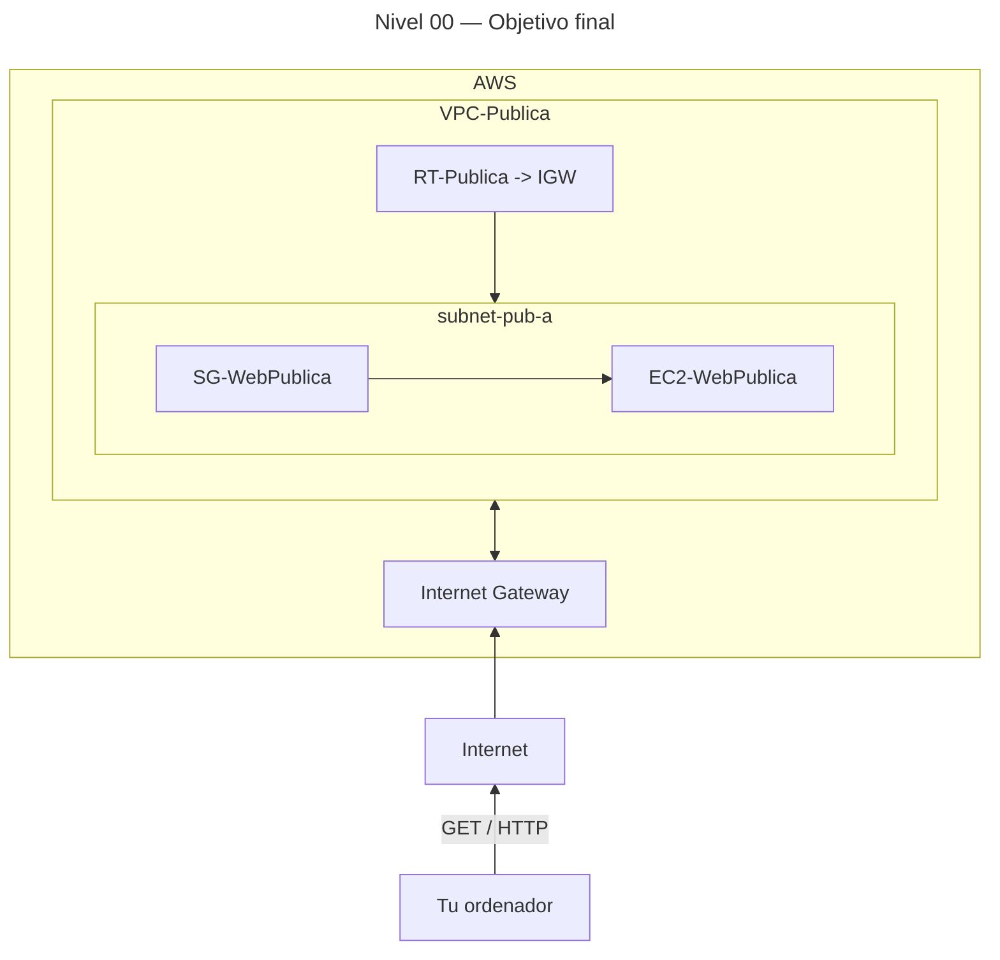

# 🥇 Nivel 00 — Difícil

Crea tu primera **VPC pública** y conéctate a un **servidor web** (HTTP). En modo **Difícil** solo se describe el problema y la solución esperada; no hay pasos ni parámetros concretos.

Se debe realizar tanto en **GUI** como en **CLI** **documentando todos los pasos** de manera similar a las prácticas de dificultad "Fácil" y comparar el resultado con estas (ya que vendrían a ser la solución).

## 🎯 Objetivo

Desplegar una red mínima en AWS que exponga un servidor web a Internet de forma segura y funcional.

## ✅ Solución esperada

Recursos creados con nombres coherentes, una **VPC pública** con una subred pública, salida a Internet mediante **Internet Gateway**, una **tabla de rutas pública** asociada a la subred, un **Security Group** que permita **HTTP**, y una **instancia EC2** que sirva una página web accesible desde Internet.

## 🗺️ Arquitectura objetivo (resultado final)

## 🔎 Verificación

Resultado esperado: acceder a `http://<IP_PUBLICA>` y obtener el mensaje de bienvenida servido por la instancia.

## 🧹 Limpieza

Borra todos los componentes usados en el orden adecuado.
