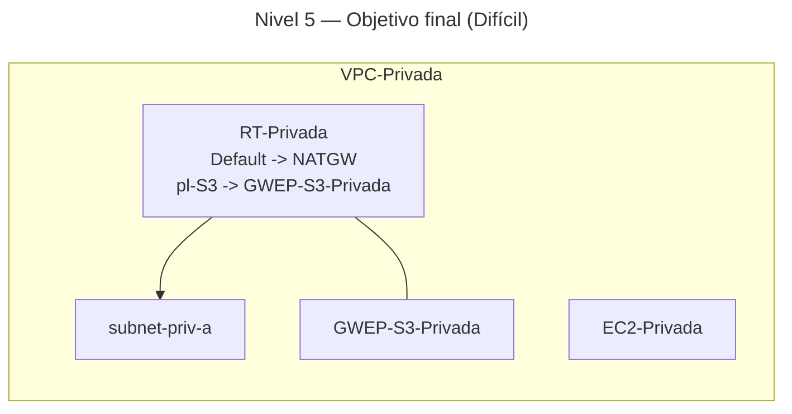

# 🥇 Nivel 5 — Difícil

Implementa un **Gateway Endpoint** para **S3** que permita a las **instancias privadas** de **VPC-Privada** acceder a **S3** sin salir de la red de **AWS**. En modo **Difícil** solo se describe el problema y la solución esperada; no hay pasos ni parámetros concretos.

Se debe realizar tanto en **GUI** como en **CLI** **documentando todos los pasos** y comparando tu resultado con el de **Fácil**.

## 🎯 Objetivo

Redirigir el tráfico hacia **S3** desde **VPC-Privada** por la **malla interna de AWS** mediante un **Gateway VPC Endpoint**, sin exponer ese tráfico a Internet/NAT.

## ✅ Solución esperada

- **GWEP-S3-Privada** (tipo **Gateway**, servicio **S3**) creado en **VPC-Privada** y asociado a **RT-Privada**.  
- **RT-Privada** muestra una **ruta al Prefix List de S3 (pl-*)** apuntando al **Gateway Endpoint**, coexistiendo con `0.0.0.0/0 → NATGW` para el resto de destinos.  
- **Verificación**:  
  - Desde `EC2-Privada`, `curl -I http://s3.<region>.amazonaws.com` responde aunque se retire temporalmente la ruta por defecto a NAT.  
  - Acceso a destinos externos como `example.com` falla sin NAT, confirmando que **S3** fluye por el **Gateway Endpoint**.

## 🗺️ Arquitectura objetivo (resultado final)

## 🔎 Verificación

- **S3** responde desde la instancia privada por **Gateway Endpoint** (403 esperado sin credenciales) incluso sin ruta por defecto a NAT.  
- Rutas y asociación en **RT-Privada** reflejan el **Prefix List** de **S3** hacia el **GWEP**.

## 🧹 Limpieza

Eliminar el **Gateway Endpoint** y, si se creó, el **bucket** de prueba y su contenido, dejando **RT-Privada** con su ruta por defecto a **NATGW**.
