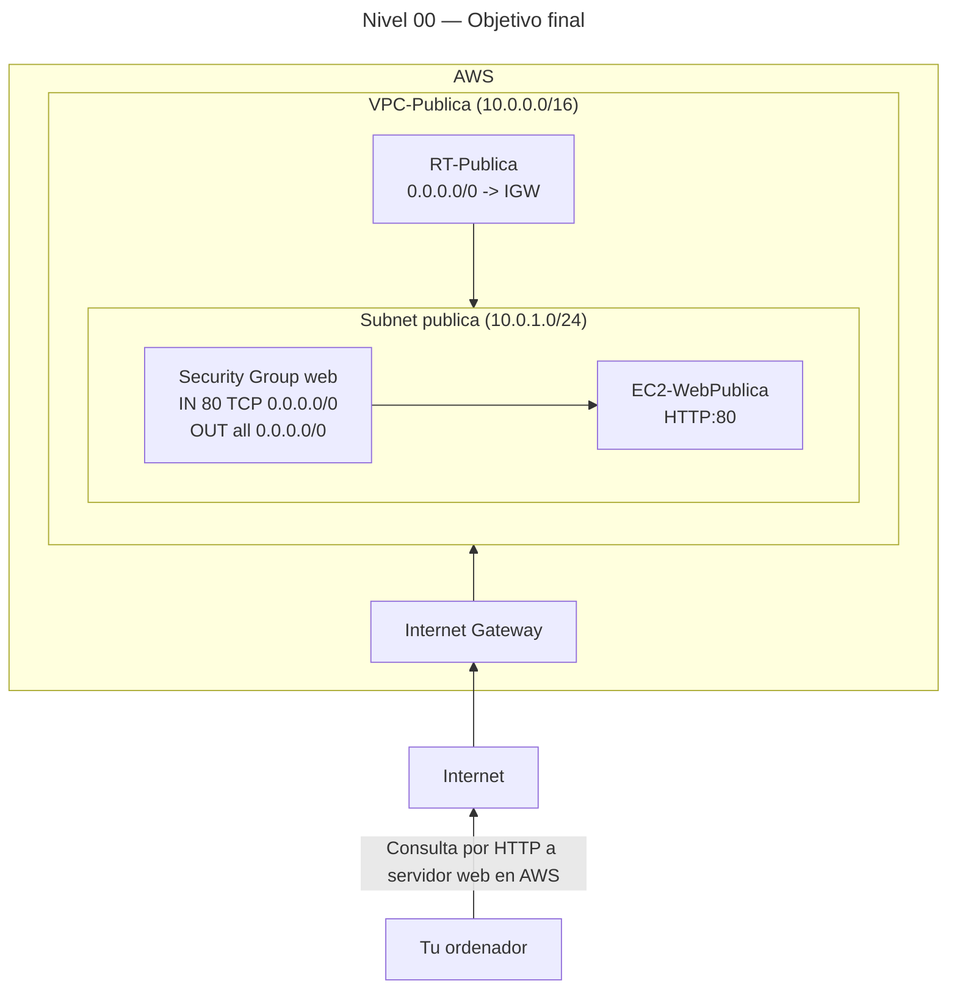

# 🥈 Nivel 00 — Media

Crea tu primera **VPC pública** y conéctate a un **servidor web** (HTTP)

**[Ir a la CLI](#️-usando-la-cli-en-cloudshell-command-line-interface)**

---

## 🖱️ Usando la GUI (Graphical User Interface)

### 🎯 Objetivo

Construir una **VPC** con **subred pública**, **Internet Gateway**, **tabla de rutas pública**, **Security Group** de web y una **instancia EC2** que sirva una página en **HTTP (80)** accesible desde Internet.

### 🧱 Requisitos previos

- Haber iniciado sesión en la **Consola de AWS** (ejemplo de región: **eu-west-1**).
- Usaremos **User data** para instalar el servidor web (no es necesario SSH).

---

### 🗺️ Arquitectura objetivo (resultado final)



---

### 🧭 Plan de trabajo (tú ejecutas los pasos)

#### 1) VPC

- Nombre: `VPC-Publica`
- CIDR: **/16** válido a tu elección (sin solapar con la Subnet).

#### 2) Subnet pública

- Nombre: `subnet-pub-a`
- CIDR: **/24** dentro del rango de la VPC.
- AZ: **cualquiera** de la región.
- Sugerencia: activa **Auto-assign public IPv4** (o lo harás al lanzar la instancia).

#### 3) Internet Gateway

- Nombre: `IGW-Publica`
- Adjunta a `VPC-Publica`.

#### 4) Route Table pública

- Nombre: `RT-Publica`
- Ruta por defecto a **IGW-Publica**.
- Asocia la **subnet-pub-a**.

#### 5) Security Group (web)

- Nombre: `SG-WebPublica`
- Inbound: HTTP (80) desde `0.0.0.0/0`
- Outbound: permitir todo (por defecto).

#### 6) EC2 (Amazon Linux 2023)

- Nombre: `EC2-WebPublica`
- Tipo: `t2.micro` o `t3.micro`
- Subnet: `subnet-pub-a`
- IP pública habilitada
- SG: `SG-WebPublica`
- User data (pega tal cual en “Advanced details”):

```bash
#!/bin/bash
set -euxo pipefail
dnf -y update
dnf -y install httpd
echo "<h1>Bienvenido a mi primer servidor en AWS</h1>" > /var/www/html/index.html
systemctl enable httpd
systemctl start httpd
```

#### 7) Verificación

- Copia la **IPv4 Public IP** de la instancia.
- Abre en tu navegador: `http://<IP_PUBLICA>`
- Debes ver el mensaje de bienvenida.

---

### ✅ Checklist de validación

- [x] La **Route Table** de la subnet tiene ruta por defecto al **IGW**.  
- [x] El **SG** permite **HTTP 80** desde `0.0.0.0/0`.  
- [x] La instancia tiene **IPv4 Public IP** asignada.  
- [x] `http://<IP_PUBLICA>` devuelve la página.

### 🧯 Problemas típicos (pistas)

- No carga la web → revisa **SG (HTTP)** y **ruta a IGW**.  
- Se instaló Apache pero no responde → da ~60s a *cloud-init* tras “running”.  
- Usaste otra AZ/Región sin querer → revalida que todo está en **la misma región**.

### 🧹 Limpieza (GUI)

Orden recomendado: **instancia → SG → RT → IGW → subnet → VPC**.

---
---
---
---
---

## ⌨️ Usando la CLI en CloudShell (Command Line Interface)

Ejecuta todo desde **AWS CloudShell** y **añade tu región manualmente** a cada comando.

---

### 🧱 Requisitos previos (CLI)

- Tener CloudShell abierto en la región de trabajo.
- Copiar manualmente los IDs que devuelven los comandos (VPC, Subnet, IGW, RT, SG, Instancia).

---

### 🔎 Prechequeo

```bash
aws sts get-caller-identity
aws configure get region
```

---

### 🧭 Tareas (comandos base, sin parámetros)

#### VPC

```bash
aws ec2 create-vpc ...
aws ec2 create-subnet ...
aws ec2 create-internet-gateway ...
aws ec2 attach-internet-gateway ...
aws ec2 create-route-table ...
aws ec2 create-route ...
aws ec2 associate-route-table ...
```

#### Seguridad

```bash
aws ec2 create-security-group ...
aws ec2 authorize-security-group-ingress ...
```

#### EC2

```bash
# User data: crea un archivo local con la instalación de Apache y página de bienvenida
# (por ejemplo, user-data.sh) y úsalo al lanzar la instancia

aws ssm get-parameters ...
aws ec2 run-instances ...
```

---

### 🔎 Verificación

```bash
# Obtén la IP pública de tu instancia con describe-instances ...
curl http://<PUBLIC_IP>
```

---

### 🧹 Limpieza (CLI)

> Orden seguro: **instancia → SG (no por defecto) → RT (desasociar antes) → IGW (detach antes) → subnet → VPC**.

```bash
aws ec2 terminate-instances ...
aws ec2 delete-security-group ...
aws ec2 disassociate-route-table ...
aws ec2 delete-route-table ...
aws ec2 detach-internet-gateway ...
aws ec2 delete-internet-gateway ...
aws ec2 delete-subnet ...
aws ec2 delete-vpc ...
# (Opcional) elimina archivos locales creados (por ejemplo, user-data.sh)
```
