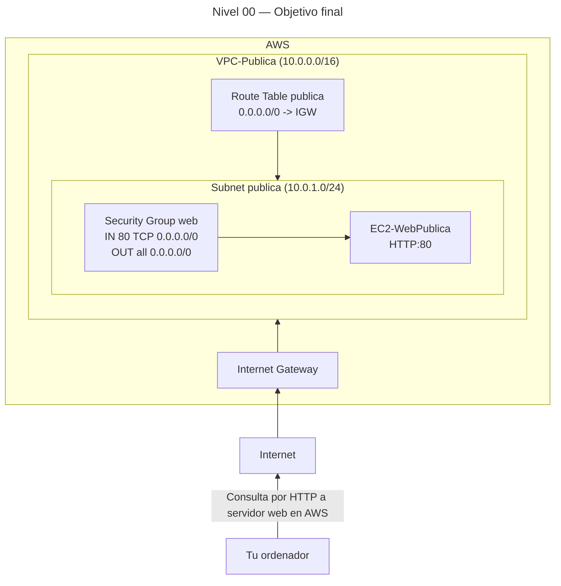

# 🥈 Nivel 00 — Media

Crea tu primera **VPC pública** y conéctate a un **servidor web** (HTTP)

**[Ir a la CLI](#️-usando-la-cli-en-cloudshell-command-line-interface)**

> Dificultad Media: instrucciones parciales y esquemas. Tú decides cómo avanzar.  

---

## 🖱️ Usando la GUI (Graphical User Interface)

### 🎯 Objetivo

Construir una **VPC** con **subred pública**, **Internet Gateway**, **tabla de rutas pública**, **Security Group** de web y una **instancia EC2** que sirva una página en **HTTP (80)** accesible desde Internet.

### 🧱 Requisitos previos

- Haber iniciado sesión en la **Consola de AWS** (ejemplo de región: **eu-west-1**).
- Usaremos **User data** para instalar el servidor web (no es necesario SSH).

---

### 🗺️ Arquitectura objetivo (resultado final)



---

### 🧭 Plan de trabajo (tú ejecutas los pasos)

#### 1) VPC

- Nombre: `VPC-Publica`
- CIDR: `10.0.0.0/16`

#### 2) Subnet pública

- Nombre: `subnet-pub-a`
- CIDR: `10.0.1.0/24`
- AZ: `eu-west-1a`
- Sugerencia: activa **Auto-assign public IPv4** (o lo harás al lanzar la instancia).

#### 3) Internet Gateway

- Nombre: `IGW-Publica`
- Adjunta a `VPC-Publica`.

#### 4) Route Table pública

- Nombre: `RT-Publica`
- Ruta: `0.0.0.0/0 → IGW-Publica`
- Asocia la **subnet-pub-a**.

#### 5) Security Group (web)

- Nombre: `SG-WebPublica`
- Inbound: HTTP (80) desde `0.0.0.0/0`
- Outbound: permitir todo (por defecto).

#### 6) EC2 (Amazon Linux 2023)

- Nombre: `EC2-WebPublica`
- Tipo: `t2.micro` o `t3.micro`
- Subnet: `subnet-pub-a`
- IP pública habilitada
- SG: `SG-WebPublica`
- User data (pega tal cual en “Advanced details”):

  ```bash
  #!/bin/bash
  set -euxo pipefail
  dnf -y update
  dnf -y install httpd
  echo "<h1>Bienvenido a mi primer servidor en AWS</h1>" > /var/www/html/index.html
  systemctl enable httpd
  systemctl start httpd
  ```

#### 7) Verificación

- Copia la **IPv4 Public IP** de la instancia.
- Abre en tu navegador: `http://<IP_PUBLICA>`
- Debes ver el mensaje de bienvenida.

---

### ✅ Checklist de validación

- [x] La **Route Table** de la subnet tiene `0.0.0.0/0 → IGW`.  
- [x] El **SG** permite **HTTP 80** desde `0.0.0.0/0`.  
- [x] La instancia tiene **IPv4 Public IP** asignada.  
- [x] `http://<IP_PUBLICA>` devuelve la página.

### 🧯 Problemas típicos (pistas)

- No carga la web → revisa **SG (HTTP)** y **ruta a IGW**.  
- Se instaló Apache pero no responde → da ~60s a *cloud-init* tras “running”.  
- Usaste otra AZ/Región sin querer → revalida que todo está en **la misma región**.

### 🧹 Limpieza (GUI)

Orden recomendado: **instancia → SG → RT → IGW → subnet → VPC**.

---
---
---
---
---

## ⌨️ Usando la CLI en CloudShell (Command Line Interface)

> CloudShell (icono de terminal en la barra superior).  

### 🧱 Requisitos previos (CLI)

- Abre **CloudShell** en la región de trabajo (ej.: **eu-west-1**).

### 🔎 Prechequeo

```bash
aws sts get-caller-identity --region eu-west-1
aws configure get region
```

---

### 🧭 Tareas (tú compones los comandos)

> Rellena los placeholders con los IDs que vayas obteniendo (apunta todo).

#### 1) VPC (VPC-Publica)

Crea la VPC `VPC-Publica` con CIDR `10.0.0.0/16`. Guarda **<VPC_ID>**.

```bash
aws ec2 create-vpc \
  --cidr-block 10.0.0.0/16 \
  --tag-specifications 'ResourceType=vpc,Tags=[{Key=Name,Value=VPC-Publica}]' \
  --region eu-west-1
```

#### 2) Subnet pública (subnet-pub-a)

Crea `subnet-pub-a` en `10.0.1.0/24` (AZ `eu-west-1a`). Guarda **<SUBNET_ID>**.  
Opcional: activa **map-public-ip-on-launch** para la subnet.

```bash
aws ec2 create-subnet \
  --vpc-id <VPC_ID> \
  --cidr-block 10.0.1.0/24 \
  --availability-zone eu-west-1a \
  --tag-specifications 'ResourceType=subnet,Tags=[{Key=Name,Value=subnet-pub-a}]' \
  --region eu-west-1

# Opcional:
aws ec2 modify-subnet-attribute \
  --subnet-id <SUBNET_ID> \
  --map-public-ip-on-launch \
  --region eu-west-1
```

#### 3) Internet Gateway (IGW-Publica)

Crea `IGW-Publica` y **adjúntalo** a la VPC. Guarda **<IGW_ID>**.

```bash
aws ec2 create-internet-gateway \
  --tag-specifications 'ResourceType=internet-gateway,Tags=[{Key=Name,Value=IGW-Publica}]' \
  --region eu-west-1

aws ec2 attach-internet-gateway \
  --internet-gateway-id <IGW_ID> \
  --vpc-id <VPC_ID> \
  --region eu-west-1
```

#### 4) Route Table pública (RT-Publica)

Crea `RT-Publica` en la VPC. Guarda **<RT_ID>**.  
Añade ruta `0.0.0.0/0 → <IGW_ID>` y asocia la **subnet** a la **RT**.

```bash
aws ec2 create-route-table \
  --vpc-id <VPC_ID> \
  --tag-specifications 'ResourceType=route-table,Tags=[{Key=Name,Value=RT-Publica}]' \
  --region eu-west-1

aws ec2 create-route \
  --route-table-id <RT_ID> \
  --destination-cidr-block 0.0.0.0/0 \
  --gateway-id <IGW_ID> \
  --region eu-west-1

aws ec2 associate-route-table \
  --subnet-id <SUBNET_ID> \
  --route-table-id <RT_ID> \
  --region eu-west-1
```

#### 5) Security Group (HTTP)

Crea `SG-WebPublica` en la VPC. Guarda **<SG_ID>**.  
Permite **HTTP (80)** desde `0.0.0.0/0`.

```bash
aws ec2 create-security-group \
  --group-name SG-WebPublica \
  --description "SG web publico Nivel 00" \
  --vpc-id <VPC_ID> \
  --region eu-west-1

aws ec2 authorize-security-group-ingress \
  --group-id <SG_ID> \
  --protocol tcp --port 80 \
  --cidr 0.0.0.0/0 \
  --region eu-west-1
```

#### 6) User data + AMI (AL2023)

Crea el archivo `user-data.sh` en CloudShell tal como sigue:

```bash
cat > user-data.sh <<'EOF'
#!/bin/bash
set -euxo pipefail
dnf -y update
dnf -y install httpd
echo "<h1>Bienvenido a mi primer servidor en AWS</h1>" > /var/www/html/index.html
systemctl enable httpd
systemctl start httpd
EOF
```

Obtén la **AMI** de Amazon Linux 2023. Copia **<AMI_ID>**.

```bash
aws ssm get-parameters \
  --names /aws/service/ami-amazon-linux-latest/al2023-ami-kernel-6.1-x86_64 \
  --region eu-west-1
```

#### 7) EC2

Lanza `EC2-WebPublica` (`t2.micro` o `t3.micro`) en la subnet, **IP pública**, SG `SG-WebPublica`, y `user-data.sh`. Guarda **<INSTANCE_ID>**.

```bash
aws ec2 run-instances \
  --image-id <AMI_ID> \
  --instance-type t2.micro \
  --subnet-id <SUBNET_ID> \
  --associate-public-ip-address \
  --security-group-ids <SG_ID> \
  --user-data file://user-data.sh \
  --tag-specifications 'ResourceType=instance,Tags=[{Key=Name,Value=EC2-WebPublica}]' \
  --region eu-west-1
```

Obtén la **IP pública**: guarda **<PUBLIC_IP>**.

```bash
aws ec2 describe-instances \
  --filters "Name=tag:Name,Values=EC2-WebPublica" \
  --query "Reservations[0].Instances[0].PublicIpAddress" \
  --output text \
  --region eu-west-1
```

#### 8) Verificación

```bash
curl http://<PUBLIC_IP>
# Debe devolver el HTML con el mensaje de bienvenida
```

---

### ✅ Tests de aceptación (para ti)

- [x] `curl http://<PUBLIC_IP>` devuelve contenido HTML.  
- [x] La Route Table de la subnet apunta a **IGW** para `0.0.0.0/0`.  
- [x] El SG permite **HTTP 80** desde `0.0.0.0/0`.

### 🧹 Limpieza (CLI)

> Orden sugerido: **instancia → SG → RT (desasociar antes) → IGW (detach antes) → subnet → VPC**.

```bash
# 1) Terminar instancia
aws ec2 describe-instances \
  --filters "Name=tag:Name,Values=EC2-WebPublica" \
  --query "Reservations[0].Instances[0].InstanceId" \
  --output text \
  --region eu-west-1
# usa el ID obtenido:
aws ec2 terminate-instances --instance-ids <INSTANCE_ID> --region eu-west-1

# 2) SG

aws ec2 delete-security-group --group-id <SG_ID> --region eu-west-1

# 3) RT (desasociar y borrar)

aws ec2 describe-route-tables --route-table-ids <RT_ID> \
  --query "RouteTables[0].Associations[?SubnetId!='null'].RouteTableAssociationId" \
  --output text --region eu-west-1
aws ec2 disassociate-route-table --association-id <RT_ASSOC_ID> --region eu-west-1
aws ec2 delete-route-table --route-table-id <RT_ID> --region eu-west-1

# 4) IGW (detach y delete)
aws ec2 detach-internet-gateway --internet-gateway-id <IGW_ID> --vpc-id <VPC_ID> --region eu-west-1
aws ec2 delete-internet-gateway --internet-gateway-id <IGW_ID> --region eu-west-1

# 5) Subnet y VPC
aws ec2 delete-subnet --subnet-id <SUBNET_ID> --region eu-west-1
aws ec2 delete-vpc --vpc-id <VPC_ID> --region eu-west-1

# 6) Archivo local
rm -f user-data.sh
```
