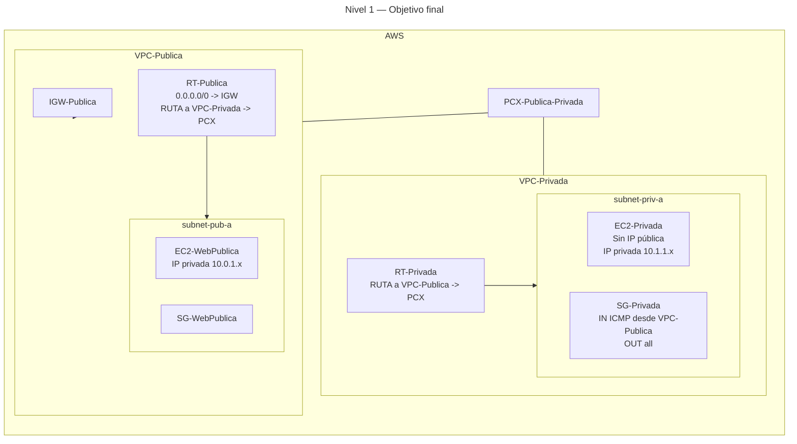

# 🥇 Nivel 1 — Difícil

Crea una **VPC privada**, establece un **VPC Peering** con tu **VPC pública existente** y **comprueba su bidireccionalidad**. En modo **Difícil** solo se describe el problema y la solución esperada; no hay pasos ni parámetros concretos.

Se debe realizar tanto en **GUI** como en **CLI** **documentando todos los pasos** de manera similar a las prácticas de dificultad "Fácil" y comparar el resultado con estas (ya que vendrían a ser la solución).

## 🎯 Objetivo

Partiendo del resultado del **Nivel 00**, desplegar una **VPC privada** (sin salida directa a Internet) y conectarla con la **VPC pública** mediante **VPC Peering**, habilitando **enrutamiento en ambos sentidos** para tráfico por **IPs privadas**.

## ✅ Solución esperada

- Recursos creados con nombres coherentes.
- **VPC-Privada** con **subnet privada** y **RT-Privada** (sin ruta a Internet).
- **VPC Peering** entre ambas VPC y **rutas recíprocas** (cada RT apunta a la red de la otra VPC vía PCX).
- **Security Group** en la VPC privada que permita, como mínimo, **ICMP** desde la red de la VPC pública.
- **Instancias EC2** alcanzables **por IP privada** entre VPCs (bidireccionalidad).

## 🗺️ Arquitectura objetivo (resultado final)

## 🔎 Verificación

- Acceso **por IP privada** entre instancias en ambas VPC (por ejemplo, **ICMP** de `EC2-WebPublica` a `EC2-Privada` con respuesta).
- La **VPC-Privada** permanece **sin salida directa a Internet**.

## 🧹 Limpieza

Borra los componentes creados en orden seguro: quita **rutas del PCX** en ambas RT → elimina el **PCX** → termina la **instancia privada** → borra **SG-Privada**, **RT-Privada**, **subnet-priv-a** y **VPC-Privada**.
