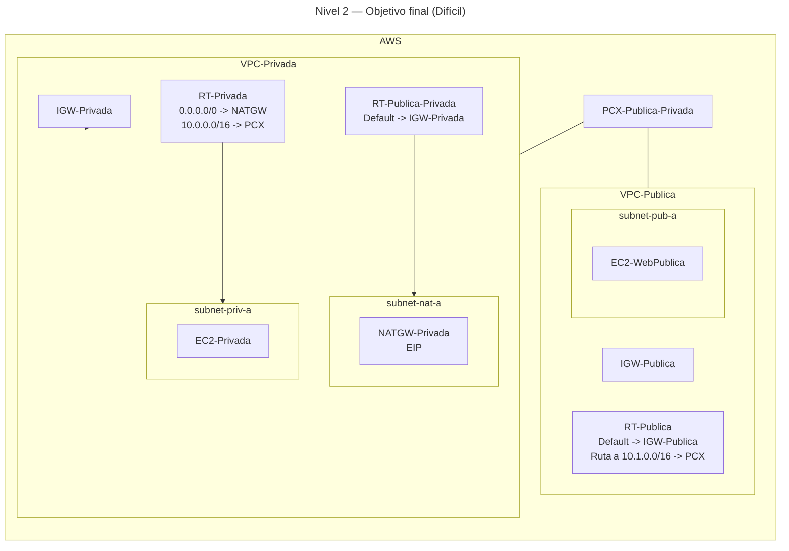

# 🥇 Nivel 2 — Difícil

Configura un **NAT Gateway** para dar **salida a Internet** a las **instancias privadas** en **VPC-Privada**. En modo **Difícil** solo se describe el problema y la solución esperada; no hay pasos ni parámetros concretos.

Se debe realizar tanto en **GUI** como en **CLI** **documentando todos los pasos** y comparando tu resultado con el de **Fácil**.

## 🎯 Objetivo

Partiendo del **Nivel 1** (peering operativo y conectividad privada entre VPCs), dotar a `subnet-priv-a` de **egreso a Internet** mediante **NAT Gateway** residente en **la misma VPC** (VPC-Privada), sin romper la conectividad por **PCX** entre ambas VPCs.

## ✅ Solución esperada

- **VPC-Privada** con:
    - **subnet-nat-a** (pública) asociada a **RT** con `0.0.0.0/0 → IGW-Privada`.
    - **NATGW-Privada** en `subnet-nat-a` con **EIP** asignada.
    - **RT-Privada** de `subnet-priv-a` con `0.0.0.0/0 → NATGW` y **ruta** hacia la VPC pública vía **PCX**.
- **VPC-Publica** sin cambios críticos (mantiene su **IGW** y ruta hacia **VPC-Privada** por **PCX**).
- **Verificación**: desde una instancia en `subnet-priv-a`, acceso **HTTP** a Internet (y la IP de salida corresponde a la **EIP** del NAT).

## 🗺️ Arquitectura objetivo (resultado final)

## 🔎 Verificación

- Acceso saliente desde `subnet-priv-a` a Internet (por ejemplo, **HTTP**) y mantenimiento de rutas de peering para **10.0.0.0/16 ↔ 10.1.0.0/16**.

## 🧹 Limpieza

- Volver al estado del **Nivel 1**: eliminar **ruta por defecto a NAT** en `RT-Privada`, borrar **NATGW** y **liberar EIP**, quitar **RT-Publica-Privada**, borrar `subnet-nat-a`, **detach/delete** de `IGW-Privada`.
