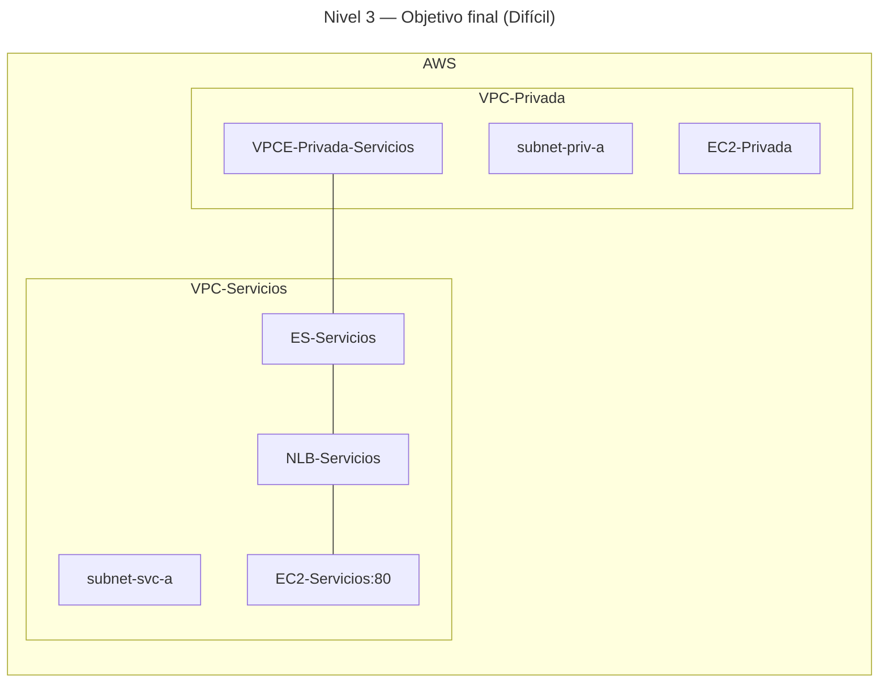

# 🥇 Nivel 3 — Difícil

Añade una **tercera VPC** que actúe como **proveedor de servicio** y expón dicho servicio a **VPC-Privada** mediante **PrivateLink (Interface Endpoint)**. En modo **Difícil** solo se describe el problema y la solución esperada; no hay pasos ni parámetros concretos.

Se debe realizar tanto en **GUI** como en **CLI**, **documentando todos los pasos** y comparando el resultado con los de **Fácil**.

## 🎯 Objetivo

Publicar un servicio HTTP interno desde **VPC-Servicios** a **VPC-Privada** usando **PrivateLink**, garantizando tráfico **privado** (ENIs del endpoint) sin rutas entre VPCs. Mantener intacta la conectividad previa (NAT en VPC-Privada, peering con VPC-Publica).

## ✅ Solución esperada

- **VPC-Servicios** con `subnet-svc-a`, **IGW-Servicios** y **RT** pública para permitir aprovisionamiento del backend.  
- **EC2-Servicios** sirviendo HTTP tras un **NLB-Servicios** (interno) y **TG** healthy.  
- **ES-Servicios (Endpoint Service)** asociado al NLB, con **acceptance** aplicado.  
- **VPC-Privada** con un **Interface VPC Endpoint** (`VPCE-Privada-Servicios`) en la **subnet-priv-a** y **SG** permitiendo **TCP 80** desde la subnet cliente.  
- **Verificación**: desde `EC2-Privada`, `curl` al **DNS privado del VPCE** devuelve el contenido del backend.  
- **Ruteo**: no se requieren rutas entre **10.1.0.0/16** y **10.2.0.0/16** para PrivateLink (independiente del peering existente con **VPC-Publica**).

## 🗺️ Arquitectura objetivo (resultado final)

## 🔎 Verificación

`EC2-Privada` accede al **DNS privado** del VPCE y obtiene el contenido del servicio (HTTP 80) sin usar Internet ni rutas entre VPCs.

## 🧹 Limpieza

Eliminar **VPCE**, **ES-Servicios**, **NLB/TG**, **EC2-Servicios**, y todos los recursos de **VPC-Servicios** en orden seguro (instancias → SGs → RTs/IGW → subnets → VPC).
