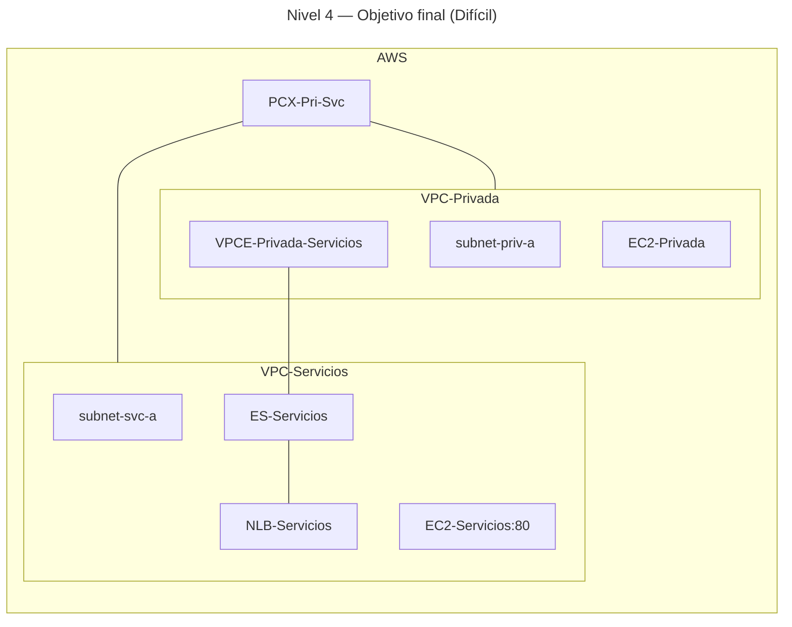

# 🥇 Nivel 4 — Difícil

Compara **VPC Peering** y **PrivateLink** desde **VPC-Privada** hacia **VPC-Servicios** usando **trazas** y **rutas controladas**. En modo **Difícil** solo se describe el problema y la solución esperada; no hay pasos ni parámetros concretos.

Se debe realizar tanto en **GUI** como en **CLI** **documentando tus pasos** y contrastando con la solución del modo **Fácil**.

## 🎯 Objetivo

Demostrar, con **evidencias técnicas**, la diferencia entre:

- Acceso al servicio mediante **PrivateLink** (DNS del **Interface Endpoint**, tráfico local a ENIs del VPCE, sin rutas entre VPCs).
- Acceso al backend por **IP privada** mediante **VPC Peering** (rutas recíprocas entre **10.1.0.0/16** y **10.2.0.0/16**).

## ✅ Solución esperada

- **PCX-Pri-Svc** creado y **rutas** aplicadas en ambas VPCs para sus CIDRs.
- **SG** ajustados para permitir **TCP 80** donde corresponda.
- **Pruebas** desde `EC2-Privada`:
    - **PrivateLink**: `curl` al **DNS privado del VPCE** funciona aunque **no** exista ruta hacia `10.2.0.0/16`.  
    - **Peering**: `curl` a la **IP privada** del backend en `10.2.1.0/24` funciona **solo** con rutas de **peering** activas.
    - **Trazas** (`traceroute -T -p 80`) muestran diferencias de **salto**/resolución (limitado por AWS).
- **Limpieza**: retirada de rutas y borrado de `PCX-Pri-Svc` para volver al estado del **Nivel 3**.

## 🗺️ Arquitectura objetivo (resultado final)

## 🔎 Verificación

- **PrivateLink** operativo sin depender de rutas entre VPCs (acceso vía **DNS del VPCE**).  
- **Peering** operativo para acceso directo por **IP privada** cuando las **rutas** están presentes.  
- Trazas y pruebas HTTP documentadas con resultados.

## 🧹 Limpieza

Eliminar **rutas** asociadas al **PCX-Pri-Svc** y borrar el **peering**, manteniendo la arquitectura del **Nivel 3**.
