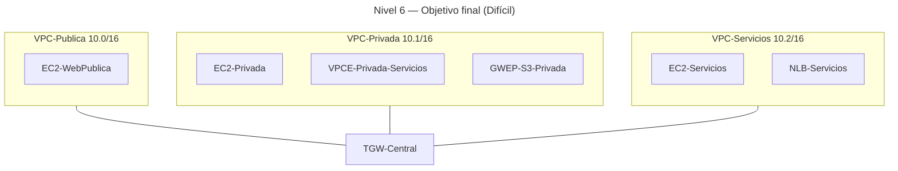

# 🥇 Nivel 6 — Difícil

Diseña una **VPC transitiva** con **Transit Gateway** que interconecte las tres VPCs del laboratorio. En modo **Difícil** solo se describe el problema y la solución esperada; no hay pasos ni parámetros concretos.

Se debe realizar tanto en **GUI** como en **CLI**, **documentando todos los pasos** y comparando el resultado con los de **Fácil**.

## 🎯 Objetivo

Establecer un **hub de tránsito** (TGW) para **VPC-Publica**, **VPC-Privada** y **VPC-Servicios**, manteniendo **S3 por Gateway Endpoint** y **PrivateLink** independientes del TGW.

## ✅ Solución esperada

- **TGW-Central** creado con **tres attachments** (uno por VPC).  
- **TGW-RT-Compartida** con **associations** de los attachments y **propagations** habilitadas (aprende 10.0/16, 10.1/16, 10.2/16).  
- **Route Tables** de las VPCs con **CIDRs remotos → TGW**; se preserva `Default → IGW/NAT` y `pl-S3 → GWEP`.  
- **Verificación**: desde `EC2-Privada`, acceso HTTP a `EC2-WebPublica` (10.0.1.X) y `EC2-Servicios` (10.2.1.X) **vía TGW**; `VPCE` y `S3` funcionan sin TGW.

## 🗺️ Arquitectura objetivo (resultado final)

## 🔎 Verificación

- `EC2-Privada` accede por IP privada a **10.0.1.X** y **10.2.1.X** (rutas via TGW).  
- **S3** accesible desde `EC2-Privada` por **GWEP** incluso sin ruta por defecto a NAT.  
- **PrivateLink** operando por **ENIs** del **VPCE**, independiente del TGW.

## 🧹 Limpieza

Eliminar rutas hacia TGW en las VPCs, borrar **attachments** y **TGW**, dejando la arquitectura del **Nivel 5**.
