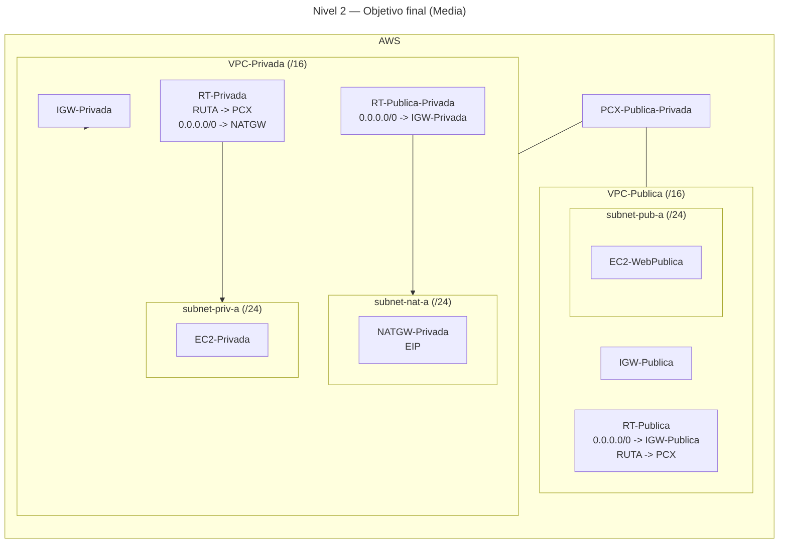

# 🥈 Nivel 2 — Media

Configura un **NAT Gateway** y proporciona **salida a Internet** a **instancias privadas** de tu **VPC-Privada** (partiendo del **Nivel 1**).

**[Enlace rápido al apartado para practicar con CLI](#️-usando-la-cli-en-cloudshell-command-line-interface)**

---

## 🖱️ Usando la GUI (Graphical User Interface)

### 🎯 Objetivo

Dar **egreso a Internet** a `subnet-priv-a` de **VPC-Privada** mediante **NATGW** en una **subnet pública** de esa misma VPC, manteniendo la **ruta de peering** entre VPCs.

### 🧱 Requisitos previos

- Arquitectura del Nivel 1 operativa en la misma región.

---

### 🗺️ Arquitectura objetivo (resultado final)



---

### 🧭 Plan de trabajo (tú ejecutas los pasos)

1) **Subred pública + IGW (VPC-Privada)**  
   - Crea `subnet-nat-a` (/24) y habilita **Auto-assign public IPv4**.  
   - Crea `IGW-Privada` y **adjúntalo** a **VPC-Privada**.  
   - Crea `RT-Publica-Privada` y asócialo a `subnet-nat-a` con **0.0.0.0/0 → IGW-Privada**.

2) **NAT Gateway**  
   - Asigna una **Elastic IP**.  
   - Crea `NATGW-Privada` en `subnet-nat-a` usando esa **EIP**.  
   - Espera a **Available**.

3) **Rutas**  
   - En `RT-Privada`, añade **0.0.0.0/0 → NATGW**.  
   - Mantén la ruta de peering hacia la otra VPC.

4) **Verificación**  
   - Desde una instancia en `subnet-priv-a`, prueba **HTTP** a Internet (p. ej., `curl http://example.com`).  
   - (Opcional) Comprueba IP de salida con `https://checkip.amazonaws.com`.

5) **Limpieza (para volver a Nivel 1)**  
   - Quita la ruta por defecto a NAT en `RT-Privada`.  
   - Elimina **NATGW** y libera la **EIP**.  
   - Borra `RT-Publica-Privada`, `subnet-nat-a` y `IGW-Privada`.

---

## ⌨️ Usando la CLI en CloudShell (Command Line Interface)

> Ejecuta todo desde **AWS CloudShell** y **añade tu región manualmente** a cada comando (por ejemplo, `--region us-east-1`). Los comandos base no incluyen parámetros.

---

### 🔎 Prechequeo

```bash
aws sts get-caller-identity
aws configure get region
```

---

### 🧭 Tareas (comandos base, sin parámetros)

#### Subred pública e IGW

```bash
aws ec2 create-subnet ...
aws ec2 modify-subnet-attribute ...
aws ec2 create-internet-gateway ...
aws ec2 attach-internet-gateway ...
aws ec2 create-route-table ...
aws ec2 create-route ...
aws ec2 associate-route-table ...
```

#### NAT y rutas

```bash
aws ec2 allocate-address ...
aws ec2 create-nat-gateway ...
aws ec2 create-route ...
```

#### Verificación

```bash
# Desde una instancia en la subnet privada:
curl http://example.com
# (Opcional) curl https://checkip.amazonaws.com
```

#### Limpieza (volver a Nivel 1)

```bash
aws ec2 delete-route ...
aws ec2 delete-nat-gateway ...
aws ec2 release-address ...
aws ec2 disassociate-route-table ...
aws ec2 delete-route-table ...
aws ec2 delete-subnet ...
aws ec2 detach-internet-gateway ...
aws ec2 delete-internet-gateway ...
```
