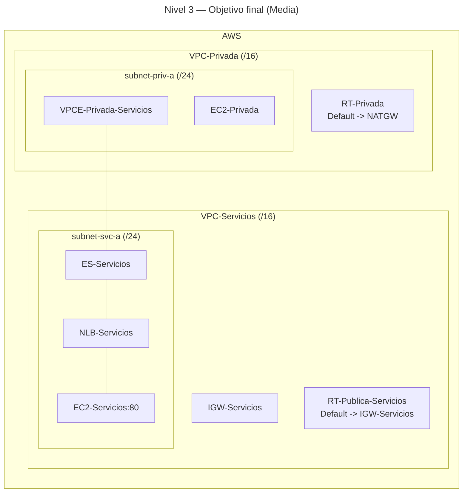

# 🥈 Nivel 3 — Media

Crea una **tercera VPC** para alojar un **servicio** y publícalo mediante **Endpoint Service (NLB)**. Consúmelo desde **VPC-Privada** con un **Interface Endpoint (PrivateLink)**. Partes desde el **Nivel 2**.

**[Enlace rápido al apartado para practicar con CLI](#️-usando-la-cli-en-cloudshell-command-line-interface)**

## ⚠️ Advertencia de costes — 03 (us-east-1)

**Clasificación:** Medio (Interface Endpoint).

**Recursos con coste:**

- **Interface Endpoint (PrivateLink):** coste por **AZ/hora** + **GB procesado**.

**Cómo minimizar:**

- Despliega el **VPCE** cuando tengas todo listo y **elimínalo** al terminar.
- Limítate a **1 AZ** para el lab.
- Comprueba con peticiones **pequeñas** (cabeceras, `curl -I`).
- Evita acceso cruzado innecesario entre AZs/VPCs.

---

## 🖱️ Usando la GUI (Graphical User Interface)

### 🎯 Objetivo

Exponer un servicio HTTP en **VPC-Servicios** a **VPC-Privada** usando **PrivateLink**, sin rutas entre VPC-Privada y VPC-Servicios (no peering ni transit). El tráfico viaja por **ENIs** privados del **Interface Endpoint**.

### 🧱 Requisitos previos

- VPC-Publica y VPC-Privada operativas (Nivel 2), NAT funcional en VPC-Privada.

---

### 🗺️ Arquitectura objetivo (resultado final)



---

### 🧭 Plan de trabajo (tú ejecutas los pasos)

1) **Red (proveedor)**  
    - Crea `VPC-Servicios` (/16) con `subnet-svc-a` (/24).  
    - IGW + RT pública para la subnet del servicio.

2) **Cómputo y balanceo (proveedor)**  
    - `EC2-Servicios` escuchando en **80** (user data simple).  
    - `NLB-Servicios` (internal) + `TG-Servicios` (TCP:80) con la instancia registrada.

3) **Endpoint Service (proveedor)**  
    - `ES-Servicios` asociado al NLB (requiere **accept** por seguridad).

4) **Interface Endpoint (consumidor)**  
    - En **VPC-Privada**, crea `VPCE-Privada-Servicios` (subnet privada) y un SG que permita **TCP 80** desde la **subnet-priv-a**.  
    - Acepta la conexión en `ES-Servicios`.

5) **Verificación**  
    - Desde `EC2-Privada`, `curl` al **DNS** del **VPCE**. Debe devolver el HTML del backend.

6) **Limpieza (vuelta a Nivel 2)**  
    - Elimina **VPCE**, **ES-Servicios**, **NLB/TG**, **EC2-Servicios**, y la **VPC-Servicios**.

---

## ⌨️ Usando la CLI en CloudShell (Command Line Interface)

> Ejecuta todo desde **AWS CloudShell** y **añade tu región manualmente** a cada comando.

---

### 🔎 Prechequeo

```bash
aws sts get-caller-identity
aws configure get region
```

---

### 🧭 Tareas (comandos base, sin parámetros)

#### Proveedor (VPC-Servicios)

```bash
aws ec2 create-vpc ...
aws ec2 create-subnet ...
aws ec2 create-internet-gateway ...
aws ec2 attach-internet-gateway ...
aws ec2 create-route-table ...
aws ec2 create-route ...
aws ec2 associate-route-table ...
aws ec2 create-security-group ...
aws ec2 authorize-security-group-ingress ...
aws ssm get-parameters ...
aws ec2 run-instances ...
aws elbv2 create-target-group ...
aws elbv2 register-targets ...
aws elbv2 create-load-balancer ...
aws elbv2 create-listener ...
aws ec2 create-vpc-endpoint-service-configuration ...
```

#### Consumidor (VPC-Privada)

```bash
aws ec2 create-security-group ...
aws ec2 authorize-security-group-ingress ...
aws ec2 create-vpc-endpoint ...
aws ec2 accept-vpc-endpoint-connections ...
```

#### Verificación

```bash
# Desde EC2-Privada:
curl http://<VPCE_DNS_PRIVADO>
```

#### Limpieza

```bash
aws ec2 delete-vpc-endpoints ...
aws ec2 delete-vpc-endpoint-service-configurations ...
aws elbv2 delete-listener ...
aws elbv2 delete-load-balancer ...
aws elbv2 delete-target-group ...
aws ec2 terminate-instances ...
aws ec2 delete-security-group ...
aws ec2 disassociate-route-table ...
aws ec2 delete-route-table ...
aws ec2 detach-internet-gateway ...
aws ec2 delete-internet-gateway ...
aws ec2 delete-subnet ...
aws ec2 delete-vpc ...
```
