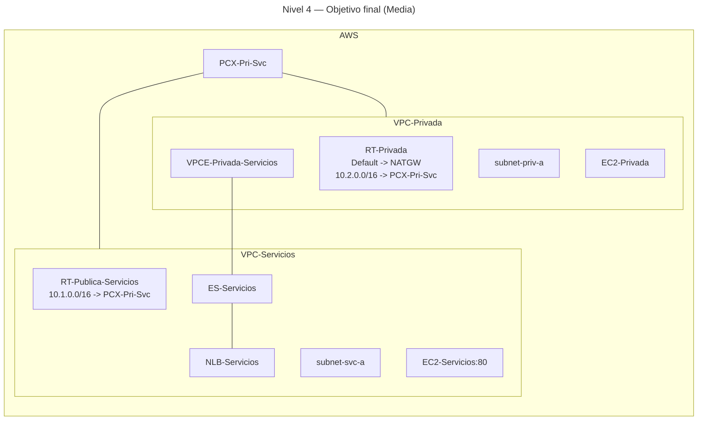

# 🥈 Nivel 4 — Media

Compara **VPC Peering** y **PrivateLink** desde **VPC-Privada** hacia **VPC-Servicios** mediante **traceroute** y **rutas controladas**. Partes del **Nivel 3**.

**[Enlace rápido al apartado para practicar con CLI](#️-usando-la-cli-en-cloudshell-command-line-interface)**

## ⚠️ Advertencia de costes — 04 (us-east-1)

**Clasificación:** Bajo–Medio (reutiliza PrivateLink del 03).

**Recursos con coste:**

- Usa el **Interface Endpoint** del nivel 03 si sigue activo; si creas uno nuevo, aplica el coste por hora/GB.

**Cómo minimizar:**

- Ejecuta la comparativa **justo después** del 03 en la **misma sesión**.
- Mantén las pruebas (traceroute/`curl`) **muy cortas**.
- **Elimina el VPCE** al finalizar si no se usará más.

---

## 🖱️ Usando la GUI (Graphical User Interface)

### 🎯 Objetivo

Habilitar **dos caminos** hacia el servicio en **VPC-Servicios**:

- **PrivateLink**: vía **VPCE** (DNS privado, sin rutas entre VPCs).
- **Peering**: vía **PCX-Pri-Svc** y rutas **10.1.0.0/16 ↔ 10.2.0.0/16**.

Comparar con **trazas** y **pruebas HTTP** desde `EC2-Privada`.

### 🧱 Requisitos previos

- Arquitectura del **Nivel 3** operativa.

---

### 🗺️ Arquitectura objetivo (resultado final)



---

### 🧭 Plan de trabajo (tú ejecutas los pasos)

1) **Peering Pri↔Svc**  
    - Crea `PCX-Pri-Svc` y **acéptalo**.

2) **Rutas**  
    - En `RT-Privada`: añade `10.2.0.0/16 → PCX-Pri-Svc`.  
    - En `RT-Publica-Servicios`: añade `10.1.0.0/16 → PCX-Pri-Svc`.

3) **Seguridad**  
    - En `VPC-Servicios`, el SG del backend permite **TCP 80** desde `10.1.0.0/16`.  
    - El SG del **VPCE** mantiene **TCP 80** desde `subnet-priv-a`.

4) **Pruebas**  
    - **PrivateLink**: `curl` al **DNS privado** del **VPCE** y `traceroute -T -p 80`.  
    - **Peering**: `curl` y `traceroute -T -p 80` a la **IP privada** del backend.

5) **Experimento de rutas**  
    - Quita temporalmente `10.2.0.0/16` de `RT-Privada`: el acceso por **PrivateLink** debe seguir funcionando.  
    - Restaura la ruta y confirma acceso por **peering**.

6) **Limpieza**  
    - Elimina rutas y `PCX-Pri-Svc` para volver al estado del **Nivel 3**.

---

## ⌨️ Usando la CLI en CloudShell (Command Line Interface)

> Ejecuta todo desde **AWS CloudShell** y **añade tu región manualmente** a cada comando.

---

### 🔎 Prechequeo

```bash
aws sts get-caller-identity
aws configure get region
```

---

### 🧭 Tareas (comandos base, sin parámetros)

#### Peering y rutas

```bash
aws ec2 create-vpc-peering-connection ...
aws ec2 accept-vpc-peering-connection ...
aws ec2 create-route ...
aws ec2 create-route ...
```

#### Seguridad

```bash
aws ec2 authorize-security-group-ingress ...
```

#### Pruebas

```bash
getent hosts <VPCE_DNS_PRIVADO>
traceroute -T -p 80 <VPCE_DNS_PRIVADO>
traceroute -T -p 80 10.2.1.X
curl -sI http://<VPCE_DNS_PRIVADO>
curl -sI http://10.2.1.X
```

#### Limpieza

```bash
aws ec2 delete-route ...
aws ec2 delete-route ...
aws ec2 delete-vpc-peering-connection ...
```
