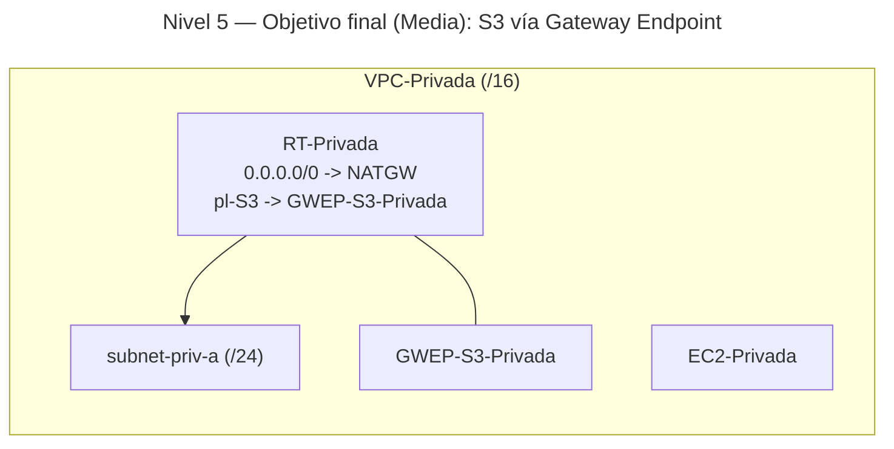

# 🥈 Nivel 5 — Media

Implementa un **Gateway Endpoint de S3** en **VPC-Privada** para acceso a **S3** sin salir de AWS. Mantén NAT para el resto del tráfico. Partes del estado del **Nivel 4** (o, como mínimo, de Nivel 3 con NAT en VPC-Privada).

**[Enlace rápido al apartado para practicar con CLI](#️-usando-la-cli-en-cloudshell-command-line-interface)**

## ⚠️ Advertencia de costes — 05 (us-east-1)

**Clasificación:** Muy bajo.

**Recursos con coste:**

- **Gateway Endpoint S3:** sin coste por hora.
- Pueden existir costes por **requests S3** y **datos a Internet** (si aplican).

**Cómo minimizar:**

- Mantén el acceso a S3 **dentro de AWS** (evita salidas a Internet).
- Haz pruebas con **objetos pequeños** y pocas operaciones.
- Este endpoint puede **quedarse** activo (no factura por hora).

---

## 🖱️ Usando la GUI (Graphical User Interface)

### 🎯 Objetivo

Enrutar el tráfico hacia **S3** desde **subnet-priv-a** mediante un **Gateway Endpoint** adjunto a **RT-Privada**, sin depender de Internet/NAT para S3.

### 🧱 Requisitos previos

- VPC-Privada, subnet privada y RT-Privada operativas.
- Instancia en la subnet privada para pruebas.

---

### 🗺️ Arquitectura objetivo (resultado final)



---

### 🧭 Plan de trabajo (tú ejecutas los pasos)

1) **S3 (opcional)**  
    - Crea un bucket y sube un objeto de prueba (solo para validar con `aws s3` si lo deseas; no es necesario hacerlo público).

2) **Gateway Endpoint**  
    - Crea un **VPC Endpoint** tipo **Gateway** para **S3** en **VPC-Privada**.  
    - Asígnalo a **RT-Privada** (tabla que usan las subnets privadas).

3) **Verificación**  
    - Desde `EC2-Privada`:  
    - `curl -I http://s3.<region>.amazonaws.com` → debe responder (403 sin credenciales).  
    - **Prueba opcional**: quita temporalmente `0.0.0.0/0 → NATGW` de **RT-Privada**; el acceso a **S3** debe seguir respondiendo mientras que `example.com` fallará.  
    - Restaura la ruta por defecto a **NATGW**.

4) **Limpieza**  
    - Elimina el **Gateway Endpoint** (y el bucket de prueba si lo creaste).

---

## ⌨️ Usando la CLI en CloudShell (Command Line Interface)

> Ejecuta todo desde **AWS CloudShell** y **añade tu región manualmente** a cada comando.

---

### 🔎 Prechequeo

```bash
aws sts get-caller-identity
aws configure get region
```

---

### 🧭 Tareas (comandos base, sin parámetros)

#### S3 (opcional)

```bash
aws s3api create-bucket ...
aws s3 cp ...
```

#### Gateway Endpoint y rutas

```bash
aws ec2 create-vpc-endpoint ...
# (tipo: Gateway, servicio: S3, RT de las subnets privadas)
```

#### Verificación

```bash
curl -I http://s3.<REGION>.amazonaws.com
# (Opcional) quitar ruta por defecto a NAT, repetir prueba S3 y example.com
```

#### Limpieza

```bash
aws ec2 delete-vpc-endpoints ...
# (Opcional) eliminar objeto y bucket
```
