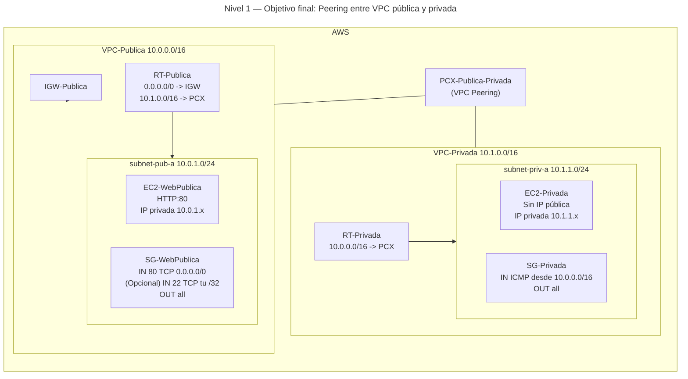
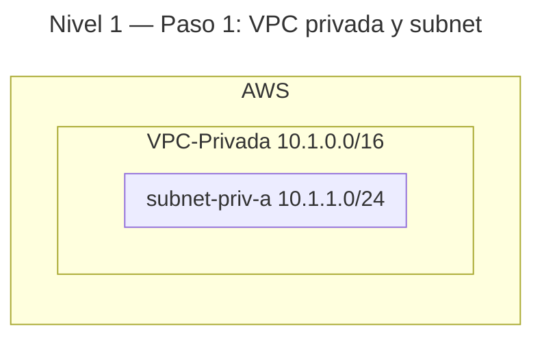
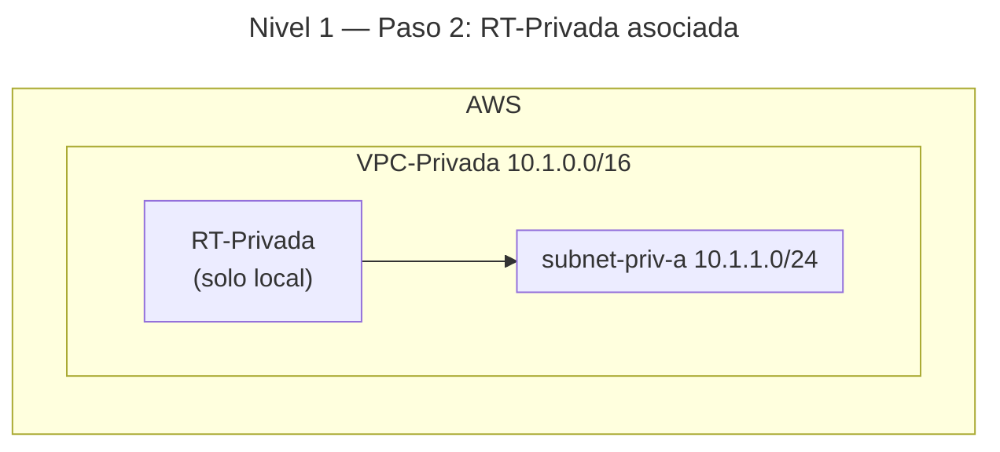
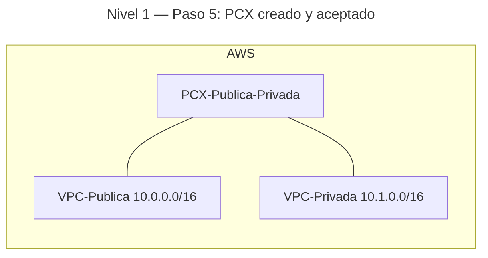
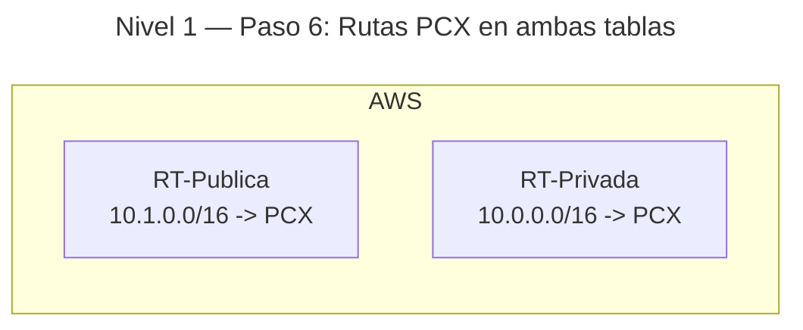
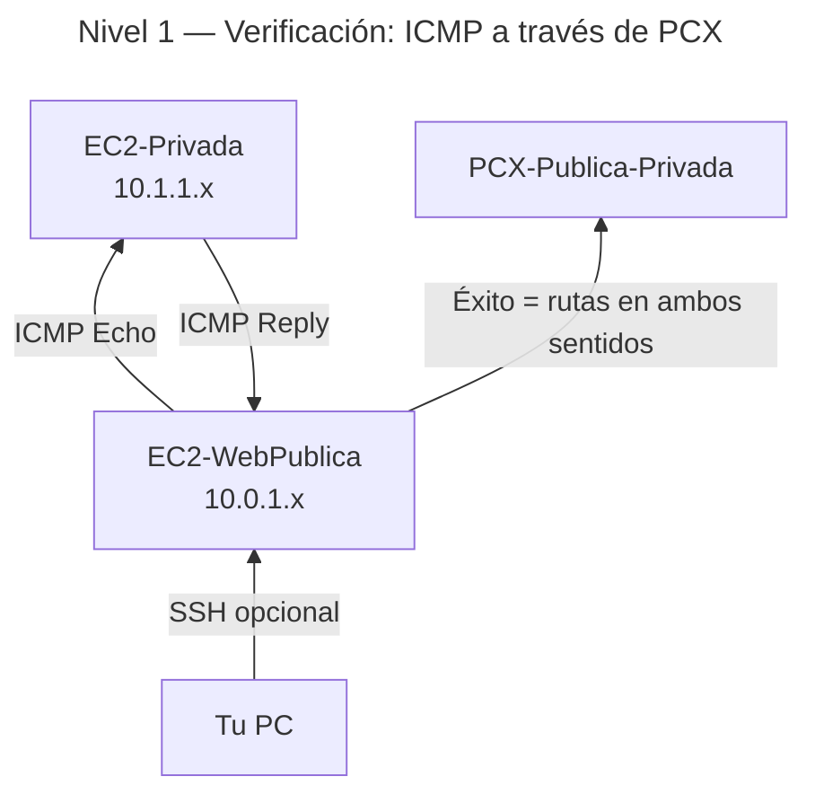

# 🥉 Nivel 1 — Fácil

Crea una **VPC privada**, establece un **VPC Peering** con tu **VPC pública existente** y **comprueba su bidireccionalidad**.

**[Enlace rápido al apartado para practicar con CLI](#️-usando-la-cli-en-cloudshell-command-line-interface)**

## ⚠️ Advertencia de costes — 01 (us-east-1)

**Clasificación:** Muy bajo.  

**Recursos con coste:**

- **VPC Peering:** sin coste horario; **sí** puede haber coste por **datos** a través del peering.

**Cómo minimizar:**

- Mantén pruebas de conectividad **ligeras** (pings/`curl -I`).
- Evita transferir ficheros grandes entre VPCs.
- Conserva el peering activo (no cobra por hora); borra solo si no lo usarás más.

---

## 🖱️ Usando la GUI (Graphical User Interface)

### 🎯 Objetivo

Partiendo del resultado del **Nivel 0 (VPC-Publica, subnet-pub-a, RT-Publica, IGW-Publica, SG-WebPublica, EC2-WebPublica)**, crear una **VPC privada** sin salida a Internet, conectarla con la pública mediante **VPC Peering** y **habilitar rutas en ambos sentidos** para que las instancias de ambos lados se alcancen por IP privada.

### 🧱 Requisitos previos

- Haber completado el **Nivel 0** en la misma región (ej.: **us-east-1**).
- Contar con **EC2-WebPublica** en ejecución y su **SG-WebPublica**.
- Si vas a usar SSH para verificar, añade **TCP 22** a **SG-WebPublica** solo desde **tu IP /32**.

---

### 🗺️ Arquitectura objetivo (resultado final)



---

### 🔧 Paso 1 — Crear la VPC privada y su Subnet

1. **VPC** → **Your VPCs** → **Create VPC** → **VPC only**.
2. **Name tag**: `VPC-Privada` — **IPv4 CIDR**: `10.1.0.0/16` → **Create VPC**.
3. **Subnets** → **Create subnet** → **VPC**: `VPC-Privada`.
4. **Subnet name**: `subnet-priv-a` — **AZ**: `us-east-1a` — **CIDR**: `10.1.1.0/24` → **Create subnet**.
5. **NO** actives **auto-assign public IPv4** en esta subnet.

**Progresión (tras paso 1):**



---

### 🔧 Paso 2 — Crear RT-Privada y asociarla a la Subnet

1. **Route Tables** → **Create route table** → **Name**: `RT-Privada` → **VPC**: `VPC-Privada`.
2. **Subnet associations** → **Edit** → marca `subnet-priv-a` → **Save**.
3. No añadas rutas a Internet.

**Progresión (tras paso 2):**



---

### 🔧 Paso 3 — SG para la instancia privada

1. **Security Groups** → **Create security group**.
2. **Name**: `SG-Privada` — **VPC**: `VPC-Privada`.
3. **Inbound rules** → **Add rule**:
    - **Type**: `All ICMP - IPv4`
    - **Source**: `10.0.0.0/16` (CIDR de tu VPC-Publica).
4. **Outbound rules**: **All traffic** → `0.0.0.0/0`.
5. **Create security group**.

---

### 🔧 Paso 4 — Lanzar EC2-Privada (sin IP pública)

1. **EC2** → **Launch instances**.
2. **Name**: `EC2-Privada` — **AMI**: **Amazon Linux 2023** — **Type**: `t2.micro`.
3. **Network**: **VPC**: `VPC-Privada` — **Subnet**: `subnet-priv-a`.
4. **Auto-assign public IP**: **Disable**.
5. **Security group**: **Select existing** → `SG-Privada`.
6. **Launch instance**.
7. Guarda la **Private IPv4 address** (ej.: `10.1.1.x`).

---

### 🔧 Paso 5 — Crear el VPC Peering y aceptarlo

1. **VPC** → **Peering connections** → **Create peering connection**.
2. **Name tag**: `PCX-Publica-Privada`.
3. **Requester VPC**: `VPC-Publica` — **Accepter VPC**: `VPC-Privada` (misma cuenta y región).
4. **Create peering connection** → **Actions** → **Accept request**.

**Progresión (tras paso 5):**



---

### 🔧 Paso 6 — Añadir rutas de peering en ambas VPC

1. **RT-Publica** (de `VPC-Publica`) → **Routes** → **Edit routes** → **Add route**:
    - **Destination**: `10.1.0.0/16`
    - **Target**: `Peering connection` → `PCX-Publica-Privada` → **Save**.
2. **RT-Privada** (de `VPC-Privada`) → **Routes** → **Edit routes** → **Add route**:
    - **Destination**: `10.0.0.0/16`
    - **Target**: `Peering connection` → `PCX-Publica-Privada` → **Save**.

**Progresión (tras paso 6):**



---

### 🔎 Paso 7 — Verificación (bidireccionalidad)

- Desde tu **PC** (opcional): habilita **SSH 22** en **SG-WebPublica** solo desde **tu IP /32**, conéctate a **EC2-WebPublica**.
- En **EC2-WebPublica**:
    1. Haz **ping** a la **IP privada** de `EC2-Privada` (ej.: `10.1.1.x`).
    2. Si recibes respuesta, implica que:
       - **RT-Publica** y **RT-Privada** tienen rutas correctas hacia el **PCX**.
       - **SG-Privada** permite **ICMP** desde `10.0.0.0/16`.
       - El **retorno** funciona (bidireccionalidad).

**Progresión (verificación):**



---

### 🧯 Problemas típicos

- **ICMP bloqueado**: revisa **SG-Privada** (IN ICMP desde `10.0.0.0/16`).  
- **Rutas faltantes**: añade la red de la otra VPC a la **RT** correspondiente con **Target = PCX**.  
- **CIDR solapado**: el peering **no** funciona con rangos que se solapan.  
- **Peering en estado pendiente**: asegúrate de **Accept request**.

---

### 🧹 Limpieza (GUI)

1. Si habilitaste **SSH** en **SG-WebPublica**, elimina esa regla.  
2. **EC2 → Instances**: termina `EC2-Privada`.  
3. **Route Tables**: elimina rutas del **PCX** en **RT-Publica** y **RT-Privada** (desasocia si procede).  
4. **VPC Peering**: borra `PCX-Publica-Privada`.  
5. **Security Groups**: borra `SG-Privada`.  
6. **Subnets**: borra `subnet-priv-a`.  
7. **VPCs**: borra `VPC-Privada`.

---
---
---
---
---

## ⌨️ Usando la CLI en CloudShell (Command Line Interface)

> CloudShell por defecto. Comandos con `--region us-east-1` **explícito** en todos los comandos. Copia los IDs manualmente (N0–N4 sin funciones ni variables avanzadas).

### 🧱 Requisitos previos (CLI)

- Haber creado previamente **VPC-Publica**, **RT-Publica** y **EC2-WebPublica** (Nivel 0).

### 🔎 Prechequeo

```bash
aws sts get-caller-identity --region us-east-1
aws configure get region
```

---

### 🔧 Paso 1 — VPC privada, Subnet y RT

```bash
aws ec2 create-vpc \
    --cidr-block 10.1.0.0/16 \
    --tag-specifications 'ResourceType=vpc,Tags=[{Key=Name,Value=VPC-Privada}]' \
    --region us-east-1
# Copia VpcId como <VPC_PRIV_ID>

aws ec2 create-subnet \
    --vpc-id <VPC_PRIV_ID> \
    --cidr-block 10.1.1.0/24 \
    --availability-zone us-east-1a \
    --tag-specifications 'ResourceType=subnet,Tags=[{Key=Name,Value=subnet-priv-a}]' \
    --region us-east-1
# Copia SubnetId como <SUBNET_PRIV_ID>

aws ec2 create-route-table \
    --vpc-id <VPC_PRIV_ID> \
    --tag-specifications 'ResourceType=route-table,Tags=[{Key=Name,Value=RT-Privada}]' \
    --region us-east-1
# Copia RouteTableId como <RT_PRIV_ID>

aws ec2 associate-route-table \
    --subnet-id <SUBNET_PRIV_ID> \
    --route-table-id <RT_PRIV_ID> \
    --region us-east-1
# Copia AssociationId como <RT_PRIV_ASSOC_ID>
```

---

### 🔧 Paso 2 — SG-Privada e instancia sin IP pública

```bash
aws ec2 create-security-group \
    --group-name SG-Privada \
    --description "SG privada ICMP desde VPC-Publica" \
    --vpc-id <VPC_PRIV_ID> \
    --region us-east-1
# Copia GroupId como <SG_PRIV_ID>

aws ec2 authorize-security-group-ingress \
    --group-id <SG_PRIV_ID> \
    --ip-permissions IpProtocol=icmp,FromPort=-1,ToPort=-1,IpRanges='[{CidrIp=10.0.0.0/16,Description=ICMP-desde-VPC-Publica}]' \
    --region us-east-1

# Lanza EC2-Privada (sin IP pública)
aws ssm get-parameters \
    --names /aws/service/ami-amazon-linux-latest/al2023-ami-kernel-6.1-x86_64 \
    --region us-east-1
# Copia Parameters[0].Value como <AMI_ID>

aws ec2 run-instances \
    --image-id <AMI_ID> \
    --instance-type t2.micro \
    --subnet-id <SUBNET_PRIV_ID> \
    --no-associate-public-ip-address \
    --security-group-ids <SG_PRIV_ID> \
    --tag-specifications 'ResourceType=instance,Tags=[{Key=Name,Value=EC2-Privada}]' \
    --region us-east-1
# Copia InstanceId como <INSTANCE_PRIV_ID>

aws ec2 describe-instances \
    --instance-ids <INSTANCE_PRIV_ID> \
    --region us-east-1
# Copia PrivateIpAddress como <PRIVATE_IP_PRIVADA>
```

---

### 🔧 Paso 3 — VPC Peering y rutas en ambos lados

```bash
# Crea el peering
aws ec2 create-vpc-peering-connection \
    --vpc-id <VPC_PUB_ID> \
    --peer-vpc-id <VPC_PRIV_ID> \
    --tag-specifications 'ResourceType=vpc-peering-connection,Tags=[{Key=Name,Value=PCX-Publica-Privada}]' \
    --region us-east-1
# Copia VpcPeeringConnectionId como <PCX_ID>

# Acepta el peering
aws ec2 accept-vpc-peering-connection \
    --vpc-peering-connection-id <PCX_ID> \
    --region us-east-1

# Añade ruta en RT-Publica (hacia 10.1.0.0/16 via PCX)
aws ec2 create-route \
    --route-table-id <RT_PUB_ID> \
    --destination-cidr-block 10.1.0.0/16 \
    --vpc-peering-connection-id <PCX_ID> \
    --region us-east-1

# Añade ruta en RT-Privada (hacia 10.0.0.0/16 via PCX)
aws ec2 create-route \
    --route-table-id <RT_PRIV_ID> \
    --destination-cidr-block 10.0.0.0/16 \
    --vpc-peering-connection-id <PCX_ID> \
    --region us-east-1
```

---

### ✅ Verificación

- Obtén la **IP privada** de `EC2-Privada` y desde `EC2-WebPublica` (vía SSH opcional desde tu IP /32) ejecuta:

```bash
ping -c 3 <PRIVATE_IP_PRIVADA>
```

- Éxito del **ping** implica **bidireccionalidad** (el Echo Reply confirma la ruta de retorno y reglas).

---

### 🧯 Troubleshooting rápido

- **Destination unreachable**: ruta ausente en alguna **RT** hacia el **PCX**.  
- **Request timed out**: **SG-Privada** sin ICMP permitido desde `10.0.0.0/16`.  
- **CIDR solapado**: redefine rangos (el peering no enrutará redes solapadas).

---

### 🧹 Limpieza (CLI)

```bash
# 1) Quitar rutas de peering
aws ec2 delete-route --route-table-id <RT_PUB_ID> --destination-cidr-block 10.1.0.0/16 --region us-east-1
aws ec2 delete-route --route-table-id <RT_PRIV_ID> --destination-cidr-block 10.0.0.0/16 --region us-east-1

# 2) Borrar peering
aws ec2 delete-vpc-peering-connection --vpc-peering-connection-id <PCX_ID> --region us-east-1

# 3) Instancia privada
aws ec2 terminate-instances --instance-ids <INSTANCE_PRIV_ID> --region us-east-1

# 4) SG privada
aws ec2 delete-security-group --group-id <SG_PRIV_ID> --region us-east-1

# 5) RT privada (desasociar si procede)
aws ec2 disassociate-route-table --association-id <RT_PRIV_ASSOC_ID> --region us-east-1
aws ec2 delete-route-table --route-table-id <RT_PRIV_ID> --region us-east-1

# 6) Subnet y VPC privada
aws ec2 delete-subnet --subnet-id <SUBNET_PRIV_ID> --region us-east-1
aws ec2 delete-vpc --vpc-id <VPC_PRIV_ID> --region us-east-1
```
