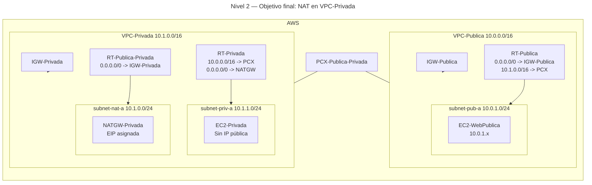
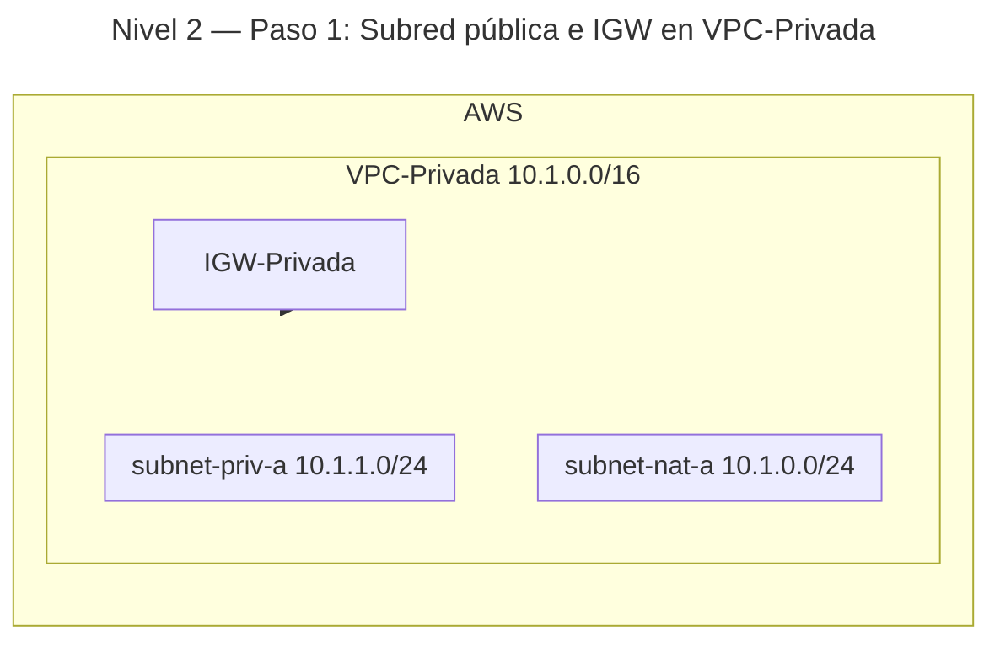
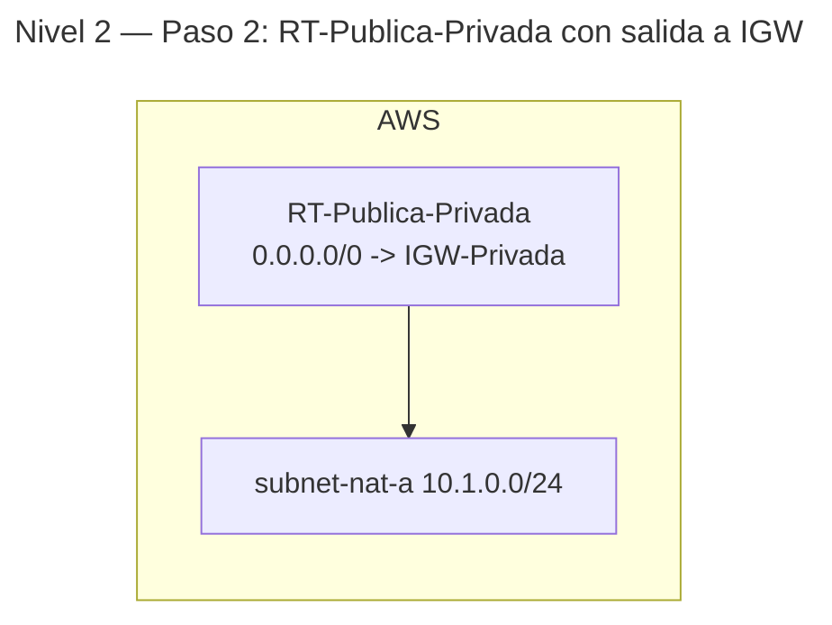
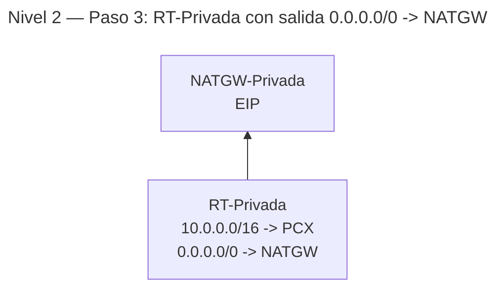

# 🥉 Nivel 2 — Fácil

Configura un **NAT Gateway** y proporciona **salida a Internet** a **instancias privadas** de tu **VPC-Privada** (parte desde el final del **Nivel 1**: dos VPCs, peering y conectividad privada entre ellas).

**[Enlace rápido al apartado para practicar con CLI](#️-usando-la-cli-en-cloudshell-command-line-interface)**

## ⚠️ Advertencia de costes — 02 (us-east-1)

**Clasificación:** Medio (recurso caro por hora).  

**Recursos con coste:**

- **NAT Gateway:** coste por **hora** + por **GB procesado**.
- **Dirección IPv4 pública (EIP):** coste por hora mientras exista.

**Cómo minimizar:**

- **Crea el NAT GW al final**, prueba y **elimínalo** al cerrar la práctica.
- **Libera la EIP** asociada si ya no se usa.
- Usa **una sola AZ** y tráfico mínimo (validaciones con `curl -I`).
- No dejes rutas a NAT activas si borras el NAT (evita confusión).

---

## 🖱️ Usando la GUI (Graphical User Interface)

### 🎯 Objetivo

En **VPC-Privada**, crear una **subred pública** para el **NAT Gateway**, adjuntar un **IGW-Privada**, enrutar la **subred privada** a **0.0.0.0/0 → NATGW**, y mantener el peering con **VPC-Publica** para tráfico **10.0.0.0/16 ↔ 10.1.0.0/16**.

### 🧱 Requisitos previos

- Haber completado el **Nivel 1** (VPC-Privada con `subnet-priv-a` y `RT-Privada`, peering `PCX-Publica-Privada`, rutas de ida y vuelta entre VPCs).
- Mantén **la misma región** (ej.: **us-east-1**).

---

### 🗺️ Arquitectura objetivo (resultado final)



---

### 🔧 Paso 1 — Crear subred pública para el NAT e IGW en VPC-Privada

1. **VPC-Privada** → **Subnets** → **Create subnet**:
   - **Name**: `subnet-nat-a`
   - **CIDR**: `10.1.0.0/24` (no solape con `10.1.1.0/24`)
   - **AZ**: `us-east-1a` (o tu preferida)
2. **Subnet settings** → **Enable auto-assign public IPv4** → **Save**.
3. **Internet Gateways** → **Create internet gateway** → **Name**: `IGW-Privada` → **Create**.
4. **Attach to VPC** → **VPC-Privada**.

**Progresión (tras paso 1):**



---

### 🔧 Paso 2 — Tabla de rutas pública para la subnet del NAT

1. **Route Tables** → **Create route table** → **Name**: `RT-Publica-Privada` → **VPC**: `VPC-Privada`.
2. **Routes** → **Edit** → **Add route** `0.0.0.0/0 → IGW-Privada` → **Save**.
3. **Subnet associations** → **Edit** → marca `subnet-nat-a` → **Save**.

**Progresión (tras paso 2):**



---

### 🔧 Paso 3 — Crear NAT Gateway y enrutar la subnet privada

1. **Elastic IPs** → **Allocate Elastic IP** (VPC) → anota el **Allocation ID**.
2. **NAT Gateways** → **Create NAT gateway**:
   - **Subnet**: `subnet-nat-a`
   - **Elastic IP**: el recién asignado
   - **Name**: `NATGW-Privada`
3. Espera a **Available** (estado).
4. **Route Tables** → abre `RT-Privada`:
   - **Routes** → **Edit** → **Add route** `0.0.0.0/0 → NATGW-Privada` → **Save**.
   - Mantén la ruta **10.0.0.0/16 → PCX** para el peering.

**Progresión (tras paso 3):**



---

### 🔎 Verificación

- **Sin SSH (opción simple):** crea temporalmente una instancia en `subnet-priv-a` con user data que haga `curl` a un sitio público (por ejemplo, `example.com`) y revisa **System log** para ver la salida de *cloud-init*.  
- **Con SSH vía bastión (opcional):** si usas claves, entra a `EC2-WebPublica` desde tu **/32**, y desde ahí a `EC2-Privada` por IP privada. Ejecuta `curl http://example.com` y `curl https://checkip.amazonaws.com` (debería devolver la **EIP del NAT** o la IP de salida asociada).

---

### 🧯 Problemas típicos

- **NAT Gateway “Pending”**: espera a **Available** antes de probar.  
- **Sin salida**: falta la ruta `0.0.0.0/0 → NATGW` en **RT-Privada** o `0.0.0.0/0 → IGW-Privada` en **RT-Publica-Privada**.  
- **Peering roto**: conserva las rutas **10.0.0.0/16 ↔ 10.1.0.0/16** hacia **PCX**.  
- **Subred equivocada**: el **NATGW** debe estar en **subnet pública** (asociada a una RT con salida a **IGW**).

---

### 🧹 Limpieza (GUI)

- Para volver al estado del **Nivel 1**:
  1. En **RT-Privada**, elimina la ruta `0.0.0.0/0 → NATGW`.
  2. **NAT Gateways** → **Delete** `NATGW-Privada`.
  3. **Elastic IPs** → **Release** la EIP usada por el NAT (cuando el NAT esté eliminado).
  4. **Route Tables** → desasocia y elimina `RT-Publica-Privada`.
  5. **Subnets** → elimina `subnet-nat-a`.
  6. **Internet Gateways** → **Detach** `IGW-Privada` de `VPC-Privada` y **Delete**.

---
---
---
---
---

## ⌨️ Usando la CLI en CloudShell (Command Line Interface)

> CloudShell por defecto. Incluye `--region us-east-1` de forma **explícita** en todos los comandos. Copia los IDs manualmente cuando se indiquen.

### 🧱 Requisitos previos (CLI)

- Haber finalizado **Nivel 1** (peering operativo) en la misma región.

---

### 🔎 Prechequeo

```bash
aws sts get-caller-identity --region us-east-1
aws configure get region
```

---

### 🔧 Paso 1 — Subred pública e IGW en VPC-Privada

```bash
aws ec2 create-subnet \
  --vpc-id <VPC_PRIV_ID> \
  --cidr-block 10.1.0.0/24 \
  --availability-zone us-east-1a \
  --tag-specifications 'ResourceType=subnet,Tags=[{Key=Name,Value=subnet-nat-a}]' \
  --region us-east-1
# Copia SubnetId como <SUBNET_NAT_ID>

aws ec2 modify-subnet-attribute \
  --subnet-id <SUBNET_NAT_ID> \
  --map-public-ip-on-launch \
  --region us-east-1

aws ec2 create-internet-gateway \
  --tag-specifications 'ResourceType=internet-gateway,Tags=[{Key=Name,Value=IGW-Privada}]' \
  --region us-east-1
# Copia InternetGatewayId como <IGW_PRIV_ID>

aws ec2 attach-internet-gateway \
  --internet-gateway-id <IGW_PRIV_ID> \
  --vpc-id <VPC_PRIV_ID> \
  --region us-east-1
```

---

### 🔧 Paso 2 — RT pública para la subnet del NAT

```bash
aws ec2 create-route-table \
  --vpc-id <VPC_PRIV_ID> \
  --tag-specifications 'ResourceType=route-table,Tags=[{Key=Name,Value=RT-Publica-Privada}]' \
  --region us-east-1
# Copia RouteTableId como <RT_PRIV_PUB_ID>

aws ec2 create-route \
  --route-table-id <RT_PRIV_PUB_ID> \
  --destination-cidr-block 0.0.0.0/0 \
  --gateway-id <IGW_PRIV_ID> \
  --region us-east-1

aws ec2 associate-route-table \
  --subnet-id <SUBNET_NAT_ID> \
  --route-table-id <RT_PRIV_PUB_ID> \
  --region us-east-1
# Copia AssociationId como <RT_PRIV_PUB_ASSOC_ID>
```

---

### 🔧 Paso 3 — NAT Gateway y ruta por defecto en RT-Privada

```bash
aws ec2 allocate-address \
  --domain vpc \
  --region us-east-1
# Copia AllocationId como <EIP_ALLOC_ID>

aws ec2 create-nat-gateway \
  --subnet-id <SUBNET_NAT_ID> \
  --allocation-id <EIP_ALLOC_ID> \
  --tag-specifications 'ResourceType=natgateway,Tags=[{Key=Name,Value=NATGW-Privada}]' \
  --region us-east-1
# Copia NatGatewayId como <NATGW_ID> (espera a estado 'available' antes de seguir)

aws ec2 create-route \
  --route-table-id <RT_PRIV_ID> \
  --destination-cidr-block 0.0.0.0/0 \
  --nat-gateway-id <NATGW_ID> \
  --region us-east-1
```

---

### ✅ Verificación

- Opción sin SSH: crea una micro instancia temporal en `subnet-priv-a` con user data que haga `curl` a un sitio público y revisa **System log**.  
- Opción con SSH (bastión `EC2-WebPublica` y claves): desde `EC2-Privada`, ejecuta:

```bash
curl http://example.com
curl https://checkip.amazonaws.com
```

---

### 🧯 Troubleshooting rápido

- El NAT no enruta: confirma `0.0.0.0/0 → NATGW` en **RT-Privada** y `0.0.0.0/0 → IGW-Privada` en **RT-Publica-Privada**.  
- NAT en subnet errónea: debe estar en **subnet pública**.  
- Recuerda mantener rutas de **peering** entre **10.0.0.0/16** y **10.1.0.0/16**.

---

### 🧹 Limpieza (CLI)

```bash
# 1) Quitar ruta por defecto hacia NAT en RT-Privada
aws ec2 delete-route \
  --route-table-id <RT_PRIV_ID> \
  --destination-cidr-block 0.0.0.0/0 \
  --region us-east-1

# 2) Borrar NATGW (puede tardar en 'deleted')
aws ec2 delete-nat-gateway \
  --nat-gateway-id <NATGW_ID> \
  --region us-east-1

# 3) Liberar la EIP usada por el NAT
aws ec2 release-address \
  --allocation-id <EIP_ALLOC_ID> \
  --region us-east-1

# 4) RT pública de la VPC-Privada (desasocia antes)
aws ec2 disassociate-route-table \
  --association-id <RT_PRIV_PUB_ASSOC_ID> \
  --region us-east-1
aws ec2 delete-route-table \
  --route-table-id <RT_PRIV_PUB_ID> \
  --region us-east-1

# 5) Subnet pública e IGW de la VPC-Privada
aws ec2 delete-subnet \
  --subnet-id <SUBNET_NAT_ID> \
  --region us-east-1
aws ec2 detach-internet-gateway \
  --internet-gateway-id <IGW_PRIV_ID> \
  --vpc-id <VPC_PRIV_ID> \
  --region us-east-1
aws ec2 delete-internet-gateway \
  --internet-gateway-id <IGW_PRIV_ID> \
  --region us-east-1
```
