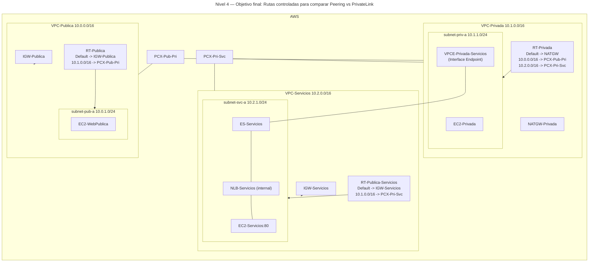

# 🥉 Nivel 4 — Fácil

Compara **VPC Peering** vs **PrivateLink (Interface Endpoint)** mediante **trazas (traceroute)** y **rutas controladas**. Partimos del **Nivel 3** (VPC-Publica, VPC-Privada con NAT y VPCE hacia VPC-Servicios, NLB y Endpoint Service ya operativos).

**[Enlace rápido al apartado para practicar con CLI](#️-usando-la-cli-en-cloudshell-command-line-interface)**

## 🖱️ Usando la GUI (Graphical User Interface)

### 🎯 Objetivo

Introducir un **VPC Peering adicional** entre **VPC-Privada** y **VPC-Servicios** y **controlar las rutas** para comparar:

- Acceso al servicio por **PrivateLink** (vía **VPCE**).
- Acceso al backend por **IP privada** mediante **VPC Peering**.

Se realizarán **trazas** y pruebas de **resolución/encaminamiento** para observar diferencias.

### 🧱 Requisitos previos

- Estado final del **Nivel 3** en la misma región (ej.: **eu-east-1**).
- `VPCE-Privada-Servicios` funcionando y `EC2-Privada` accesible (vía bastión o consola).

---

### 🗺️ Arquitectura objetivo (resultado final)



---

### 🔧 Paso 1 — Crear peering entre VPC-Privada y VPC-Servicios

1. **VPC → Peering connections → Create peering connection**.
2. **Name**: `PCX-Pri-Svc`.
3. **Requester**: `VPC-Privada` — **Accepter**: `VPC-Servicios` → **Create**.
4. Selecciona el peering → **Actions → Accept request**.

---

### 🔧 Paso 2 — Rutas recíprocas para 10.1.0.0/16 ↔ 10.2.0.0/16

1. **RT-Privada** (de `VPC-Privada`) → **Routes → Edit** → **Add route**:
   - **Destination**: `10.2.0.0/16`
   - **Target**: `PCX-Pri-Svc` → **Save**.
2. **RT-Publica-Servicios** (de `VPC-Servicios`) → **Routes → Edit** → **Add route**:
   - **Destination**: `10.1.0.0/16`
   - **Target**: `PCX-Pri-Svc` → **Save**.

> Mantén **VPCE** operativo (no requiere rutas) para poder comparar ambos caminos.

---

### 🔧 Paso 3 — Ajustes de Security Groups para pruebas

1. En `VPC-Servicios`, en **SG-ServiciosWeb**:
   - Asegura **HTTP 80** permitido desde `10.1.0.0/16` (traza TCP en puerto 80).
2. En el **SG del VPCE**:
   - Asegura **TCP 80** desde `subnet-priv-a` (ya debería estar así desde Nivel 3).

---

### 🔎 Paso 4 — Verificación y trazas

Desde `EC2-Privada`:

- **PrivateLink (DNS del VPCE)**:
  1. Resuelve el DNS del endpoint y prueba conectividad:

     ```bash
     getent hosts <VPCE_DNS_PRIVADO>
     curl -sI http://<VPCE_DNS_PRIVADO>
     ```

  2. Traza hacia el **VPCE** (suele ser 1 salto al ENI del endpoint):

     ```bash
     traceroute -T -p 80 <VPCE_DNS_PRIVADO>
     ```

- **Peering (IP privada del backend)**:
  1. Obtén la **IP privada** de `EC2-Servicios` y pruébala:

     ```bash
     curl -sI http://10.2.1.X
     ```

  2. Traza hacia la **IP del backend** (ruta vía **PCX-Pri-Svc**):

     ```bash
     traceroute -T -p 80 10.2.1.X
     ```

> Nota: En AWS, los routers intermedios normalmente **no** responden a TTL expirado; la traza puede mostrar pocos saltos. Úsala como indicio junto con **resolución DNS**, **IP destino** y **tablas de rutas**.

---

### 🧯 Problemas típicos

- **Traces sin hops**: comportamiento normal en AWS; valida con `getent hosts`, `ip route get DEST` y reglas de SG.
- **HTTP por peering falla**: faltan rutas `10.1.0.0/16 ↔ 10.2.0.0/16` o SG no permite **TCP 80** desde `10.1.0.0/16`.
- **PrivateLink no responde**: revisa **Endpoint Service** (healthy del TG y listener del NLB) y **SG del VPCE**.

---

### 🧹 Limpieza (GUI)

1. Si solo era para la comparación, elimina **rutas de peering** en `RT-Privada` y `RT-Publica-Servicios`.
2. **VPC Peering**: borra `PCX-Pri-Svc`.
3. Mantén la arquitectura del **Nivel 3** (PrivateLink) si vas a continuar.

---
---
---
---
---

## ⌨️ Usando la CLI en CloudShell (Command Line Interface)

> CloudShell por defecto. Incluye `--region eu-east-1` **explícito** en todos los comandos. Copia los **IDs** manualmente (`<PCX_ID>`, `<RT_PRIV_ID>`, `<RT_SVC_PUB_ID>`, etc.). Sin funciones ni pipes avanzados.

### 🧱 Requisitos previos (CLI)

- Arquitectura del **Nivel 3** en la misma región.

---

### 🔎 Prechequeo

```bash
aws sts get-caller-identity --region eu-east-1
aws configure get region
```

---

### 🔧 Paso 1 — Peering Pri↔Svc

```bash
aws ec2 create-vpc-peering-connection \
  --vpc-id <VPC_PRIV_ID> \
  --peer-vpc-id <VPC_SVC_ID> \
  --tag-specifications 'ResourceType=vpc-peering-connection,Tags=[{Key=Name,Value=PCX-Pri-Svc}]' \
  --region eu-east-1
# Copia VpcPeeringConnectionId como <PCX_PRI_SVC_ID>

aws ec2 accept-vpc-peering-connection \
  --vpc-peering-connection-id <PCX_PRI_SVC_ID> \
  --region eu-east-1
```

---

### 🔧 Paso 2 — Rutas controladas

```bash
# En RT-Privada (VPC-Privada) añadir 10.2.0.0/16 -> PCX-Pri-Svc
aws ec2 create-route \
  --route-table-id <RT_PRIV_ID> \
  --destination-cidr-block 10.2.0.0/16 \
  --vpc-peering-connection-id <PCX_PRI_SVC_ID> \
  --region eu-east-1

# En RT-Publica-Servicios (VPC-Servicios) añadir 10.1.0.0/16 -> PCX-Pri-Svc
aws ec2 create-route \
  --route-table-id <RT_SVC_PUB_ID> \
  --destination-cidr-block 10.1.0.0/16 \
  --vpc-peering-connection-id <PCX_PRI_SVC_ID> \
  --region eu-east-1
```

---

### 🔧 Paso 3 — Ajustes de SG

```bash
# Permitir TCP 80 desde 10.1.0.0/16 en SG-ServiciosWeb (en VPC-Servicios)
aws ec2 authorize-security-group-ingress \
  --group-id <SG_SVC_ID> \
  --protocol tcp --port 80 \
  --cidr 10.1.0.0/16 \
  --region eu-east-1
```

---

### ✅ Paso 4 — Pruebas (en EC2-Privada)

```bash
# PrivateLink
getent hosts <VPCE_DNS_PRIVADO>
traceroute -T -p 80 <VPCE_DNS_PRIVADO>
curl -sI http://<VPCE_DNS_PRIVADO>

# Peering
traceroute -T -p 80 10.2.1.X
curl -sI http://10.2.1.X
```

---

### 🧯 Troubleshooting rápido

- Verifica con:
  
  ```bash
  ip route get 10.2.1.X
  ```

- Asegura **TCP 80** permitido en los SGs adecuados y rutas correctas en ambas RT.

---

### 🧹 Limpieza (CLI)

```bash
# 1) Quitar rutas de peering
aws ec2 delete-route --route-table-id <RT_PRIV_ID> --destination-cidr-block 10.2.0.0/16 --region eu-east-1
aws ec2 delete-route --route-table-id <RT_SVC_PUB_ID> --destination-cidr-block 10.1.0.0/16 --region eu-east-1

# 2) Borrar peering Pri↔Svc
aws ec2 delete-vpc-peering-connection --vpc-peering-connection-id <PCX_PRI_SVC_ID> --region eu-east-1
```
