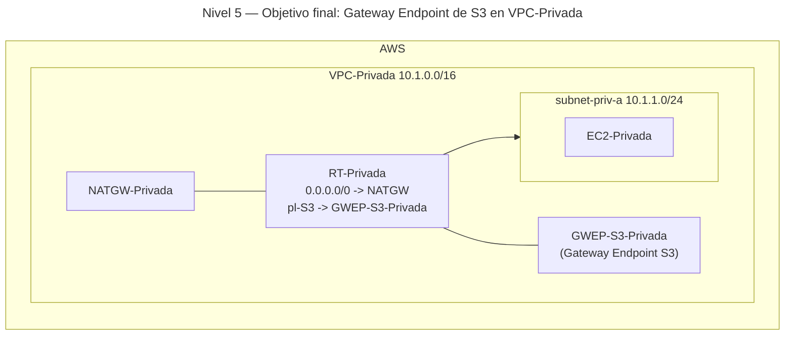
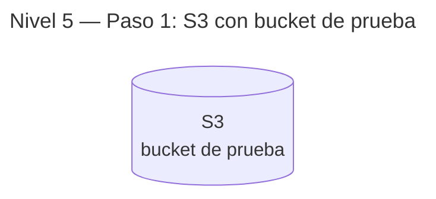
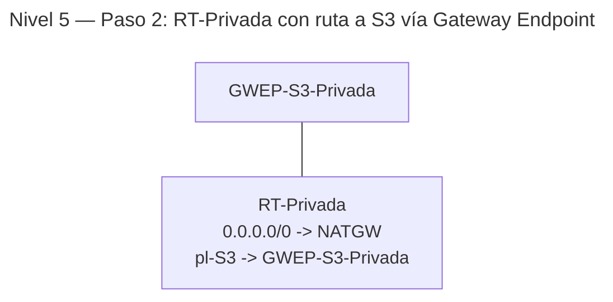

# 🥉 Nivel 5 — Fácil

Implementa un **Gateway Endpoint de S3** para que las instancias de **VPC-Privada** accedan a **S3** sin salir de la red de **AWS** (sin pasar por NAT/IGW). Partimos del **Nivel 4** ya desplegado (o, como mínimo, del estado del **Nivel 3** con VPC-Privada + NAT y conectividad previa).

**[Enlace rápido al apartado para practicar con CLI](#️-usando-la-cli-en-cloudshell-command-line-interface)**

## ⚠️ Advertencia de costes — 05 (us-east-1)

**Clasificación:** Muy bajo.

**Recursos con coste:**

- **Gateway Endpoint S3:** sin coste por hora.
- Pueden existir costes por **requests S3** y **datos a Internet** (si aplican).

**Cómo minimizar:**

- Mantén el acceso a S3 **dentro de AWS** (evita salidas a Internet).
- Haz pruebas con **objetos pequeños** y pocas operaciones.
- Este endpoint puede **quedarse** activo (no factura por hora).

---

## 🖱️ Usando la GUI (Graphical User Interface)

### 🎯 Objetivo

Configurar un **Gateway VPC Endpoint (S3)** asociado a la **tabla de rutas privada** de **VPC-Privada** para que el tráfico hacia **Amazon S3** use la **red interna de AWS**. Mantener NAT para el resto de destinos de Internet.

### 🧱 Requisitos previos

- **VPC-Privada** con **subnet-priv-a** y **RT-Privada** (por defecto: `0.0.0.0/0 → NATGW`).
- Una instancia en **subnet-priv-a** (p. ej., `EC2-Privada`) para probar conectividad.
- Región de trabajo coherente (ej.: **us-east-1**).

---

### 🗺️ Arquitectura objetivo (resultado final)



---

### 🔧 Paso 1 — (Opcional) Crear un bucket y un objeto de prueba en S3

1. **S3 → Create bucket** → nómbralo de forma única en tu cuenta y región.
2. Sube un **objeto de prueba** (por ejemplo, `readme.txt`) con permisos por defecto.
3. (No es necesario hacer el bucket público ni cambiar políticas para esta comprobación de red).

**Progresión (tras paso 1):**



---

### 🔧 Paso 2 — Crear el Gateway Endpoint de S3 en VPC-Privada

1. **VPC → Endpoints → Create endpoint**.
2. **Service category**: `AWS services` → **Service name**: `com.amazonaws.<region>.s3`.
3. **VPC**: `VPC-Privada`.
4. **VPC endpoint settings**:
    - **Type**: `Gateway`.
    - **Route tables**: selecciona **RT-Privada** (la de `subnet-priv-a`).
    - **Policy**: `Full access` (por defecto) para la práctica.
5. **Create endpoint** y espera a estado **Available**.

**Progresión (tras paso 2):**



---

### 🔎 Paso 3 — Verificación (demostrando camino privado a S3)

**A)** Verificación simple de conectividad selectiva:

1. En **EC2-Privada** (subnet-priv-a), ejecuta:
    - `curl -I http://s3.<tu-region>.amazonaws.com` → **debe responder 403** (no autenticado, pero hay conectividad).
    - `curl -I http://example.com` → **funciona** (vía NAT), si no cambiaste la ruta por defecto.

2. **Prueba concluyente (opcional):** edita temporalmente **RT-Privada** y elimina la **ruta por defecto `0.0.0.0/0 → NATGW`**.
    - Repite:
        - `curl -I http://s3.<tu-region>.amazonaws.com` → **sigue respondiendo 403** (conectividad a S3 por **Gateway Endpoint**).
        - `curl -I http://example.com` → **falla** (sin NAT).
    - **Restaura** luego la ruta por defecto a NAT.

**B)** En **VPC → Route tables → RT-Privada**, verifica que exista la **entrada hacia el Prefix List de S3** (pl-*) apuntando al **Gateway Endpoint**.

---

### 🧯 Problemas típicos

- **No ves la ruta pl-*** en la RT: comprueba que seleccionaste **RT-Privada** al crear el endpoint.
- **`curl` a S3 falla cuando quitas NAT**: revisa que el endpoint sea **Gateway**, servicio **S3** y esté **Available**.
- **403 de S3** es esperado sin credenciales: indica conectividad. No necesitas IAM para esta verificación de red.

---

### 🧹 Limpieza (GUI)

- Si no vas a usar el endpoint:
    1. **VPC → Endpoints**: elimina **GWEP-S3-Privada**.
    2. **S3**: elimina el **bucket de prueba** y su contenido (si lo creaste).
    3. **RT-Privada**: asegúrate de restaurar `0.0.0.0/0 → NATGW` si la quitaste.

---
---
---
---
---

## ⌨️ Usando la CLI en CloudShell (Command Line Interface)

> CloudShell por defecto. Incluye `--region us-east-1` **explícito** en todos los comandos. Copia los **IDs** manualmente cuando se indiquen.

### 🧱 Requisitos previos (CLI)

- VPC-Privada operativa con **RT-Privada** y **NATGW** (estado desde Nivel 3/4).
- Una instancia en `subnet-priv-a` para probar.

---

### 🔎 Prechequeo

```bash
aws sts get-caller-identity --region us-east-1
aws configure get region
```

---

### 🔧 Paso 1 — (Opcional) Crear bucket y objeto de prueba

```bash
# Crea un bucket (usa un nombre único en tu cuenta)
aws s3api create-bucket \
    --bucket <BUCKET_UNICO> \
    --create-bucket-configuration LocationConstraint=us-east-1 \
    --region us-east-1

# Sube un objeto de prueba desde CloudShell
echo "Objeto de prueba Nivel 5" > objeto.txt
aws s3 cp objeto.txt s3://<BUCKET_UNICO>/objeto.txt --region us-east-1
```

---

### 🔧 Paso 2 — Crear Gateway Endpoint de S3 asociado a RT-Privada

```bash
# Crea el endpoint (tipo Gateway) para S3 en la VPC-Privada
aws ec2 create-vpc-endpoint \
    --vpc-id <VPC_PRIV_ID> \
    --service-name com.amazonaws.us-east-1.s3 \
    --vpc-endpoint-type Gateway \
    --route-table-ids <RT_PRIV_ID> \
    --tag-specifications 'ResourceType=vpc-endpoint,Tags=[{Key=Name,Value=GWEP-S3-Privada}]' \
    --region us-east-1
# Copia VpcEndpointId como <GWEP_ID>
```

---

### ✅ Paso 3 — Verificación (desde EC2-Privada)

```bash
# Con NAT activo:
curl -I http://s3.us-east-1.amazonaws.com
curl -I http://example.com

# (Opcional) Elimina temporalmente la ruta por defecto en RT-Privada:
# aws ec2 delete-route --route-table-id <RT_PRIV_ID> --destination-cidr-block 0.0.0.0/0 --region us-east-1
# Ahora:
curl -I http://s3.us-east-1.amazonaws.com   # debe responder (403)
curl -I http://example.com                   # debe fallar
# Restaura la ruta por defecto al NAT si la quitaste:
# aws ec2 create-route --route-table-id <RT_PRIV_ID> --destination-cidr-block 0.0.0.0/0 --nat-gateway-id <NATGW_ID> --region us-east-1
```

---

### 🧯 Troubleshooting rápido

- Comprueba el **estado** del endpoint:

    ```bash
    aws ec2 describe-vpc-endpoints --vpc-endpoint-ids <GWEP_ID> --region us-east-1
    ```

- Verifica en **RT-Privada** que apareció una **ruta al Prefix List de S3 (pl-*)** dirigida al **GWEP**.

---

### 🧹 Limpieza (CLI)

```bash
# 1) Eliminar el Gateway Endpoint
aws ec2 delete-vpc-endpoints \
    --vpc-endpoint-ids <GWEP_ID> \
    --region us-east-1

# 2) (Opcional) Borrar bucket y objeto de prueba
aws s3 rm s3://<BUCKET_UNICO>/objeto.txt --region us-east-1
aws s3api delete-bucket --bucket <BUCKET_UNICO> --region us-east-1

# 3) Asegúrate de que RT-Privada conserva la ruta por defecto a NATGW si la tocaste
# aws ec2 create-route --route-table-id <RT_PRIV_ID> --destination-cidr-block 0.0.0.0/0 --nat-gateway-id <NATGW_ID> --region us-east-1
```
