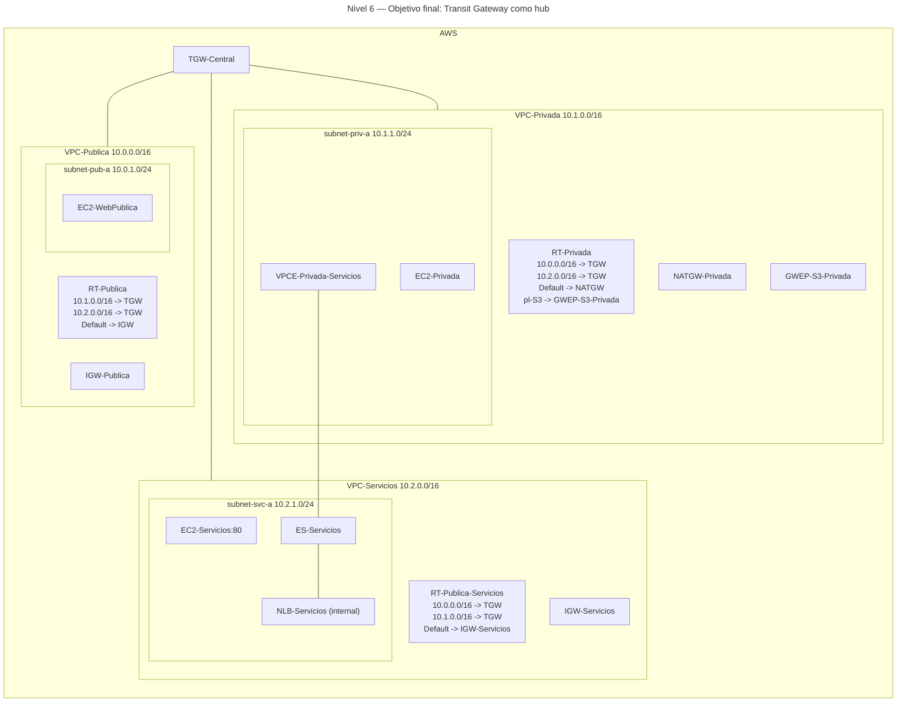
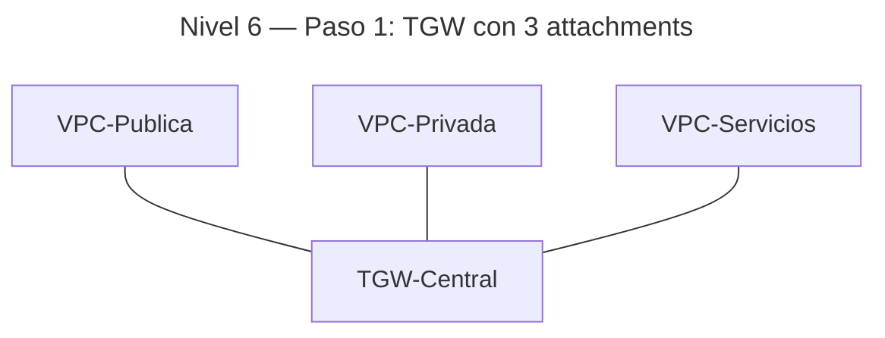
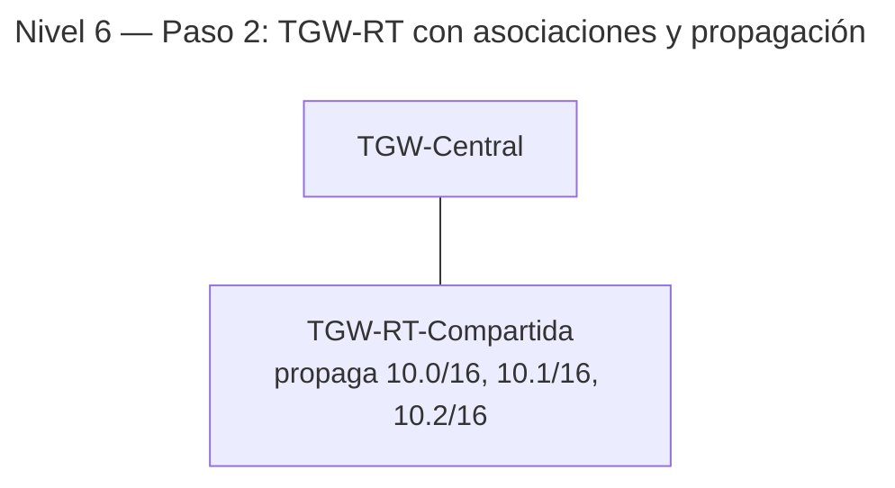
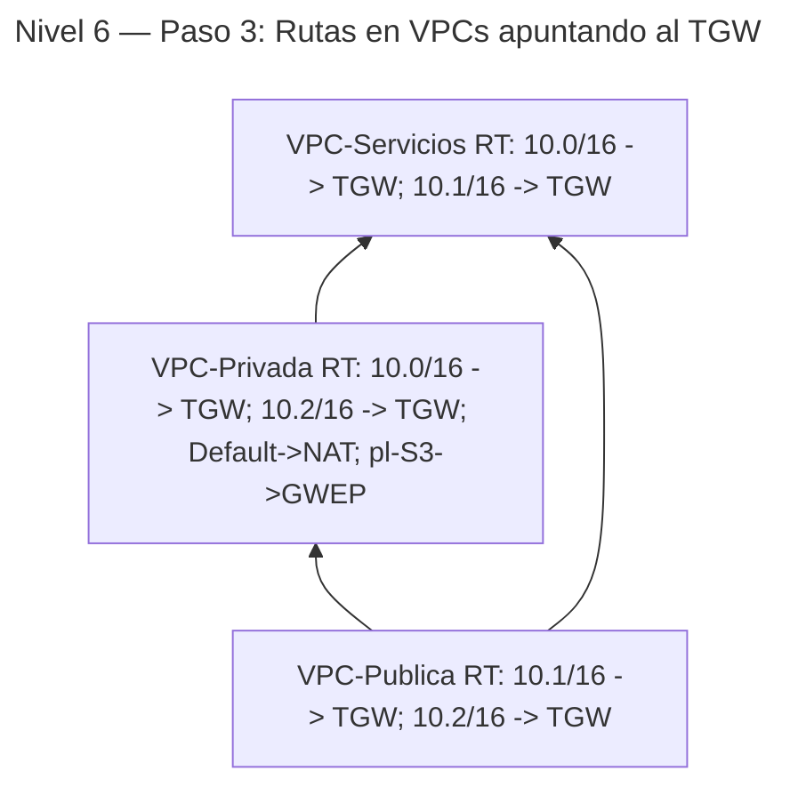

# 🥉 Nivel 6 — Fácil

Diseña una **VPC transitiva** con **Transit Gateway (TGW)** para interconectar **VPC-Publica**, **VPC-Privada** y **VPC-Servicios**, y analiza el **flujo de tráfico** entre ellas. Partimos del **Nivel 5** (S3 vía Gateway Endpoint en VPC-Privada, PrivateLink operativo hacia VPC-Servicios).

**[Enlace rápido al apartado para practicar con CLI](#️-usando-la-cli-en-cloudshell-command-line-interface)**

## ⚠️ Advertencia de costes — 06 (us-east-1)

**Clasificación:** Medio–Alto (Transit Gateway).

**Recursos con coste:**

- **Transit Gateway:** coste por **attachment/hora** + **GB**.
- Varios attachments (3+) incrementan el gasto.

**Cómo minimizar:**

- **Crea TGW y attachments solo para la demo**, y **elimínalos** al cerrar.
- Usa el número **mínimo** de attachments necesario.
- Valida con **bajo tráfico** (comandos de control, no transferencias).

---

## 🖱️ Usando la GUI (Graphical User Interface)

### 🎯 Objetivo

Crear un **hub de tránsito** con **AWS Transit Gateway** y **adjuntar** las tres VPCs para permitir conectividad **any-to-any** controlada. Ajustar las **tablas de rutas** de las VPCs y la **tabla de rutas del TGW** para encaminar el tráfico este-oeste. Verificar que:

- El acceso a **S3** desde VPC-Privada **sigue usando** su **Gateway Endpoint** (no sale por TGW).
- El acceso vía **PrivateLink** **no** depende del TGW (sigue resolviéndose por ENIs del VPCE).
- El tráfico entre VPCs **sí** fluye por el TGW según rutas.

### 🧱 Requisitos previos

- **VPC-Publica**, **VPC-Privada** y **VPC-Servicios** disponibles (de niveles anteriores).
- **RT-Privada** con `0.0.0.0/0 → NATGW` y ruta a **S3** vía **GWEP** (pl-*).
- **PrivateLink** (VPCE en VPC-Privada) **operativo** hacia el NLB de VPC-Servicios.
- Instancias para pruebas: `EC2-WebPublica` (10.0.1.0/24), `EC2-Privada` (10.1.1.0/24), `EC2-Servicios` (10.2.1.0/24).

---

### 🗺️ Arquitectura objetivo (resultado final)



---

### 🔧 Paso 1 — Crear Transit Gateway y adjuntar las VPCs

1. **VPC → Transit Gateways → Create transit gateway**.  
   - **Name**: `TGW-Central`  
   - Otras opciones por defecto → **Create** (espera a **Available**).
2. **Transit Gateway attachments → Create attachment** (repite 3 veces, una por VPC):  
   - **Name**: `TGW-ATT-Publica` / `TGW-ATT-Privada` / `TGW-ATT-Servicios`  
   - **Transit gateway ID**: `TGW-Central`  
   - **Attachment type**: `VPC`  
   - **VPC**: la VPC correspondiente  
   - **Subnets**: selecciona la subnet de cada VPC (p. ej., `subnet-pub-a`, `subnet-priv-a`, `subnet-svc-a`)  
   - **Create attachment** (espera a **Available**).

**Progresión (tras Paso 1):**



---

### 🔧 Paso 2 — Tabla de rutas del TGW y propagaciones

1. **Transit gateway route tables → Create**  
   - **Name**: `TGW-RT-Compartida` → **Create**.
2. **Associations**: asocia **cada attachment** a `TGW-RT-Compartida`.
3. **Propagations**: habilita **propagación** de **cada attachment** en `TGW-RT-Compartida`.  
   (De este modo, la TGW-RT aprende las rutas de las VPCs 10.0.0.0/16, 10.1.0.0/16, 10.2.0.0/16).

**Progresión (tras Paso 2):**



---

### 🔧 Paso 3 — Rutas en las VPCs hacia el TGW

Ajusta **cada Route Table** de cada VPC para enrutar los **CIDRs remotos** hacia el **TGW**:

- **RT-Publica** (VPC-Publica):  
  - `10.1.0.0/16 → TGW-Central`  
  - `10.2.0.0/16 → TGW-Central`  
  - Mantén `Default → IGW-Publica`.

- **RT-Privada** (VPC-Privada):  
  - `10.0.0.0/16 → TGW-Central`  
  - `10.2.0.0/16 → TGW-Central`  
  - Mantén `Default → NATGW` y `pl-S3 → GWEP-S3-Privada`.

- **RT-Publica-Servicios** (VPC-Servicios):  
  - `10.0.0.0/16 → TGW-Central`  
  - `10.1.0.0/16 → TGW-Central`  
  - Mantén `Default → IGW-Servicios`.

**Progresión (tras Paso 3):**



---

### 🔎 Verificación

- **Tráfico este-oeste por TGW**:  
  - Desde `EC2-Privada` → `curl` a la **IP privada** de `EC2-WebPublica` (10.0.1.X).  
  - Desde `EC2-Privada` → `curl` a la **IP privada** de `EC2-Servicios` (10.2.1.X).  
  - (Opcional) `traceroute -T -p 80` a esos destinos (pocos saltos visibles en AWS).
- **S3**: desde `EC2-Privada`, `curl -I http://s3.<region>.amazonaws.com` responde **aunque desconectes Internet** (si quitas temporalmente `Default → NATGW`), validando que sigue por **GWEP**.  
- **PrivateLink**: desde `EC2-Privada`, `curl` al **DNS del VPCE** responde sin depender del TGW.

---

### 🧯 Problemas típicos

- **No hay reach** entre VPCs**:** falta alguna ruta hacia **TGW** en las **RT** de VPC, o el **attachment** no está **Associated/Propagating** en `TGW-RT-Compartida`.  
- **Confusión con PrivateLink**: recuerda que VPCE **no** usa TGW.  
- **S3 falla sin NAT**: revisa que **GWEP-S3-Privada** esté en **RT-Privada** (ruta pl-*).

---

### 🧹 Limpieza (GUI)

- Para volver al estado del **Nivel 5**:
  1. En **TGW-RT-Compartida**: deshabilita **propagations** y **associations** de los **attachments**.  
  2. Elimina **TGW attachments**.  
  3. Elimina **Transit Gateway**.  
  4. En cada **Route Table** de VPC, elimina rutas a otros CIDRs que apunten a TGW.  
  5. Mantén **GWEP-S3-Privada** y **PrivateLink** si continuarás con niveles posteriores.

---
---
---
---
---

## ⌨️ Usando la CLI en CloudShell (Command Line Interface)

> CloudShell por defecto. Comandos con `--region us-east-1` **explícito**. A partir del Nivel 6 puedes ver pequeñas “píldoras pro” (consultas con `--query`) para inspección. Copia IDs/DNS manualmente como `<PLACEHOLDER>`.

### 🧱 Requisitos previos (CLI)

- Topología del **Nivel 5** en la misma región.

---

### 🔎 Prechequeo

```bash
aws sts get-caller-identity --region us-east-1
aws configure get region
```

---

### 🔧 Paso 1 — TGW y attachments

```bash
aws ec2 create-transit-gateway \
  --description "TGW-Central" \
  --tag-specifications 'ResourceType=transit-gateway,Tags=[{Key=Name,Value=TGW-Central}]' \
  --region us-east-1
# Copia TransitGatewayId como <TGW_ID>

aws ec2 create-transit-gateway-vpc-attachment \
  --transit-gateway-id <TGW_ID> \
  --vpc-id <VPC_PUB_ID> \
  --subnet-ids <SUBNET_PUB_ID> \
  --tag-specifications 'ResourceType=transit-gateway-attachment,Tags=[{Key=Name,Value=TGW-ATT-Publica}]' \
  --region us-east-1
# Copia TransitGatewayAttachmentId como <ATT_PUB_ID>

aws ec2 create-transit-gateway-vpc-attachment \
  --transit-gateway-id <TGW_ID> \
  --vpc-id <VPC_PRIV_ID> \
  --subnet-ids <SUBNET_PRIV_ID> \
  --tag-specifications 'ResourceType=transit-gateway-attachment,Tags=[{Key=Name,Value=TGW-ATT-Privada}]' \
  --region us-east-1
# Copia TransitGatewayAttachmentId como <ATT_PRIV_ID>

aws ec2 create-transit-gateway-vpc-attachment \
  --transit-gateway-id <TGW_ID> \
  --vpc-id <VPC_SVC_ID> \
  --subnet-ids <SUBNET_SVC_ID> \
  --tag-specifications 'ResourceType=transit-gateway-attachment,Tags=[{Key=Name,Value=TGW-ATT-Servicios}]' \
  --region us-east-1
# Copia TransitGatewayAttachmentId como <ATT_SVC_ID>
```

---

### 🔧 Paso 2 — TGW Route Table: asociación y propagación

```bash
aws ec2 create-transit-gateway-route-table \
  --transit-gateway-id <TGW_ID> \
  --tag-specifications 'ResourceType=transit-gateway-route-table,Tags=[{Key=Name,Value=TGW-RT-Compartida}]' \
  --region us-east-1
# Copia TransitGatewayRouteTableId como <TGW_RT_ID>

aws ec2 associate-transit-gateway-route-table \
  --transit-gateway-route-table-id <TGW_RT_ID> \
  --transit-gateway-attachment-id <ATT_PUB_ID> \
  --region us-east-1

aws ec2 associate-transit-gateway-route-table \
  --transit-gateway-route-table-id <TGW_RT_ID> \
  --transit-gateway-attachment-id <ATT_PRIV_ID> \
  --region us-east-1

aws ec2 associate-transit-gateway-route-table \
  --transit-gateway-route-table-id <TGW_RT_ID> \
  --transit-gateway-attachment-id <ATT_SVC_ID> \
  --region us-east-1

aws ec2 enable-transit-gateway-route-table-propagation \
  --transit-gateway-route-table-id <TGW_RT_ID> \
  --transit-gateway-attachment-id <ATT_PUB_ID> \
  --region us-east-1

aws ec2 enable-transit-gateway-route-table-propagation \
  --transit-gateway-route-table-id <TGW_RT_ID> \
  --transit-gateway-attachment-id <ATT_PRIV_ID> \
  --region us-east-1

aws ec2 enable-transit-gateway-route-table-propagation \
  --transit-gateway-route-table-id <TGW_RT_ID> \
  --transit-gateway-attachment-id <ATT_SVC_ID> \
  --region us-east-1
```

---

### 🔧 Paso 3 — Rutas en Route Tables de las VPCs

```bash
# RT-Publica (VPC-Publica): añade rutas a 10.1/16 y 10.2/16 via TGW
aws ec2 create-route --route-table-id <RT_PUB_ID> --destination-cidr-block 10.1.0.0/16 --transit-gateway-id <TGW_ID> --region us-east-1
aws ec2 create-route --route-table-id <RT_PUB_ID> --destination-cidr-block 10.2.0.0/16 --transit-gateway-id <TGW_ID> --region us-east-1

# RT-Privada (VPC-Privada): añade rutas a 10.0/16 y 10.2/16 via TGW (mantén Default->NAT y pl-S3->GWEP)
aws ec2 create-route --route-table-id <RT_PRIV_ID> --destination-cidr-block 10.0.0.0/16 --transit-gateway-id <TGW_ID> --region us-east-1
aws ec2 create-route --route-table-id <RT_PRIV_ID> --destination-cidr-block 10.2.0.0/16 --transit-gateway-id <TGW_ID> --region us-east-1

# RT-Publica-Servicios (VPC-Servicios): añade rutas a 10.0/16 y 10.1/16 via TGW
aws ec2 create-route --route-table-id <RT_SVC_PUB_ID> --destination-cidr-block 10.0.0.0/16 --transit-gateway-id <TGW_ID> --region us-east-1
aws ec2 create-route --route-table-id <RT_SVC_PUB_ID> --destination-cidr-block 10.1.0.0/16 --transit-gateway-id <TGW_ID> --region us-east-1
```

---

### ✅ Verificación

```bash
# Desde EC2-Privada:
# 1) Reach a Web en VPC-Publica (via TGW)
curl -sI http://10.0.1.X

# 2) Reach a Servicios en VPC-Servicios (via TGW)
curl -sI http://10.2.1.X

# 3) PrivateLink sigue independiente
curl -sI http://<VPCE_DNS_PRIVADO>

# 4) S3 sigue por Gateway Endpoint (403 esperado sin credenciales)
curl -I http://s3.us-east-1.amazonaws.com
```

**Píldora pro (inspección TGW):**

```bash
# Listar rutas aprendidas en la TGW-RT
aws ec2 search-transit-gateway-routes \
  --transit-gateway-route-table-id <TGW_RT_ID> \
  --filters Name=type,Values=propagated \
  --region us-east-1 \
  --query "Routes[].{CIDR:DestinationCidrBlock, AttachmentId:TransitGatewayAttachments[0].TransitGatewayAttachmentId}"

# Ver rutas estáticas/activas
aws ec2 search-transit-gateway-routes \
  --transit-gateway-route-table-id <TGW_RT_ID> \
  --filters Name=state,Values=active \
  --region us-east-1 \
  --query "Routes[].DestinationCidrBlock"
```

---

### 🧯 Troubleshooting rápido

- **Rutas faltantes**: revisa las **RT de VPC** y la **TGW-RT** (propagations/associations).  
- **Bloqueos de SG/NACL**: valida que puertos usados (HTTP 80 o ICMP/TCP para pruebas) estén permitidos.  
- **Confusión con S3/PrivateLink**: no pasan por TGW.

---

### 🧹 Limpieza (CLI)

```bash
# 1) Quitar rutas en VPCs
aws ec2 delete-route --route-table-id <RT_PUB_ID> --destination-cidr-block 10.1.0.0/16 --region us-east-1
aws ec2 delete-route --route-table-id <RT_PUB_ID> --destination-cidr-block 10.2.0.0/16 --region us-east-1
aws ec2 delete-route --route-table-id <RT_PRIV_ID> --destination-cidr-block 10.0.0.0/16 --region us-east-1
aws ec2 delete-route --route-table-id <RT_PRIV_ID> --destination-cidr-block 10.2.0.0/16 --region us-east-1
aws ec2 delete-route --route-table-id <RT_SVC_PUB_ID> --destination-cidr-block 10.0.0.0/16 --region us-east-1
aws ec2 delete-route --route-table-id <RT_SVC_PUB_ID> --destination-cidr-block 10.1.0.0/16 --region us-east-1

# 2) Desasociar/propagación (opcional: al borrar attachments ya no aplican)
aws ec2 delete-transit-gateway-vpc-attachment --transit-gateway-attachment-id <ATT_PUB_ID> --region us-east-1
aws ec2 delete-transit-gateway-vpc-attachment --transit-gateway-attachment-id <ATT_PRIV_ID> --region us-east-1
aws ec2 delete-transit-gateway-vpc-attachment --transit-gateway-attachment-id <ATT_SVC_ID> --region us-east-1

# 3) Borrar TGW RT y TGW
aws ec2 delete-transit-gateway-route-table --transit-gateway-route-table-id <TGW_RT_ID> --region us-east-1
aws ec2 delete-transit-gateway --transit-gateway-id <TGW_ID> --region us-east-1
```
